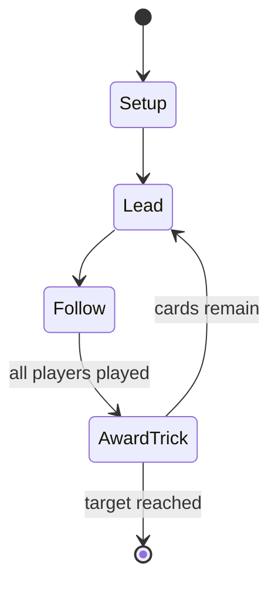

# Pitch

*card game*

`pitch` &nbsp; state: **DEEPENED** &nbsp; method: **heuristic**

## Found layer (recorded, not trusted)

| field | value |
| --- | --- |
| wikidata | Q1823090 |
| wikipedia | Pitch (card game) |
| genres (source) | -- |
| instance of (source) | trick-taking game |
| country of origin | -- |

## Declared layer (orders bench work)

| field | value |
| --- | --- |
| year created | -- |
| epoch | -- |
| region | -- |
| media | TRICK_TAKING |
| players | 4 |
| age band | -- |
| exogenous process | DEPLETING_DECK |
| loss shape | NONE |
| live axes | BID, COMMIT_BLIND |
| horizon | RACE_TO_TARGET |
| scoring shape | LINEAR_ACCUMULATION |
| information | -- |
| interaction | TEAM |
| turn structure | TRICK_ROUND |
| tractability | SAMPLING_ONLY |
| randomness | DECK_SHUFFLE |
| luck factor | 0.35 |
| rules complexity | 2.39 |
| strategic depth | 2.0 |
| novelty | 0.8327 |
| solved status | -- |
| strategies | spatial_packing |
| algorithms | -- |

## Object model

```
Episode
  players      : 4
  turn_structure: TRICK_ROUND
  horizon       : RACE_TO_TARGET
  scoring       : LINEAR_ACCUMULATION

Trick          -- one card per player; a winner is determined
Trump          -- suit that dominates the ordering
Auction        -- priced competition resolving to one winner
SealedChoice   -- irrevocable choice made without observation
```

## State transition diagram



## Research item -- turn trace

```
# Pitch -- simulated turn events
# generated from the DECLARED vector, not from a rulebook.
# structure: exo=DEPLETING_DECK loss=NONE horizon=RACE_TO_TARGET scoring=LINEAR_ACCUMULATION axes=BID,COMMIT_BLIND

t=0    SETUP        players=4  pot=0  capacity=6
t=1    DRAW         p1 draw from deck -> outcome #4  (p=0.141)
t=2    FORCED       p1 single legal option taken (pot_gain=+1.4)
t=3    DRAW         p1 draw from deck -> outcome #1  (p=0.216)
t=4    FORCED       p1 single legal option taken (pot_gain=+1.6)
t=5    DRAW         p1 draw from deck -> outcome #4  (p=0.100)
t=6    FORCED       p1 single legal option taken (pot_gain=+1.1)
t=7    BID          p1 sealed bid of 8 against 3 rivals
t=8    DRAW         p1 draw from deck -> outcome #1  (p=0.052)
t=9    FORCED       p1 single legal option taken (pot_gain=+1.6)
t=10   DRAW         p1 draw from deck -> outcome #1  (p=0.076)
t=11   FORCED       p1 single legal option taken (pot_gain=+1.4)
t=12   BID          p1 sealed bid of 6 against 3 rivals
t=13   DRAW         p1 draw from deck -> outcome #5  (p=0.286)
t=14   FORCED       p1 single legal option taken (pot_gain=+1.5)
t=15   BID          p1 sealed bid of 2 against 3 rivals
t=16   DRAW         p1 draw from deck -> outcome #1  (p=0.126)
t=17   FORCED       p1 single legal option taken (pot_gain=+1.7)
t=18   BID          p1 sealed bid of 9 against 3 rivals
t=19   DRAW         p1 draw from deck -> outcome #4  (p=0.073)
t=20   FORCED       p1 single legal option taken (pot_gain=+1.2)
t=21   ENDTURN      turn passes to p2
t=22   DRAW         p2 draw from deck -> outcome #6  (p=0.054)
t=23   FORCED       p2 single legal option taken (pot_gain=+1.1)
t=24   ENDTURN      turn passes to p3
t=25   DRAW         p3 draw from deck -> outcome #1  (p=0.111)
t=26   FORCED       p3 single legal option taken (pot_gain=+1.6)

terminal: RACE_TO_TARGET
```

## Conditions

| kind | threshold | effect | trigger |
| --- | --- | --- | --- |
| WIN | 1 player | -- | It may happen that at the end of a deal more than one player reaches the number of points necessary to win the game. |
| WIN | 100 points | -- | Game play is normal with the 2 winning conditions: the first team to win a bid that brings them above 100 points or if a team reaches -100 points the other team is declared winner. |
| TERMINATE | 1 player | -- | The game ends when one player reaches 50 points. |
| TERMINATE | 51 points | -- | Play ends at 51 points rather than 32. |
| TERMINATE | 18 points | -- | Bidding "hotshot" makes the game sudden death; if the bidder succeeds and collects all 18 points in the round, he wins the entire game, but if he fails, the game is over. |
| BOUNDARY | 3 cards | -- | discards at least three non-trumps, or exactly three cards including all non-trumps, |
| BOUNDARY | 36 points | -- | Bidding can range from the minimum of 5 to a maximum of "double-18." Double-18s require the team winning the bid to win every single trick and rewards 36 points. |
| WIN | -- | -- | (A player with a negative score is said to be "in the hole".) Alternatively, each player may begin with as many counters as are needed to win the game, and get rid of one for each point won. |
| WIN | -- | -- | Another variation common in partnership pitch is that only the pitching party can win the game. |
| WIN | -- | -- | Bid to go out: Also called bidder goes out, in this variant a player can only win the game if they reach the goal on a hand for which they made the winning bid. |
| WIN | -- | -- | If the player or team makes the bid, they win the game; if they are set, they lose the game. |
| WIN | -- | -- | This also means "sloughing game" (cards with a point value) to a single player so that the bidder will not win the game point. |
| WIN | -- | -- | If the game ends with both teams with 32 or more points, the team that won the bid on the final hand is the winner. |
| TERMINATE | -- | -- | Players who lose a card have nothing to play in the sixth and final round of play. |
| TERMINATE | -- | -- | In the event that both teams have 11 or more points, the bidding team of the final round wins even if the non-bidding team has more points. |
| LOSE | -- | -- | The misdeal rule is in effect, as is shoot the moon, which is differentiated from and superior to a perfect bid (11) in that shoot the moon automatically wins or loses the game. |
| BOUNDARY | -- | -- | A pitcher who did not win at least the number of points undertaken with the bid does not receive any of the points, and is instead set back by the amount of the bid. |
| BOUNDARY | -- | -- | Under this variation the dealer is obliged to make at least the minimum bid if all other players have passed. |
| BOUNDARY | -- | -- | A pitcher who made and wins the maximum bid is said to smudge, slam or shoot the moon. |
| BOUNDARY | -- | -- | Shoot the moon: A player may shoot the moon, bidding the maximum number. |
| BOUNDARY | -- | -- | The objective of the hand for the team with the winning bid is to (at least) match what they bid. |
| BOUNDARY | -- | -- | The maximum number of points that can be won is 18. |

## Source extract

Pitch (or "high low jack") is an American trick-taking game equivalent to the British blind all
fours which, in turn, is derived from the classic all fours (US: seven up). Historically, pitch
started as "blind all fours", a very simple all fours variant that is still played in England as
a pub game. The modern game involving a bidding phase and setting back a party's score if the
bid is not reached came up in the middle of the 19th century and is more precisely known as
auction pitch or setback. Whereas all fours began as a two-player game, pitch is most popular
for three to five players. Four can play individually or in fixed partnerships, depending in
part on regional preferences. Auction pitch is played in numerous variations that vary the deck
used, provide methods for improving players hands, or expand the scoring system. Some of these
variants gave rise to new games such as Pedro, Pedro Sancho, Dom Pedro or Cinch.   == Pitch or
blind all fours ==  Two or more players play individually or in equal-sized teams, seated
alternatingly. Normal play rotation is clockwise. Players cut for first deal. Cards rank as in
whist and have certain numerical values called pips as shown in the

<sub>Wikipedia, CC BY-SA. Retained as evidence for the structural
classification above. Every rule inferred from it is HYPOTHESIZED
until audited against a rulebook.</sub>
