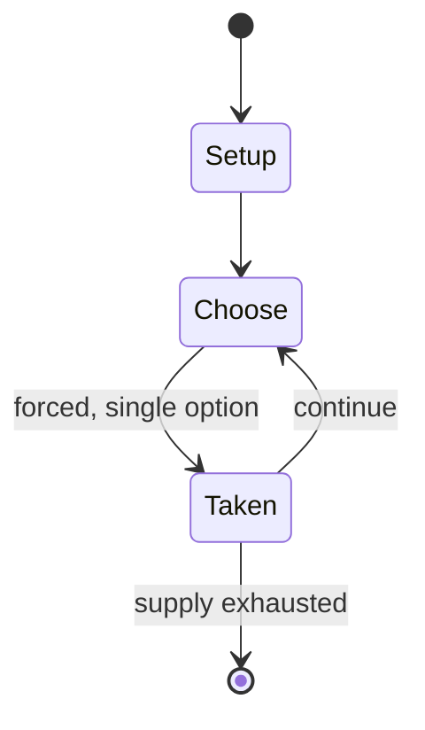

# Pokémon Home

*cloud service for storing Pokémon*

`pok_mon_home` &nbsp; state: **DEEPENED** &nbsp; method: **heuristic**

## Found layer (recorded, not trusted)

| field | value |
| --- | --- |
| wikidata | Q93807404 |
| wikipedia | Pokémon Home |
| genres (source) | -- |
| instance of (source) | mobile app, online service, video game |
| country of origin | -- |

## Declared layer (orders bench work)

| field | value |
| --- | --- |
| year created | 2020 |
| epoch | CONTEMPORARY |
| region | -- |
| media | VIDEO |
| players | -- |
| age band | -- |
| exogenous process | -- |
| loss shape | -- |
| live axes | - |
| horizon | -- |
| scoring shape | -- |
| information | -- |
| interaction | -- |
| turn structure | -- |
| tractability | SAMPLING_ONLY |
| randomness | -- |
| luck factor | 0.35 |
| rules complexity | 1.65 |
| strategic depth | 2.0 |
| novelty | 0.0938 |
| solved status | -- |
| strategies | -- |
| algorithms | -- |

## Object model

```
Episode
  players      : ?
  turn_structure: ?
  horizon       : ?
  scoring       : ?

WorldState     -- simulation state advanced by the engine
Avatar         -- player-controlled agent
Clock          -- frame or tick counter
```

## State transition diagram



## Research item -- turn trace

```
# Pokémon Home -- simulated turn events
# generated from the DECLARED vector, not from a rulebook.
# structure: exo=None loss=None horizon=None scoring=None axes=-

t=0    SETUP        players=2  pot=0  capacity=5
t=1    FORCED       p1 single legal option taken (pot_gain=+1.0)
t=2    FORCED       p1 single legal option taken (pot_gain=+1.9)
t=3    FORCED       p1 single legal option taken (pot_gain=+1.4)
t=4    FORCED       p1 single legal option taken (pot_gain=+0.9)
t=5    FORCED       p1 single legal option taken (pot_gain=+0.5)
t=6    ENDTURN      turn passes to p2
t=7    FORCED       p2 single legal option taken (pot_gain=+1.2)
t=8    ENDTURN      turn passes to p1
t=9    FORCED       p1 single legal option taken (pot_gain=+0.9)
t=10   ENDTURN      turn passes to p2
t=11   FORCED       p2 single legal option taken (pot_gain=+0.8)
t=12   FORCED       p2 single legal option taken (pot_gain=+0.6)
t=13   FORCED       p2 single legal option taken (pot_gain=+1.7)
t=14   ENDTURN      turn passes to p1
t=15   FORCED       p1 single legal option taken (pot_gain=+1.7)
t=16   FORCED       p1 single legal option taken (pot_gain=+1.2)
t=17   FORCED       p1 single legal option taken (pot_gain=+0.8)
t=18   FORCED       p1 single legal option taken (pot_gain=+0.7)
t=19   FORCED       p1 single legal option taken (pot_gain=+1.3)
t=20   FORCED       p1 single legal option taken (pot_gain=+2.0)
t=21   FORCED       p1 single legal option taken (pot_gain=+0.5)
t=22   ENDTURN      turn passes to p2
t=23   FORCED       p2 single legal option taken (pot_gain=+1.5)
t=24   ENDTURN      turn passes to p1
t=25   FORCED       p1 single legal option taken (pot_gain=+0.9)
t=26   ENDTURN      turn passes to p2

terminal: VARIABLE
```

## Source extract

Pokémon is a series of role-playing video games developed by Game Freak and published by
Nintendo and The Pokémon Company. Over the years, a number of spin-off games based on the series
have also been developed by multiple companies. While the main series consists of RPGs, spin-off
games encompass other genres, such as action role-playing, puzzle, fighting, and digital pet
games. Most Pokémon video games have been developed exclusively for Nintendo handheld and home
consoles, dating from the Game Boy to the Nintendo Switch 2.   == Main series games/remakes ==
== Spin-off games ==   === Pokémon Stadium series ===   === Trading Card Games ===   ====
Pokémon Card GB series ====   ==== Play It! series ====   ==== Other Games ====   === Pinball
games ===   === Mystery Dungeon series ===   === Ranger series ===   === Rumble series ===   ===
Snap series ===   === Puzzle games ===   ==== Pokémon Puzzle League series ====   ==== Pokémon
Trozei series ====   ==== Other puzzle games ====   === PokéPark series ===   === Pikachu series
===   === Detective Pikachu games ===   === Pokémon Mini games ===   === Arcade games ===   ====
Puck series ====   ==== Pokkén Tournament ====   ==== Mezast

<sub>Wikipedia, CC BY-SA. Retained as evidence for the structural
classification above. Every rule inferred from it is HYPOTHESIZED
until audited against a rulebook.</sub>
