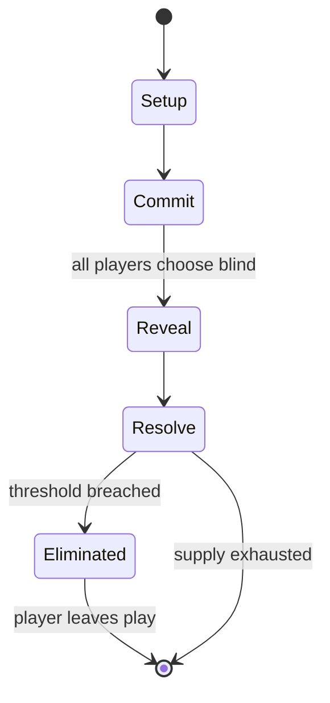

# Pokémon Trading Card Game

*1996 collectible card game based on Pokémon*

`pok_mon_trading_card_game` &nbsp; state: **DEEPENED** &nbsp; method: **heuristic**

## Found layer (recorded, not trusted)

| field | value |
| --- | --- |
| wikidata | Q1056309 |
| wikipedia | Pokémon Trading Card Game |
| genres (source) | -- |
| instance of (source) | collectible card game, deck-building game, esports discipline |
| country of origin | United States |

## Declared layer (orders bench work)

| field | value |
| --- | --- |
| year created | 1996 |
| epoch | DIGITAL |
| region | NORTH_AMERICA |
| media | CARD, COLLECTIBLE, DICE |
| players | -- |
| age band | -- |
| exogenous process | IID |
| loss shape | ELIMINATION |
| live axes | BID, TRADE |
| horizon | -- |
| scoring shape | LINEAR_ACCUMULATION |
| information | -- |
| interaction | SOLITAIRE |
| turn structure | SIMULTANEOUS |
| tractability | EXACT_WITH_CUT |
| randomness | DECK_SHUFFLE, DICE, SIMULTANEOUS_CHOICE |
| luck factor | 0.76 |
| rules complexity | 3.4 |
| strategic depth | 1.83 |
| novelty | 0.7219 |
| solved status | -- |
| strategies | spatial_packing |
| algorithms | -- |

## Object model

```
Episode
  players      : ?
  turn_structure: SIMULTANEOUS
  horizon       : ?
  scoring       : LINEAR_ACCUMULATION

Deck           -- ordered multiset, drawn without replacement
Hand           -- private multiset held by one player
DiscardPile    -- public accumulation of spent cards
DicePool       -- n dice, each an iid categorical draw
Roll           -- realised outcome of a pool
Auction        -- priced competition resolving to one winner
Offer          -- proposed exchange between two agents
```

## State transition diagram



## Research item -- turn trace

```
# Pokémon Trading Card Game -- simulated turn events
# generated from the DECLARED vector, not from a rulebook.
# structure: exo=IID loss=ELIMINATION horizon=None scoring=LINEAR_ACCUMULATION axes=BID,TRADE

t=0    SETUP        players=2  pot=0  capacity=4
t=1    DRAW         p1 roll from d6 pool -> outcome #4  (p=0.120)
t=2    FORCED       p1 single legal option taken (pot_gain=+1.8)
t=3    TRADE        p1 offers 2:1 exchange to p2
t=4    DRAW         p1 roll from d6 pool -> outcome #4  (p=0.204)
t=5    FORCED       p1 single legal option taken (pot_gain=+1.8)
t=6    DRAW         p1 roll from d6 pool -> outcome #6  (p=0.282)
t=7    FORCED       p1 single legal option taken (pot_gain=+1.5)
t=8    DRAW         p1 roll from d6 pool -> outcome #3  (p=0.165)
t=9    FORCED       p1 single legal option taken (pot_gain=+1.9)
t=10   TRADE        p1 offers 2:1 exchange to p2
t=11   DRAW         p1 roll from d6 pool -> outcome #4  (p=0.259)
t=12   FORCED       p1 single legal option taken (pot_gain=+1.3)
t=13   DRAW         p1 roll from d6 pool -> outcome #6  (p=0.104)
t=14   FORCED       p1 single legal option taken (pot_gain=+1.6)
t=15   DRAW         p1 roll from d6 pool -> outcome #2  (p=0.258)
t=16   FORCED       p1 single legal option taken (pot_gain=+1.2)
t=17   BID          p1 sealed bid of 3 against 1 rivals
t=18   DRAW         p1 roll from d6 pool -> outcome #5  (p=0.050)
t=19   FORCED       p1 single legal option taken (pot_gain=+1.1)
t=20   BID          p1 sealed bid of 6 against 1 rivals
t=21   DRAW         p1 roll from d6 pool -> outcome #6  (p=0.066)
t=22   FORCED       p1 single legal option taken (pot_gain=+1.8)
t=23   BID          p1 sealed bid of 8 against 1 rivals
t=24   ENDTURN      turn passes to p2
t=25   DRAW         p2 roll from d6 pool -> outcome #5  (p=0.274)
t=26   FORCED       p2 single legal option taken (pot_gain=+1.2)

terminal: VARIABLE
```

## Conditions

| kind | threshold | effect | trigger |
| --- | --- | --- | --- |
| BOUNDARY | 6 cards | -- | Once both players have at least one Basic Pokémon, they can play up to five more Basic Pokémon onto their Bench, and then take the top six cards of their deck and place them to the side as Prize cards. |
| ELIMINATE | -- | -- | Pokémon that have sustained enough damage from attacks–that reaches or exceeds its HP–is referred to as being "Knocked Out", granting the opponent a prize card; however, powerful card mechanics like Pokémon-V and Pokémon |
| ELIMINATE | -- | -- | Other ways to win are by "Knocking Out" or by removing all opponent's Pokémon in play–the Active and those on the Bench (i.e. the row behind the Active that can house up to five additional Pokémon to support and substitu |
| ELIMINATE | -- | -- | After Trainer cards are played, cards are discarded by effects from Trainer cards or Abilities, and after Pokémon were "Knocked Out", they are put into the discard pile. |
| ELIMINATE | -- | -- | Attacks deal damage to the opponent's Active Pokémon and sometimes deal additional damage to their Benched Pokémon; they may have additional effects like drawing cards, inflicting Special Conditions (Asleep, Burned, Conf |
| ELIMINATE | -- | -- | Abilities, previously called Poké-Powers and Poké-Bodies until 2011, are not attacks, but special effects on Pokémon that may be activated once or multiple times during their turn, such as drawing additional cards or swi |
| ELIMINATE | -- | -- | Afterward, there will be a cut off the top record-holders (approximately the top 1/8 of participants) where players will play best two out of three matches and the loser gets eliminated (standard tournament bracket style |
| BOUNDARY | -- | -- | A card with a high grade can be worth significantly more on the open market than its ungraded counterpart, with many collectors using a card's PSA 10 (Gem Mint) value as a benchmark for the maximum potential value of a c |

## Source extract

The Pokémon Trading Card Game (Japanese: ポケモンカードゲーム, Hepburn: Pokemon Kādo Gēmu; "Pokémon Card
Game"), abbreviated as PTCG or Pokémon TCG, is a tabletop and collectible card game developed by
Creatures Inc. based on the Pokémon franchise. Originally published in Japan by Media Factory in
1996, publishing worldwide is currently handled by the Pokémon Company. In the United States,
the game was originally licensed to Wizards of the Coast, the producer of Magic: The Gathering.
Wizards published eight expansion sets between 1998 and 2003, after which licensing was
transferred to the Pokémon Company. Players assume the role of Pokémon Trainers engaging in
battle, and play with 60-card decks. Standard gameplay cards include Pokémon cards, Energy
cards, and Trainer cards. Pokémon are introduced in battle from a "bench" and perform attacks on
their opponent to deplete their health points. Attacks are enabled by the attachment of a
sufficient number of Energy cards to the active Pokémon. Pokémon may also adjust other gameplay
factors and evolve into more powerful stages. Players may use Trainer cards to draw cards into
their hand, harm their opponent, or perform other gameplay functions. Ca

<sub>Wikipedia, CC BY-SA. Retained as evidence for the structural
classification above. Every rule inferred from it is HYPOTHESIZED
until audited against a rulebook.</sub>
