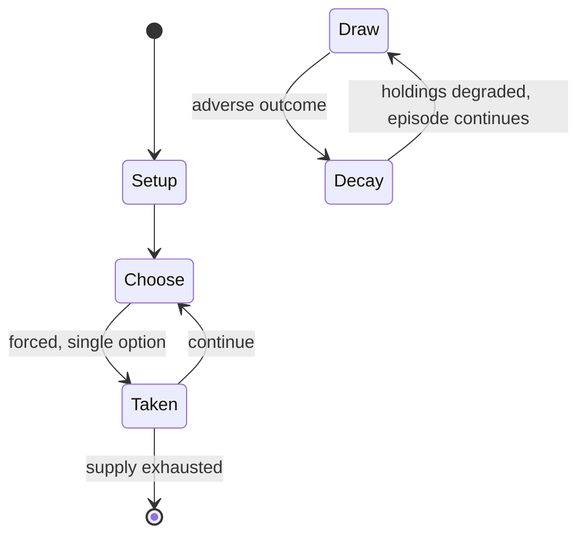

# Poker

`poker` &nbsp; state: **DEEPENED** &nbsp; method: **heuristic**

## Found layer (recorded, not trusted)

| field | value |
| --- | --- |
| wikidata | Q80131 |
| wikipedia | Poker |
| genres (source) | -- |
| instance of (source) | -- |
| country of origin | -- |

## Declared layer (orders bench work)

| field | value |
| --- | --- |
| year created | -- |
| epoch | -- |
| region | -- |
| media | CARD, GAMBLING |
| players | -- |
| age band | -- |
| exogenous process | NONE |
| loss shape | PARTIAL_DECAY |
| live axes | BLUFF, COMMIT_BLIND, DISCARD |
| horizon | -- |
| scoring shape | -- |
| information | IMPERFECT |
| interaction | SOLITAIRE |
| turn structure | STRICT_TURN |
| tractability | EXACT |
| randomness | DECK_SHUFFLE, HIDDEN_INFO, NONE |
| luck factor | 0.05 |
| rules complexity | 3.3 |
| strategic depth | 2.75 |
| novelty | 0.8476 |
| solved status | SOLVED_WEAK |
| strategies | bluffing, probability_estimation, spatial_packing |
| algorithms | counterfactual_regret_minimisation, nash_equilibrium_solving |

## Object model

```
Episode
  players      : ?
  turn_structure: STRICT_TURN
  horizon       : ?
  scoring       : ?

Deck           -- ordered multiset, drawn without replacement
Hand           -- private multiset held by one player
DiscardPile    -- public accumulation of spent cards
Belief         -- what an observer is induced to think is true
SealedChoice   -- irrevocable choice made without observation
DiscardChoice  -- what is given up to satisfy a limit
```

## State transition diagram



## Research item -- turn trace

```
# Poker -- simulated turn events
# generated from the DECLARED vector, not from a rulebook.
# structure: exo=NONE loss=PARTIAL_DECAY horizon=None scoring=None axes=BLUFF,COMMIT_BLIND,DISCARD

t=0    SETUP        players=2  pot=0  capacity=7
t=1    FORCED       p1 single legal option taken (pot_gain=+1.0)
t=2    FORCED       p1 single legal option taken (pot_gain=+1.8)
t=3    DISCARD      p1 discards to hand limit
t=4    BLUFF        p1 represents a holding it does not have
t=5    ENDTURN      turn passes to p2
t=6    FORCED       p2 single legal option taken (pot_gain=+0.6)
t=7    DISCARD      p2 discards to hand limit
t=8    FORCED       p2 single legal option taken (pot_gain=+1.8)
t=9    ENDTURN      turn passes to p1
t=10   FORCED       p1 single legal option taken (pot_gain=+1.5)
t=11   DISCARD      p1 discards to hand limit
t=12   FORCED       p1 single legal option taken (pot_gain=+1.7)
t=13   BLUFF        p1 represents a holding it does not have
t=14   FORCED       p1 single legal option taken (pot_gain=+1.5)
t=15   DISCARD      p1 discards to hand limit
t=16   FORCED       p1 single legal option taken (pot_gain=+0.6)
t=17   DISCARD      p1 discards to hand limit
t=18   FORCED       p1 single legal option taken (pot_gain=+1.9)
t=19   DISCARD      p1 discards to hand limit
t=20   FORCED       p1 single legal option taken (pot_gain=+1.3)
t=21   DISCARD      p1 discards to hand limit
t=22   BLUFF        p1 represents a holding it does not have
t=23   FORCED       p1 single legal option taken (pot_gain=+0.8)
t=24   DISCARD      p1 discards to hand limit
t=25   ENDTURN      turn passes to p2
t=26   FORCED       p2 single legal option taken (pot_gain=+1.0)
t=27   BLUFF        p2 represents a holding it does not have

terminal: VARIABLE
```

## Conditions

| kind | threshold | effect | trigger |
| --- | --- | --- | --- |
| TERMINATE | 1 player | awarded the pot | At any time during a betting round, if one player bets, no opponents choose to call (match) the bet, and all opponents instead fold, the hand ends immediately, the bettor is awarded the pot, no cards are required to be s |
| TERMINATE | -- | -- | The betting round ends when all players have either called the last bet or folded. |
| BOUNDARY | -- | -- | The action then proceeds clockwise as each player in turn must either match (or "call") the maximum previous bet, or fold, losing the amount bet so far and all further involvement in the hand. |
| BOUNDARY | -- | -- | When calculating the maximum raise allowed, all previous bets and calls, including the intending raiser's call, are first added to the pot. |
| BOUNDARY | -- | -- | The authors claimed that Cepheus would lose at most 0.001 big blinds per game on average against its worst-case opponent, and the strategy is thus so "close to optimal" that "it can't be beaten with statistical significa |

## Source extract

Poker is a family of comparing card games in which players wager over which hand is best
according to that specific game's rules. It is played worldwide, with varying rules in different
places. While the earliest known form of the game was played with just 20 cards, today it is
usually played with a standard 52-card deck, although in countries where short packs are common,
it may be played with 32, 40 or 48 cards. Thus poker games vary in deck configuration, the
number of cards in play, the number dealt face up or face down and the number shared by all
players, but all have rules that involve one or more rounds of betting. In most modern poker
games, the first round of betting begins with one or more of the players making some form of a
forced bet (the blind or ante). In standard poker, each player bets according to the rank they
believe their hand is worth as compared to the other players. The action then proceeds clockwise
as each player in turn must either match (or "call") the maximum previous bet, or fold, losing
the amount bet so far and all further involvement in the hand. A player who matches a bet may
also "raise" (increase) the bet. The betting round ends when all players

<sub>Wikipedia, CC BY-SA. Retained as evidence for the structural
classification above. Every rule inferred from it is HYPOTHESIZED
until audited against a rulebook.</sub>
