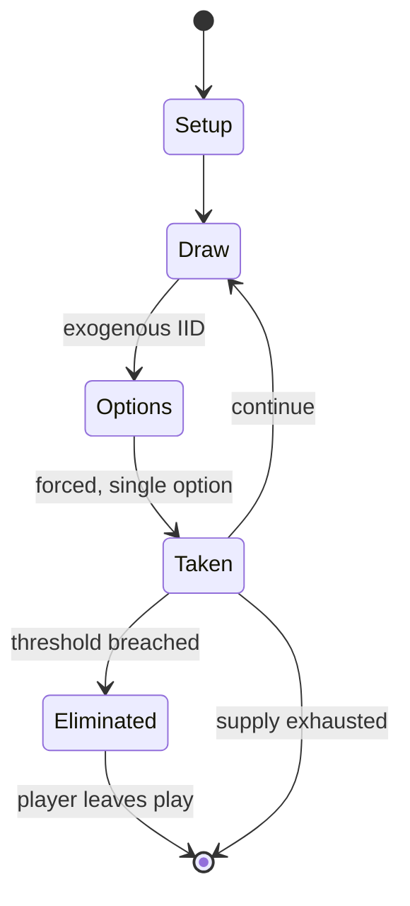

# Pop Goes the Weasel

*folk song*

`pop_goes_the_weasel` &nbsp; state: **DEEPENED** &nbsp; method: **heuristic**

## Found layer (recorded, not trusted)

| field | value |
| --- | --- |
| wikidata | Q7229002 |
| wikipedia | Pop Goes the Weasel |
| genres (source) | jig |
| instance of (source) | musical work/composition, singing game, type of dance |
| country of origin | United Kingdom of Great Britain and Ireland |

## Declared layer (orders bench work)

| field | value |
| --- | --- |
| year created | 1855 |
| epoch | INDUSTRIAL |
| region | EUROPE_WEST |
| media | - |
| players | -- |
| age band | CHILD |
| exogenous process | IID |
| loss shape | ELIMINATION |
| live axes | - |
| horizon | -- |
| scoring shape | -- |
| information | -- |
| interaction | COMPETITIVE |
| turn structure | -- |
| tractability | EXACT_WITH_CUT |
| randomness | SPINNER |
| luck factor | 0.42 |
| rules complexity | 2.4 |
| strategic depth | 2.5 |
| novelty | 0.6808 |
| solved status | -- |
| strategies | memory_recall, opponent_modelling |
| algorithms | -- |

## Object model

```
Episode
  players      : ?
  turn_structure: ?
  horizon       : ?
  scoring       : ?

State          -- opaque; no medium or axis evidence was found
Player         -- an agent that selects among legal successors
```

## State transition diagram



## Research item -- turn trace

```
# Pop Goes the Weasel -- simulated turn events
# generated from the DECLARED vector, not from a rulebook.
# structure: exo=IID loss=ELIMINATION horizon=None scoring=None axes=-

t=0    SETUP        players=2  pot=0  capacity=3
t=1    DRAW         p1 roll from d6 pool -> outcome #4  (p=0.296)
t=2    FORCED       p1 single legal option taken (pot_gain=+0.7)
t=3    DRAW         p1 roll from d6 pool -> outcome #5  (p=0.264)
t=4    FORCED       p1 single legal option taken (pot_gain=+1.4)
t=5    DRAW         p1 roll from d6 pool -> outcome #6  (p=0.049)
t=6    FORCED       p1 single legal option taken (pot_gain=+0.6)
t=7    DRAW         p1 roll from d6 pool -> outcome #1  (p=0.016)
t=8    FORCED       p1 single legal option taken (pot_gain=+1.1)
t=9    DRAW         p1 roll from d6 pool -> outcome #3  (p=0.050)
t=10   FORCED       p1 single legal option taken (pot_gain=+0.8)
t=11   DRAW         p1 roll from d6 pool -> outcome #2  (p=0.203)
t=12   FORCED       p1 single legal option taken (pot_gain=+1.1)
t=13   DRAW         p1 roll from d6 pool -> outcome #6  (p=0.013)
t=14   FORCED       p1 single legal option taken (pot_gain=+1.7)
t=15   ENDTURN      turn passes to p2
t=16   DRAW         p2 roll from d6 pool -> outcome #2  (p=0.175)
t=17   FORCED       p2 single legal option taken (pot_gain=+0.5)
t=18   DRAW         p2 roll from d6 pool -> outcome #3  (p=0.137)
t=19   FORCED       p2 single legal option taken (pot_gain=+1.1)
t=20   DRAW         p2 roll from d6 pool -> outcome #6  (p=0.044)
t=21   FORCED       p2 single legal option taken (pot_gain=+0.8)
t=22   DRAW         p2 roll from d6 pool -> outcome #1  (p=0.218)
t=23   FORCED       p2 single legal option taken (pot_gain=+1.0)
t=24   ENDTURN      turn passes to p1
t=25   DRAW         p1 roll from d6 pool -> outcome #1  (p=0.052)
t=26   FORCED       p1 single legal option taken (pot_gain=+0.9)

terminal: VARIABLE
```

## Conditions

| kind | threshold | effect | trigger |
| --- | --- | --- | --- |
| ELIMINATE | -- | eliminated | The player that fails to secure a ring is eliminated as a "weasel". |
| BOUNDARY | -- | -- | In 1856, a letter to The Morning Post read, "For many months, everybody has been bored to death with the eternal grinding of this ditty on street." Since at least the late 19th century, the nursery rhyme was used with a  |

## Source extract

"Pop! Goes the Weasel" (Roud 5249) is a traditional old English song, a country dance, nursery
rhyme, and singing game that emerged in the mid-19th century. The melody is often used in jack-
in-the-box toys and is frequently played by ice cream trucks.   == Origin == In the early 1850s,
Miller and Beacham of Baltimore published sheet music for "Pop goes the Weasel for Fun and
Frolic". This is the oldest known source that pairs the name to this tune. Miller and Beacham's
music was a variation of "The Haymakers", a tune dating back to the 1700s. Gow's Repository of
the Dance Music of Scotland (1799 to 1820), included "The Haymakers" as a country dance or jig.
One modern expert believes the tune, like most jigs, originated in the 1600s. In June 1852, the
boat Pop Goes The Weasel competed in the Durham Regatta. By December 1852, "Pop Goes The Weasel"
was a popular social dance in England. A ball held in Ipswich on 13 December 1852 ended with "a
country dance, entitled 'Pop Goes the Weasel', one of the most mirth inspiring dances which can
well be imagined." On 24 December 1852, an ad in the Birmingham Journal offered lessons in the
"Pop Goes The Weasel" dance, described as a "highly fas

<sub>Wikipedia, CC BY-SA. Retained as evidence for the structural
classification above. Every rule inferred from it is HYPOTHESIZED
until audited against a rulebook.</sub>
