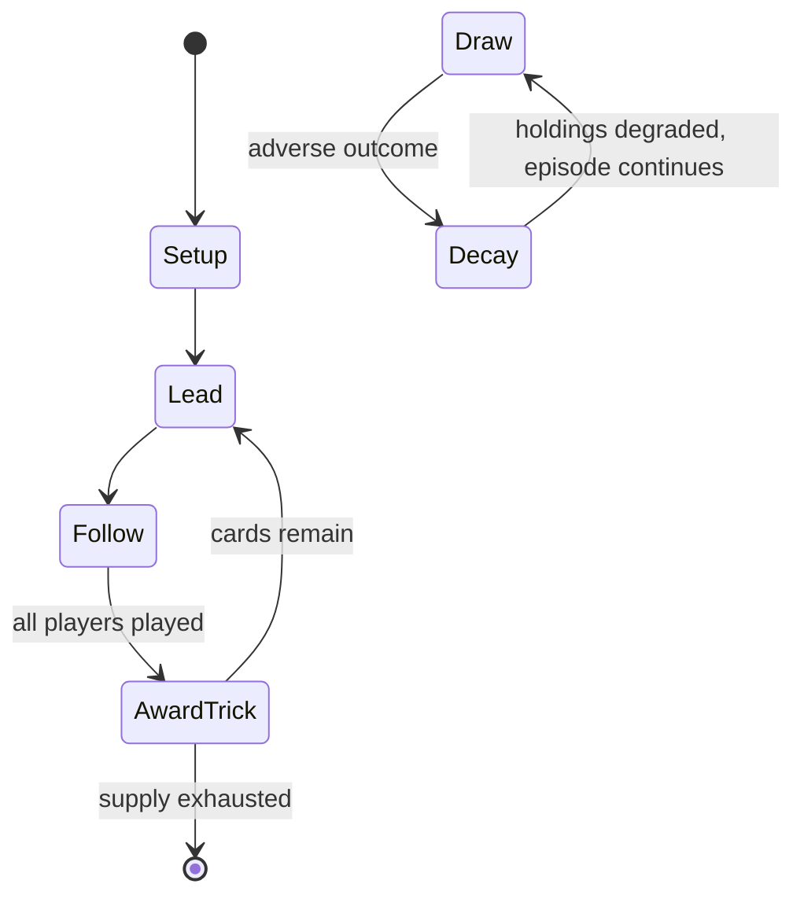

# Préférence

*trick-taking game from Central and Eastern Europe*

`pr_f_rence` &nbsp; state: **DEEPENED** &nbsp; method: **heuristic**

## Found layer (recorded, not trusted)

| field | value |
| --- | --- |
| wikidata | Q17116326 |
| wikipedia | Préférence |
| genres (source) | -- |
| instance of (source) | bidding-based game, card game, trick-taking game |
| country of origin | Austria |

## Declared layer (orders bench work)

| field | value |
| --- | --- |
| year created | -- |
| epoch | -- |
| region | EUROPE_WEST |
| media | TRICK_TAKING |
| players | -- |
| age band | -- |
| exogenous process | IID |
| loss shape | PARTIAL_DECAY |
| live axes | BID |
| horizon | -- |
| scoring shape | -- |
| information | -- |
| interaction | COOPERATIVE |
| turn structure | TRICK_ROUND |
| tractability | SAMPLING_ONLY |
| randomness | DECK_SHUFFLE, DICE |
| luck factor | 0.35 |
| rules complexity | 2.2 |
| strategic depth | 2.25 |
| novelty | 0.4732 |
| solved status | -- |
| strategies | spatial_packing |
| algorithms | -- |

## Object model

```
Episode
  players      : ?
  turn_structure: TRICK_ROUND
  horizon       : ?
  scoring       : ?

Trick          -- one card per player; a winner is determined
Trump          -- suit that dominates the ordering
Auction        -- priced competition resolving to one winner
```

## State transition diagram



## Research item -- turn trace

```
# Préférence -- simulated turn events
# generated from the DECLARED vector, not from a rulebook.
# structure: exo=IID loss=PARTIAL_DECAY horizon=None scoring=None axes=BID

t=0    SETUP        players=2  pot=0  capacity=7
t=1    DRAW         p1 roll from d6 pool -> outcome #2  (p=0.243)
t=2    FORCED       p1 single legal option taken (pot_gain=+0.7)
t=3    DRAW         p1 roll from d6 pool -> outcome #6  (p=0.010)
t=4    FORCED       p1 single legal option taken (pot_gain=+0.7)
t=5    BID          p1 sealed bid of 7 against 1 rivals
t=6    DRAW         p1 roll from d6 pool -> outcome #4  (p=0.049)
t=7    FORCED       p1 single legal option taken (pot_gain=+1.9)
t=8    DRAW         p1 roll from d6 pool -> outcome #1  (p=0.112)
t=9    FORCED       p1 single legal option taken (pot_gain=+1.4)
t=10   BID          p1 sealed bid of 6 against 1 rivals
t=11   ENDTURN      turn passes to p2
t=12   DRAW         p2 roll from d6 pool -> outcome #3  (p=0.247)
t=13   FORCED       p2 single legal option taken (pot_gain=+1.7)
t=14   BID          p2 sealed bid of 3 against 1 rivals
t=15   DRAW         p2 roll from d6 pool -> outcome #6  (p=0.256)
t=16   FORCED       p2 single legal option taken (pot_gain=+0.8)
t=17   DRAW         p2 roll from d6 pool -> outcome #5  (p=0.212)
t=18   FORCED       p2 single legal option taken (pot_gain=+1.3)
t=19   DRAW         p2 roll from d6 pool -> outcome #1  (p=0.294)
t=20   FORCED       p2 single legal option taken (pot_gain=+0.8)
t=21   DRAW         p2 roll from d6 pool -> outcome #2  (p=0.158)
t=22   FORCED       p2 single legal option taken (pot_gain=+0.8)
t=23   DRAW         p2 roll from d6 pool -> outcome #2  (p=0.130)
t=24   FORCED       p2 single legal option taken (pot_gain=+1.2)
t=25   ENDTURN      turn passes to p1
t=26   DRAW         p1 roll from d6 pool -> outcome #5  (p=0.077)
t=27   FORCED       p1 single legal option taken (pot_gain=+1.0)

terminal: VARIABLE
```

## Conditions

| kind | threshold | effect | trigger |
| --- | --- | --- | --- |
| BOUNDARY | 6 tricks | -- | There is then an auction in which players may bid to become the declarer who has the privilege of exchanging with the talon, announcing the trump suit and leading to the first trick, committing to take at least 6 tricks. |
| BOUNDARY | 2 tricks | -- | A player who plays on with the declarer must take at least 2 tricks to share the winnings. |
| BOUNDARY | 6 tricks | -- | If the declarer took at least 6 tricks, he won 10, 20, 30 or 40 kr from the pot depending on the suit played. |
| BOUNDARY | 2 tricks | -- | In any case, each defender who won at least two tricks receives 1 unit directly from the dealer. |
| BOUNDARY | 4 tricks | -- | All tricks won by either defender player count for the inviting player, who must win at least 4 tricks or pay 1 unit into the pot. |
| BOUNDARY | 2 tricks | -- | If neither defender invited the other, this applies to any defender who did not win at least 2 tricks, and if one defender invited the other and both defenders together did not win at least 4 tricks, it applies to the in |
| BOUNDARY | 5 tricks | -- | In this case the other defendant is considered invited (whether he or she dropped out or not), and the defenders must win at least 5 tricks together. |
| PENALTY | 6 tricks | -- | Although this is not stated in any of the rules, players must also agree on a penalty in case declarer wins less than 6 tricks. |
| BOUNDARY | -- | -- | Declarer then announces trump, whose value must be at least that of the bid. |
| BOUNDARY | -- | -- | Declarer announces any contract whose value is at least that of the bid. |
| PENALTY | -- | -- | Otherwise forehand says "pass again" (abermals weiter), whereupon the dealer must pick up the talon and either play or pass and pay a penalty called a bête (see below). |

## Source extract

Préférence, frequently spelt Preference, is a Central and Eastern European 10-card plain-trick
game with bidding, played by three players with a 32-card Piquet deck, and probably originating
in early 19th century Austria, becoming the second most popular game in Vienna by 1980. It also
took off in Russia where it was played by the higher echelons of society, the regional variant
known as Preferans being still very popular in that country, while other variants are played
from Lithuania to Greece.   == History == In spite of the game's French name and a number of
French terms, it has always been mostly unknown in France. A game of this name was already
mentioned as popular in Vienna in 1803, but Depaulis has found references as early as 1801 in
Bohemia and notes that it may even have been known in Russia before 1800. Nevertheless, the
earliest known description is in an 1829 Austrian game anthology, Préférence quickly became
popular in Imperial Russia as well. Via Yeralash, the suit order of Russian Preferans became the
suit order of Bridge whist, before it was changed for a new order, with Spades high like in
Contract Bridge. As of 1846, a German encyclopedia listed the games played

<sub>Wikipedia, CC BY-SA. Retained as evidence for the structural
classification above. Every rule inferred from it is HYPOTHESIZED
until audited against a rulebook.</sub>
