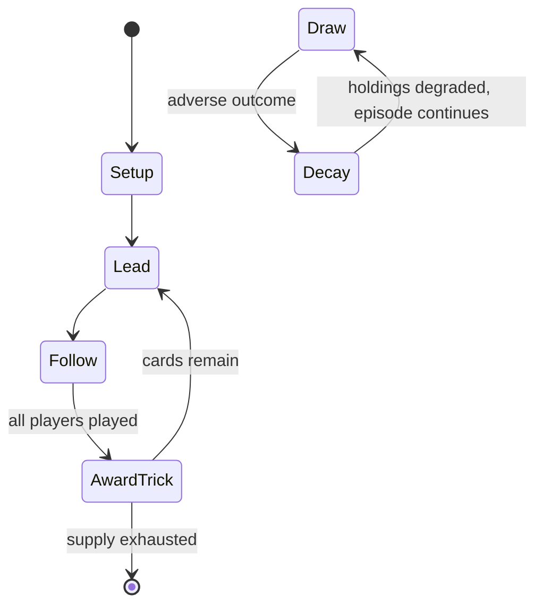

# Preferans

*trick-taking game*

`preferans` &nbsp; state: **DEEPENED** &nbsp; method: **heuristic**

## Found layer (recorded, not trusted)

| field | value |
| --- | --- |
| wikidata | Q1076377 |
| wikipedia | Preferans |
| genres (source) | -- |
| instance of (source) | trick-taking game |
| country of origin | Russian Empire |

## Declared layer (orders bench work)

| field | value |
| --- | --- |
| year created | -- |
| epoch | -- |
| region | EUROPE_EAST |
| media | CARD, TRICK_TAKING |
| players | 2-4 |
| age band | -- |
| exogenous process | -- |
| loss shape | PARTIAL_DECAY |
| live axes | BID |
| horizon | -- |
| scoring shape | NONLINEAR |
| information | -- |
| interaction | SOLITAIRE |
| turn structure | TRICK_ROUND |
| tractability | SAMPLING_ONLY |
| randomness | -- |
| luck factor | 0.35 |
| rules complexity | 2.33 |
| strategic depth | 2.0 |
| novelty | 0.6879 |
| solved status | -- |
| strategies | signalling |
| algorithms | -- |

## Object model

```
Episode
  players      : 2-4
  turn_structure: TRICK_ROUND
  horizon       : ?
  scoring       : NONLINEAR

Deck           -- ordered multiset, drawn without replacement
Hand           -- private multiset held by one player
DiscardPile    -- public accumulation of spent cards
Trick          -- one card per player; a winner is determined
Trump          -- suit that dominates the ordering
Auction        -- priced competition resolving to one winner
```

## State transition diagram



## Research item -- turn trace

```
# Preferans -- simulated turn events
# generated from the DECLARED vector, not from a rulebook.
# structure: exo=None loss=PARTIAL_DECAY horizon=None scoring=NONLINEAR axes=BID

t=0    SETUP        players=2  pot=0  capacity=5
t=1    FORCED       p1 single legal option taken (pot_gain=+0.7)
t=2    FORCED       p1 single legal option taken (pot_gain=+1.3)
t=3    FORCED       p1 single legal option taken (pot_gain=+1.9)
t=4    BID          p1 sealed bid of 3 against 1 rivals
t=5    FORCED       p1 single legal option taken (pot_gain=+0.8)
t=6    FORCED       p1 single legal option taken (pot_gain=+1.4)
t=7    ENDTURN      turn passes to p2
t=8    FORCED       p2 single legal option taken (pot_gain=+1.5)
t=9    FORCED       p2 single legal option taken (pot_gain=+1.3)
t=10   BID          p2 sealed bid of 3 against 1 rivals
t=11   FORCED       p2 single legal option taken (pot_gain=+1.5)
t=12   FORCED       p2 single legal option taken (pot_gain=+1.4)
t=13   BID          p2 sealed bid of 7 against 1 rivals
t=14   ENDTURN      turn passes to p1
t=15   FORCED       p1 single legal option taken (pot_gain=+1.2)
t=16   FORCED       p1 single legal option taken (pot_gain=+1.5)
t=17   BID          p1 sealed bid of 7 against 1 rivals
t=18   FORCED       p1 single legal option taken (pot_gain=+1.1)
t=19   FORCED       p1 single legal option taken (pot_gain=+1.4)
t=20   ENDTURN      turn passes to p2
t=21   FORCED       p2 single legal option taken (pot_gain=+1.0)
t=22   BID          p2 sealed bid of 5 against 1 rivals
t=23   ENDTURN      turn passes to p1
t=24   FORCED       p1 single legal option taken (pot_gain=+1.6)
t=25   BID          p1 sealed bid of 3 against 1 rivals
t=26   FORCED       p1 single legal option taken (pot_gain=+1.1)

terminal: VARIABLE
```

## Conditions

| kind | threshold | effect | trigger |
| --- | --- | --- | --- |
| BOUNDARY | 6 tricks | -- | In both situations, the lead player MUST take at least 6 tricks to pass, while other players try to take as much as they can, except in a "bettler" game, where the lead player must not take any tricks; bettler is German  |
| TERMINATE | -- | -- | If this is not possible because all players have reached the target score (and the game is over), the player reduces their dump accordingly to make sure that the pool points can be ignored in the final reckoning. |
| TERMINATE | -- | -- | When the game is over, each player's score consists of the whist points in the player's whist point area, minus the whist points that other players have written for that player, minus 10 times the number in the player's  |
| BOUNDARY | -- | -- | Unless the declarer's bid was misère, the declarer then declares any contract that ranks at least as high as the highest bid. |
| BOUNDARY | -- | -- | In trick-play, the declarer must win at least the number of tricks indicated in the contract. |
| PENALTY | -- | -- | However, there are significant penalties for the whister(s) if the defenders fail to win enough tricks. |
| PENALTY | -- | -- | If this happens when there are two whisters, then the penalty is distributed fairly among them according to the principle that each whister is only responsible for their own undertricks with respect to half the required  |
| PENALTY | -- | -- | Dump points are used for keeping track of the penalties that declarers or whisters have to pay for not winning the required number of tricks. |
| PENALTY | -- | -- | It differs from Sochi scoring in that the dump penalties for whisters in case the defenders do not win enough tricks are halved. |

## Source extract

Preferans (Russian: преферанс, IPA: [prʲɪfʲɪˈrans]) or Russian Preference is a 10-card plain-
trick game with bidding, played by three or four players with a 32-card Piquet deck. It is a
sophisticated variant of the Austrian game Préférence, which in turn descends from Spanish Ombre
and French Boston. It is renowned in the card game world for its many complicated rules and
insistence on strategical approaches. Popular in Russia since approximately the 1830s, Preferans
quickly became the country's national card game. Although superseded in this role by Durak, it
is still one of the most popular games in Russia. Similar games are played in various other
European countries, from Lithuania to Greece, where an earlier form of Russian Preferans is
known as Prefa (Greek: Πρέφα). Compared to Austrian Préférence, Russian Preferans and Greek
Prefa are distinguished by the greater number of possible contracts, which allows for almost any
combination of trumps and numbers of tricks. Another distinguishing feature is the relatively
independent roles played by the opponents of the soloist.   == Overview == Preferans is played
by three active players with a French-suited 32-card piquet deck. Aces

<sub>Wikipedia, CC BY-SA. Retained as evidence for the structural
classification above. Every rule inferred from it is HYPOTHESIZED
until audited against a rulebook.</sub>
