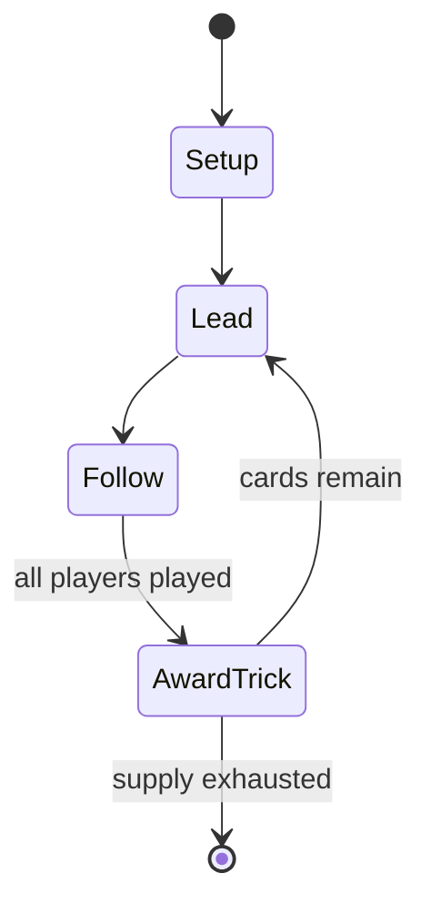

# Priffe

*Swedish card game*

`priffe` &nbsp; state: **DEEPENED** &nbsp; method: **heuristic**

## Found layer (recorded, not trusted)

| field | value |
| --- | --- |
| wikidata | Q10638731 |
| wikipedia | Priffe |
| genres (source) | -- |
| instance of (source) | card game |
| country of origin | -- |

## Declared layer (orders bench work)

| field | value |
| --- | --- |
| year created | -- |
| epoch | -- |
| region | -- |
| media | CARD, TRICK_TAKING |
| players | 4 |
| age band | -- |
| exogenous process | -- |
| loss shape | -- |
| live axes | BID |
| horizon | -- |
| scoring shape | -- |
| information | -- |
| interaction | TEAM |
| turn structure | TRICK_ROUND |
| tractability | SAMPLING_ONLY |
| randomness | -- |
| luck factor | -- |
| rules complexity | 2.06 |
| strategic depth | 2.0 |
| novelty | 0.6368 |
| solved status | -- |
| strategies | -- |
| algorithms | -- |

## Object model

```
Episode
  players      : 4
  turn_structure: TRICK_ROUND
  horizon       : ?
  scoring       : ?

Deck           -- ordered multiset, drawn without replacement
Hand           -- private multiset held by one player
DiscardPile    -- public accumulation of spent cards
Trick          -- one card per player; a winner is determined
Trump          -- suit that dominates the ordering
Auction        -- priced competition resolving to one winner
```

## State transition diagram



## Research item -- turn trace

```
# Priffe -- simulated turn events
# generated from the DECLARED vector, not from a rulebook.
# structure: exo=None loss=None horizon=None scoring=None axes=BID

t=0    SETUP        players=4  pot=0  capacity=8
t=1    FORCED       p1 single legal option taken (pot_gain=+0.9)
t=2    ENDTURN      turn passes to p2
t=3    FORCED       p2 single legal option taken (pot_gain=+1.9)
t=4    FORCED       p2 single legal option taken (pot_gain=+1.7)
t=5    FORCED       p2 single legal option taken (pot_gain=+1.5)
t=6    FORCED       p2 single legal option taken (pot_gain=+0.6)
t=7    ENDTURN      turn passes to p3
t=8    FORCED       p3 single legal option taken (pot_gain=+1.3)
t=9    BID          p3 sealed bid of 7 against 3 rivals
t=10   ENDTURN      turn passes to p4
t=11   FORCED       p4 single legal option taken (pot_gain=+0.6)
t=12   FORCED       p4 single legal option taken (pot_gain=+1.8)
t=13   ENDTURN      turn passes to p1
t=14   FORCED       p1 single legal option taken (pot_gain=+1.1)
t=15   FORCED       p1 single legal option taken (pot_gain=+1.7)
t=16   FORCED       p1 single legal option taken (pot_gain=+1.3)
t=17   BID          p1 sealed bid of 8 against 3 rivals
t=18   FORCED       p1 single legal option taken (pot_gain=+0.8)
t=19   BID          p1 sealed bid of 5 against 3 rivals
t=20   FORCED       p1 single legal option taken (pot_gain=+1.3)
t=21   BID          p1 sealed bid of 1 against 3 rivals
t=22   FORCED       p1 single legal option taken (pot_gain=+1.6)
t=23   FORCED       p1 single legal option taken (pot_gain=+0.9)
t=24   BID          p1 sealed bid of 7 against 3 rivals
t=25   ENDTURN      turn passes to p2
t=26   FORCED       p2 single legal option taken (pot_gain=+1.0)

terminal: VARIABLE
```

## Source extract

Priffe  or Preference is a classic Swedish trick-taking card game for four players who form two
teams of two. It is an elaboration of Whist that involves bidding, but this is a different form
from that in American Bid Whist. Together with Vira, Priffe was one of the most common card
games in Sweden until superseded by Bridge.   == Rules ==   === Object === The aim of each team
is to win as many tricks as possible in a trump or suit game. In the misère contract, called
Noll, the goal is to take as few tricks as possible.   === Deal === Players draw lots (e.g. by
cutting the pack). The one who draws the highest card selects seat and becomes dealer. The
player with the second highest card takes the opposite seat. The player with the third highest
card selects one of the two remaining seats, and the player with the lowest card takes the
remaining seat. The player to the left of the dealer is forehand. The players sitting opposite
one another are partners and compete against the other pair. In a classic game of Priffe, the
players rotate so that everyone partners everyone else. In this way, an individual winner can
finally be selected. A hand begins with all cards being dealt so that th

<sub>Wikipedia, CC BY-SA. Retained as evidence for the structural
classification above. Every rule inferred from it is HYPOTHESIZED
until audited against a rulebook.</sub>
