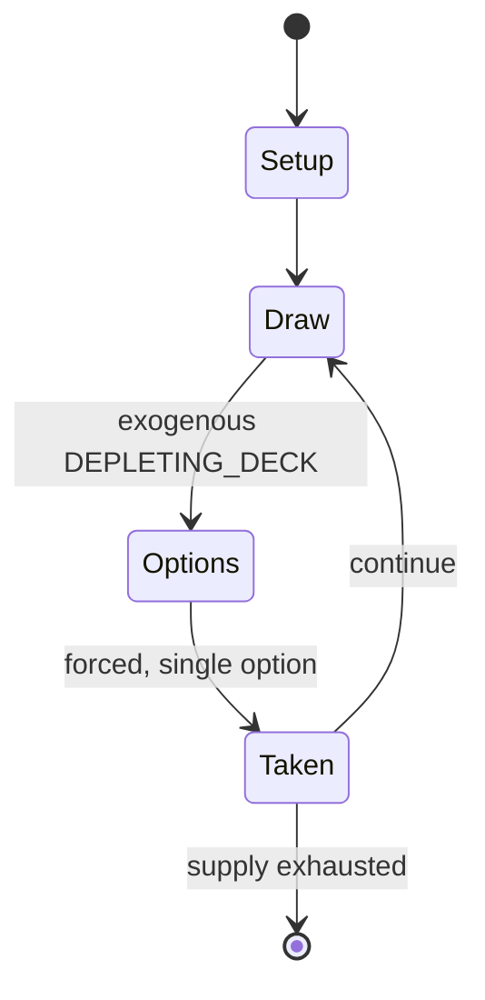

# Professional eater

*card game*

`professional_eater` &nbsp; state: **DEEPENED** &nbsp; method: **heuristic**

## Found layer (recorded, not trusted)

| field | value |
| --- | --- |
| wikidata | Q1004599 |
| wikipedia | Cheat (game) |
| genres (source) | -- |
| instance of (source) | card game |
| country of origin | -- |

## Declared layer (orders bench work)

| field | value |
| --- | --- |
| year created | -- |
| epoch | -- |
| region | -- |
| media | CARD |
| players | -- |
| age band | -- |
| exogenous process | DEPLETING_DECK |
| loss shape | -- |
| live axes | BLUFF, DISCARD |
| horizon | VARIABLE |
| scoring shape | -- |
| information | -- |
| interaction | SOLITAIRE |
| turn structure | -- |
| tractability | EXACT_WITH_CUT |
| randomness | DECK_SHUFFLE, HIDDEN_INFO |
| luck factor | 0.53 |
| rules complexity | 2.38 |
| strategic depth | 2.2 |
| novelty | 0.7399 |
| solved status | -- |
| strategies | spatial_packing |
| algorithms | -- |

## Object model

```
Episode
  players      : ?
  turn_structure: ?
  horizon       : VARIABLE
  scoring       : ?

Deck           -- ordered multiset, drawn without replacement
Hand           -- private multiset held by one player
DiscardPile    -- public accumulation of spent cards
Belief         -- what an observer is induced to think is true
DiscardChoice  -- what is given up to satisfy a limit
```

## State transition diagram



## Research item -- turn trace

```
# Professional eater -- simulated turn events
# generated from the DECLARED vector, not from a rulebook.
# structure: exo=DEPLETING_DECK loss=None horizon=VARIABLE scoring=None axes=BLUFF,DISCARD

t=0    SETUP        players=2  pot=0  capacity=3
t=1    DRAW         p1 draw from deck -> outcome #2  (p=0.087)
t=2    FORCED       p1 single legal option taken (pot_gain=+2.0)
t=3    DISCARD      p1 discards to hand limit
t=4    BLUFF        p1 represents a holding it does not have
t=5    ENDTURN      turn passes to p2
t=6    DRAW         p2 draw from deck -> outcome #6  (p=0.238)
t=7    FORCED       p2 single legal option taken (pot_gain=+0.8)
t=8    DISCARD      p2 discards to hand limit
t=9    DRAW         p2 draw from deck -> outcome #3  (p=0.024)
t=10   FORCED       p2 single legal option taken (pot_gain=+0.9)
t=11   BLUFF        p2 represents a holding it does not have
t=12   DRAW         p2 draw from deck -> outcome #2  (p=0.036)
t=13   FORCED       p2 single legal option taken (pot_gain=+1.1)
t=14   DISCARD      p2 discards to hand limit
t=15   DRAW         p2 draw from deck -> outcome #1  (p=0.282)
t=16   FORCED       p2 single legal option taken (pot_gain=+1.6)
t=17   DRAW         p2 draw from deck -> outcome #3  (p=0.117)
t=18   FORCED       p2 single legal option taken (pot_gain=+0.5)
t=19   DISCARD      p2 discards to hand limit
t=20   DRAW         p2 draw from deck -> outcome #4  (p=0.253)
t=21   FORCED       p2 single legal option taken (pot_gain=+1.8)
t=22   DISCARD      p2 discards to hand limit
t=23   ENDTURN      turn passes to p1
t=24   DRAW         p1 draw from deck -> outcome #6  (p=0.109)
t=25   FORCED       p1 single legal option taken (pot_gain=+0.8)
t=26   DISCARD      p1 discards to hand limit
t=27   BLUFF        p1 represents a holding it does not have
t=28   ENDTURN      turn passes to p2

terminal: VARIABLE
```

## Conditions

| kind | threshold | effect | trigger |
| --- | --- | --- | --- |
| ELIMINATE | 2 players | -- | Play continues until there are only two players (at which point some cards have probably been removed from the game). |
| TERMINATE | 1 player | -- | The game ends when one player runs out of cards, at which point that player wins. |
| ELIMINATE | -- | -- | If all players pass consecutively, then the face-down stack of played cards is taken out of the game until the next bluff is called. |
| LOSE | -- | -- | If a player fails to do this and later leads a round with this rank, they automatically lose the game. |
| BOUNDARY | -- | -- | Similar to Russian Bluff, it is a version used by at least some in Canada and known in Spain. |
| PENALTY | -- | -- | The loser is usually penalised by the winners either in having the dishonour of losing, or having to perform a forfeit. |

## Source extract

Cheat (Britain), also known as Bullshit (United States) or I Doubt It, is a card game where the
players aim to get rid of all of their cards. It is a game of deception, with cards being played
face-down and players being permitted (and often required) to lie about the cards they have
played. A challenge is usually made by players calling out the name of the game, and the loser
of a challenge has to pick up every card played so far. Cheat is classed as a party game. As
with many card games, cheat has an oral tradition and so people are taught the game under
different names.   == Rules == One pack of 52 cards is used for four or fewer players; games
with five or more players generally combine two 52-card packs. The cards are shuffled and dealt
as evenly as possible among the players, with no cards left. Depending on the number of players,
some may end up with one card more or less than the others. Players may look at their hands. The
player who sits to the dealer's left (clockwise) usually takes the first turn and calls aces.
The second player does the same and calls twos. Play continues like this, increasing rank each
time, with aces following kings. As players call the rank, they d

<sub>Wikipedia, CC BY-SA. Retained as evidence for the structural
classification above. Every rule inferred from it is HYPOTHESIZED
until audited against a rulebook.</sub>
