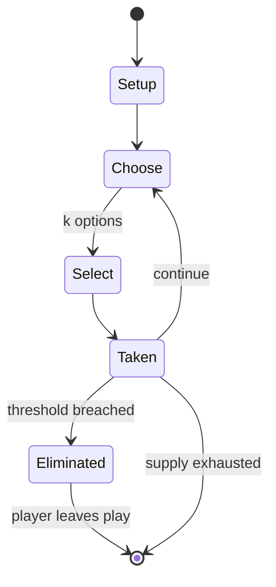

# Puerto Rico

*2002 board game*

`puerto_rico` &nbsp; state: **DEEPENED** &nbsp; method: **heuristic**

## Found layer (recorded, not trusted)

| field | value |
| --- | --- |
| wikidata | Q1457040 |
| wikipedia | Puerto Rico (board game) |
| genres (source) | -- |
| instance of (source) | German-style board game, board game |
| country of origin | Germany |

## Declared layer (orders bench work)

| field | value |
| --- | --- |
| year created | 2002 |
| epoch | CONTEMPORARY |
| region | EUROPE_WEST |
| media | BOARD, CARD, DEXTERITY |
| players | 3-5 |
| age band | -- |
| exogenous process | -- |
| loss shape | ELIMINATION |
| live axes | ORDER, SELECT, TRADE |
| horizon | -- |
| scoring shape | LINEAR_ACCUMULATION |
| information | ASYMMETRIC |
| interaction | NEGOTIATION |
| turn structure | PHASE_STRUCTURED |
| tractability | INTRACTABLE |
| randomness | HIDDEN_INFO |
| luck factor | 0.35 |
| rules complexity | 4.9 |
| strategic depth | 2.0 |
| novelty | 0.9492 |
| solved status | -- |
| strategies | -- |
| algorithms | -- |

## Object model

```
Episode
  players      : 3-5
  turn_structure: PHASE_STRUCTURED
  horizon       : ?
  scoring       : LINEAR_ACCUMULATION

Board          -- spatial substrate; cells carry position and occupancy
Piece          -- movable token owned by a player
Deck           -- ordered multiset, drawn without replacement
Hand           -- private multiset held by one player
DiscardPile    -- public accumulation of spent cards
Sequence       -- the permutation under the player's control
OptionSet      -- the choices available after an exogenous draw
Offer          -- proposed exchange between two agents
```

## State transition diagram



## Research item -- turn trace

```
# Puerto Rico -- simulated turn events
# generated from the DECLARED vector, not from a rulebook.
# structure: exo=None loss=ELIMINATION horizon=None scoring=LINEAR_ACCUMULATION axes=ORDER,SELECT,TRADE

t=0    SETUP        players=3  pot=0  capacity=3
t=1    SELECT       p1 3 options; take #1  (pot_gain=+1.3, capacity=-0)
t=2    TRADE        p1 offers 2:1 exchange to p2
t=3    SELECT       p1 2 options; take #2  (pot_gain=+2.8, capacity=-1)
t=4    TRADE        p1 offers 2:1 exchange to p2
t=5    SELECT       p1 2 options; take #1  (pot_gain=+1.2, capacity=-0)
t=6    SELECT       p1 2 options; take #2  (pot_gain=+3.0, capacity=-0)
t=7    TRADE        p1 offers 2:1 exchange to p2
t=8    ENDTURN      turn passes to p2
t=9    SELECT       p2 4 options; take #3  (pot_gain=+0.9, capacity=-1)
t=10   TRADE        p2 offers 2:1 exchange to p3
t=11   ENDTURN      turn passes to p3
t=12   SELECT       p3 2 options; take #1  (pot_gain=+0.6, capacity=-2)
t=13   TRADE        p3 offers 2:1 exchange to p1
t=14   SELECT       p3 2 options; take #1  (pot_gain=+3.0, capacity=-1)
t=15   SELECT       p3 1 options; take #1  (pot_gain=+2.8, capacity=-0)
t=16   SELECT       p3 4 options; take #3  (pot_gain=+2.6, capacity=-0)
t=17   TRADE        p3 offers 2:1 exchange to p1
t=18   ENDTURN      turn passes to p1
t=19   SELECT       p1 1 options; take #1  (pot_gain=+1.1, capacity=-0)
t=20   TRADE        p1 offers 2:1 exchange to p2
t=21   SELECT       p1 3 options; take #1  (pot_gain=+2.8, capacity=-1)
t=22   TRADE        p1 offers 2:1 exchange to p2
t=23   ENDTURN      turn passes to p2
t=24   SELECT       p2 3 options; take #3  (pot_gain=+1.6, capacity=-1)
t=25   SELECT       p2 2 options; take #2  (pot_gain=+0.9, capacity=-1)
t=26   SELECT       p2 1 options; take #1  (pot_gain=+2.8, capacity=-0)

terminal: VARIABLE
```

## Conditions

| kind | threshold | effect | trigger |
| --- | --- | --- | --- |
| TERMINATE | -- | -- | In each case, players finish the current round before the game ends. |
| BOUNDARY | -- | -- | The player who selected Craftsman may produce one additional good of their choosing, provided that they were able to produce at least one of that type. |
| BOUNDARY | -- | -- | The player who selected Captain gains one additional victory point, provided they were able to ship at least one good. |

## Source extract

Puerto Rico is a Euro-style board game designed by German designer Andreas Seyfarth and
published in 2002 in a German-language  edition by Alea.  Players assume the roles of colonial
governors on the island of Puerto Rico during the age of Caribbean ascendancy. Puerto Rico was
the highest-rated game on the board game website BoardGameGeek for over five years, until it was
surpassed by Agricola. The aim of the game is to amass victory points in two ways: by exporting
goods and by constructing buildings. Puerto Rico can be played by three, four or five players,
although an official two-player variant also exists. There is an official expansion released in
2004, which adds new buildings with different abilities that can replace or be used alongside
those in the original game. A second, smaller expansion became available in 2009. Additionally,
changes to the rules have been suggested that serve to balance the game.   == Gameplay == Each
player uses a separate small board with spaces for city buildings, plantations, and resources.
Shared between the players are three ships, a trading house, and a supply of resources and
doubloons (money). The resource cycle of the game is that players g

<sub>Wikipedia, CC BY-SA. Retained as evidence for the structural
classification above. Every rule inferred from it is HYPOTHESIZED
until audited against a rulebook.</sub>
