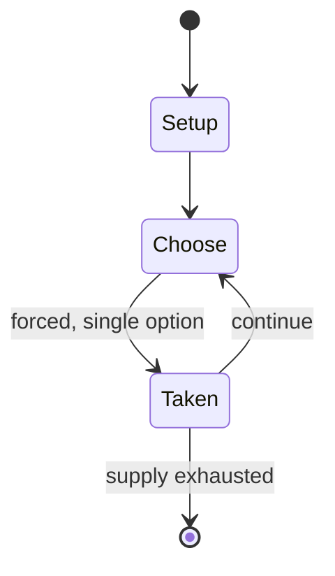

# Quacks & Co.: Quedlinburg Dash

`quacks_co_quedlinburg_dash` &nbsp; state: **DEEPENED** &nbsp; method: **heuristic**

## Found layer (recorded, not trusted)

| field | value |
| --- | --- |
| wikidata | Q112660083 |
| wikipedia | Quacks & Co.: Quedlinburg Dash |
| genres (source) | -- |
| instance of (source) | -- |
| country of origin | -- |

## Declared layer (orders bench work)

| field | value |
| --- | --- |
| year created | 2022 |
| epoch | CONTEMPORARY |
| region | -- |
| media | BOARD |
| players | -- |
| age band | -- |
| exogenous process | -- |
| loss shape | -- |
| live axes | - |
| horizon | -- |
| scoring shape | RACE_POSITION |
| information | -- |
| interaction | -- |
| turn structure | STRICT_TURN |
| tractability | SAMPLING_ONLY |
| randomness | TILE_BAG |
| luck factor | 0.42 |
| rules complexity | 1.78 |
| strategic depth | 2.25 |
| novelty | 0.5743 |
| solved status | -- |
| strategies | set_collection |
| algorithms | -- |

## Object model

```
Episode
  players      : ?
  turn_structure: STRICT_TURN
  horizon       : ?
  scoring       : RACE_POSITION

Board          -- spatial substrate; cells carry position and occupancy
Piece          -- movable token owned by a player
```

## State transition diagram



## Research item -- turn trace

```
# Quacks & Co.: Quedlinburg Dash -- simulated turn events
# generated from the DECLARED vector, not from a rulebook.
# structure: exo=None loss=None horizon=None scoring=RACE_POSITION axes=-

t=0    SETUP        players=2  pot=0  capacity=6
t=1    FORCED       p1 single legal option taken (pot_gain=+0.9)
t=2    FORCED       p1 single legal option taken (pot_gain=+1.5)
t=3    FORCED       p1 single legal option taken (pot_gain=+1.0)
t=4    ENDTURN      turn passes to p2
t=5    FORCED       p2 single legal option taken (pot_gain=+1.4)
t=6    ENDTURN      turn passes to p1
t=7    FORCED       p1 single legal option taken (pot_gain=+1.4)
t=8    FORCED       p1 single legal option taken (pot_gain=+1.7)
t=9    ENDTURN      turn passes to p2
t=10   FORCED       p2 single legal option taken (pot_gain=+1.6)
t=11   FORCED       p2 single legal option taken (pot_gain=+0.9)
t=12   ENDTURN      turn passes to p1
t=13   FORCED       p1 single legal option taken (pot_gain=+2.0)
t=14   FORCED       p1 single legal option taken (pot_gain=+1.1)
t=15   FORCED       p1 single legal option taken (pot_gain=+1.2)
t=16   ENDTURN      turn passes to p2
t=17   FORCED       p2 single legal option taken (pot_gain=+1.2)
t=18   ENDTURN      turn passes to p1
t=19   FORCED       p1 single legal option taken (pot_gain=+1.0)
t=20   ENDTURN      turn passes to p2
t=21   FORCED       p2 single legal option taken (pot_gain=+1.3)
t=22   FORCED       p2 single legal option taken (pot_gain=+1.5)
t=23   ENDTURN      turn passes to p1
t=24   FORCED       p1 single legal option taken (pot_gain=+1.1)
t=25   FORCED       p1 single legal option taken (pot_gain=+0.6)
t=26   FORCED       p1 single legal option taken (pot_gain=+0.7)

terminal: VARIABLE
```

## Source extract

Quacks & Co.: Quedlinburg Dash, also known as Quacks & Co., is a German children's racing game
designed by Wolfgang Warsch and first published by Schmidt Spiele in 2022. It is a spin-off of
the game The Quacks of Quedlinburg. Players take turns drawing coloured chips from a bag in
order to move their animal along a racetrack and be the first to make it to Quedlinburg.   ==
Gameplay == Quacks & Co. is played using a game board with a short race track on one side and a
long racetrack on the other. Each player begins the game with an animal token (donkey, sheep,
pig, or cow) at the start of the track and the corresponding animal card, as well as a cloth
feeding bag with an identical set of chips. A set of action cards are placed in the centre of
the play area so they are visible to all players. On a player's turn, they randomly draw a
chip–which can be either a food chip (red, yellow, green, blue, and white) or a black "dream
weed" chip–from their bag and "feed" it to their animal. If a player draws a food chip, they
move their animal token the number of spaces listed on the chip and take the action on the
corresponding action card; some of the food tokens allows the player take a rub

<sub>Wikipedia, CC BY-SA. Retained as evidence for the structural
classification above. Every rule inferred from it is HYPOTHESIZED
until audited against a rulebook.</sub>
