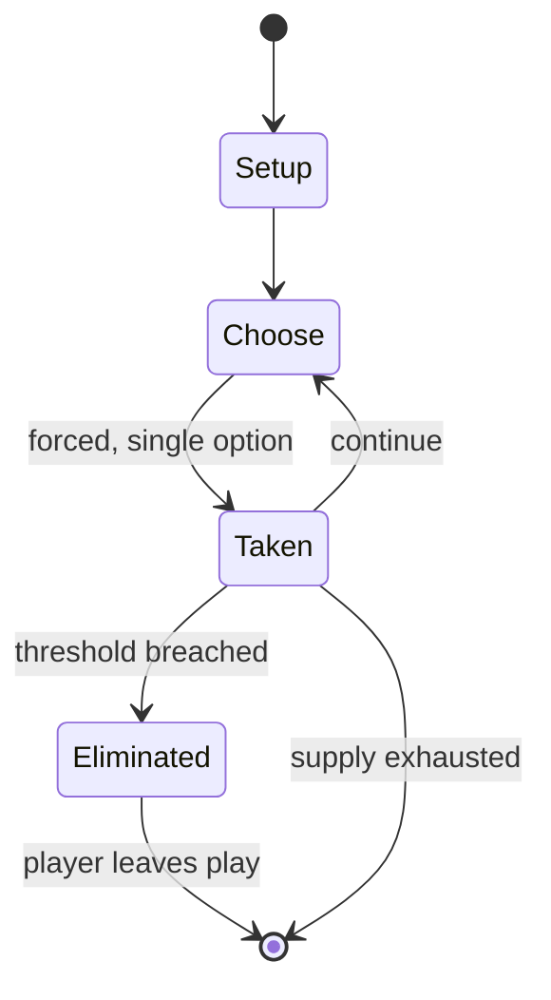

# Quiet game

*children's "game" where children must stay quiet and still, on fear of punishment*

`quiet_game` &nbsp; state: **DEEPENED** &nbsp; method: **heuristic**

## Found layer (recorded, not trusted)

| field | value |
| --- | --- |
| wikidata | Q10707856 |
| wikipedia | Quiet game |
| genres (source) | -- |
| instance of (source) | children's game |
| country of origin | -- |

## Declared layer (orders bench work)

| field | value |
| --- | --- |
| year created | -- |
| epoch | -- |
| region | -- |
| media | - |
| players | -- |
| age band | CHILD |
| exogenous process | -- |
| loss shape | ELIMINATION |
| live axes | - |
| horizon | -- |
| scoring shape | -- |
| information | -- |
| interaction | -- |
| turn structure | -- |
| tractability | SAMPLING_ONLY |
| randomness | -- |
| luck factor | 0.35 |
| rules complexity | 1.72 |
| strategic depth | 2.0 |
| novelty | 0.4408 |
| solved status | -- |
| strategies | -- |
| algorithms | -- |

## Object model

```
Episode
  players      : ?
  turn_structure: ?
  horizon       : ?
  scoring       : ?

State          -- opaque; no medium or axis evidence was found
Player         -- an agent that selects among legal successors
```

## State transition diagram



## Research item -- turn trace

```
# Quiet game -- simulated turn events
# generated from the DECLARED vector, not from a rulebook.
# structure: exo=None loss=ELIMINATION horizon=None scoring=None axes=-

t=0    SETUP        players=2  pot=0  capacity=5
t=1    FORCED       p1 single legal option taken (pot_gain=+1.9)
t=2    FORCED       p1 single legal option taken (pot_gain=+1.0)
t=3    ENDTURN      turn passes to p2
t=4    FORCED       p2 single legal option taken (pot_gain=+0.5)
t=5    FORCED       p2 single legal option taken (pot_gain=+1.8)
t=6    FORCED       p2 single legal option taken (pot_gain=+1.9)
t=7    FORCED       p2 single legal option taken (pot_gain=+1.4)
t=8    FORCED       p2 single legal option taken (pot_gain=+0.6)
t=9    FORCED       p2 single legal option taken (pot_gain=+1.6)
t=10   FORCED       p2 single legal option taken (pot_gain=+1.7)
t=11   ENDTURN      turn passes to p1
t=12   FORCED       p1 single legal option taken (pot_gain=+1.1)
t=13   FORCED       p1 single legal option taken (pot_gain=+0.7)
t=14   FORCED       p1 single legal option taken (pot_gain=+1.7)
t=15   FORCED       p1 single legal option taken (pot_gain=+1.0)
t=16   FORCED       p1 single legal option taken (pot_gain=+0.7)
t=17   FORCED       p1 single legal option taken (pot_gain=+1.2)
t=18   ENDTURN      turn passes to p2
t=19   FORCED       p2 single legal option taken (pot_gain=+1.0)
t=20   ENDTURN      turn passes to p1
t=21   FORCED       p1 single legal option taken (pot_gain=+0.9)
t=22   ENDTURN      turn passes to p2
t=23   FORCED       p2 single legal option taken (pot_gain=+1.8)
t=24   ENDTURN      turn passes to p1
t=25   FORCED       p1 single legal option taken (pot_gain=+1.0)
t=26   FORCED       p1 single legal option taken (pot_gain=+1.8)

terminal: VARIABLE
```

## Conditions

| kind | threshold | effect | trigger |
| --- | --- | --- | --- |
| WIN | -- | -- | The last child or team to make noise wins the game. |
| PENALTY | -- | -- | If you show your teeth or tongue, you must pay a forfeit." In Ireland, a similar game is called "Silence in the Courtyard", opened with the rhyme "Silence in the courtyard, silence in the street, the biggest fool in Irel |

## Source extract

The quiet game is a children's game where children must stay quiet. Stillness is sometimes a
rule but in most cases not.  The last child or team to make noise wins the game. It is usually
acceptable for players to make sounds they cannot control, such as sneezing or coughing whereas
talking would cause a player to get out. The game is often played indoors, typically in
classrooms. It can also be played outdoors, for instance, at summer camps. One application of
the game is for parents to keep their loud children quiet for a long journey.  There are many
versions of this game, which all follow the same general rules: one who talks is immediately
eliminated, eventually isolating the winner at the end. Sometimes played by only excluding
verbal language rather than all sounds.  The children's game quaker meeting is a version of the
game that starts with a spoken rhyme such as "Quaker meeting has begun; No more laughing, no
more fun. If you show your teeth or tongue, you must pay a forfeit." In Ireland, a similar game
is called "Silence in the Courtyard", opened with the rhyme "Silence in the courtyard, silence
in the street, the biggest fool in Ireland is just about to speak. No laughi

<sub>Wikipedia, CC BY-SA. Retained as evidence for the structural
classification above. Every rule inferred from it is HYPOTHESIZED
until audited against a rulebook.</sub>
