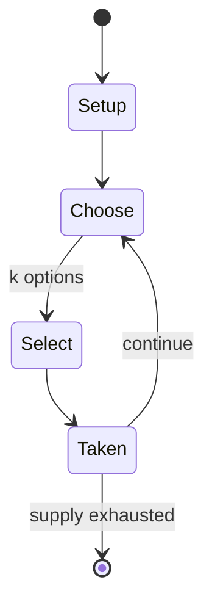

# QuizUp

*2014 video game*

`quizup` &nbsp; state: **DEEPENED** &nbsp; method: **heuristic**

## Found layer (recorded, not trusted)

| field | value |
| --- | --- |
| wikidata | Q16927767 |
| wikipedia | QuizUp |
| genres (source) | puzzle video game, quiz video game |
| instance of (source) | video game |
| country of origin | Iceland |

## Declared layer (orders bench work)

| field | value |
| --- | --- |
| year created | 2013 |
| epoch | CONTEMPORARY |
| region | EUROPE_NORTH |
| media | VIDEO |
| players | -- |
| age band | -- |
| exogenous process | -- |
| loss shape | -- |
| live axes | SELECT |
| horizon | -- |
| scoring shape | LINEAR_ACCUMULATION |
| information | -- |
| interaction | COMPETITIVE |
| turn structure | -- |
| tractability | SAMPLING_ONLY |
| randomness | -- |
| luck factor | 0.35 |
| rules complexity | 2.1 |
| strategic depth | 2.0 |
| novelty | 0.5345 |
| solved status | -- |
| strategies | -- |
| algorithms | -- |

## Object model

```
Episode
  players      : ?
  turn_structure: ?
  horizon       : ?
  scoring       : LINEAR_ACCUMULATION

WorldState     -- simulation state advanced by the engine
Avatar         -- player-controlled agent
Clock          -- frame or tick counter
OptionSet      -- the choices available after an exogenous draw
```

## State transition diagram



## Research item -- turn trace

```
# QuizUp -- simulated turn events
# generated from the DECLARED vector, not from a rulebook.
# structure: exo=None loss=None horizon=None scoring=LINEAR_ACCUMULATION axes=SELECT

t=0    SETUP        players=2  pot=0  capacity=8
t=1    SELECT       p1 2 options; take #1  (pot_gain=+2.6, capacity=-0)
t=2    SELECT       p1 1 options; take #1  (pot_gain=+3.3, capacity=-0)
t=3    ENDTURN      turn passes to p2
t=4    SELECT       p2 3 options; take #1  (pot_gain=+0.9, capacity=-1)
t=5    SELECT       p2 4 options; take #2  (pot_gain=+1.6, capacity=-1)
t=6    SELECT       p2 4 options; take #3  (pot_gain=+2.8, capacity=-2)
t=7    SELECT       p2 4 options; take #1  (pot_gain=+1.7, capacity=-2)
t=8    SELECT       p2 2 options; take #2  (pot_gain=+1.9, capacity=-2)
t=9    SELECT       p2 2 options; take #2  (pot_gain=+0.9, capacity=-1)
t=10   SELECT       p2 4 options; take #4  (pot_gain=+3.0, capacity=-0)
t=11   ENDTURN      turn passes to p1
t=12   SELECT       p1 3 options; take #1  (pot_gain=+2.3, capacity=-1)
t=13   ENDTURN      turn passes to p2
t=14   SELECT       p2 4 options; take #4  (pot_gain=+1.0, capacity=-2)
t=15   ENDTURN      turn passes to p1
t=16   SELECT       p1 3 options; take #1  (pot_gain=+2.6, capacity=-0)
t=17   SELECT       p1 1 options; take #1  (pot_gain=+2.2, capacity=-1)
t=18   SELECT       p1 3 options; take #3  (pot_gain=+2.1, capacity=-1)
t=19   SELECT       p1 3 options; take #1  (pot_gain=+1.0, capacity=-1)
t=20   ENDTURN      turn passes to p2
t=21   SELECT       p2 3 options; take #3  (pot_gain=+1.0, capacity=-0)
t=22   SELECT       p2 4 options; take #4  (pot_gain=+0.6, capacity=-2)
t=23   SELECT       p2 1 options; take #1  (pot_gain=+3.2, capacity=-0)
t=24   SELECT       p2 4 options; take #3  (pot_gain=+1.7, capacity=-1)
t=25   ENDTURN      turn passes to p1
t=26   SELECT       p1 1 options; take #1  (pot_gain=+1.5, capacity=-1)

terminal: VARIABLE
```

## Conditions

| kind | threshold | effect | trigger |
| --- | --- | --- | --- |
| BOUNDARY | 20 points | -- | Users were awarded for the accuracy and speed of their answer, with a maximum of 20 points awarded per round. |
| BOUNDARY | 6 rounds | -- | The maximum points possible to be scored in a single game was 160 [(6 rounds x 20 points)+(1 bonus round x 40 points)]; the player with the most points won the match. |

## Source extract

QuizUp is a discontinued mobile game originally developed and published by Iceland-based Plain
Vanilla Games and later operated by Glu Mobile. The game was a mobile trivia app similar to the
game Trivial Pursuit. QuizUp was a multiplayer game where one user competes against another in
seven rounds of timed multiple-choice questions of various topics. There were over 1,200 total
topics available to users to choose from, and all the questions were voluntarily submitted by
content contributors. Most topics were available in several different languages.   == History ==
QuizUp was initially released for iOS in November 2013. Plain Vanilla Games released an Android
version in March 2014. As of May 2014, QuizUp had 20 million users and had raised over $26
million from venture capital investments. Over a billion matches had been played in over 197
countries by March 2014. The company claims that users play an average of 40 minutes each day.
On 30 September 2015, Plain Vanilla Games announced that they had reached a deal with Universal
Television, the production arm of NBC, for a 10-episode television game show based on the app.
Five days later, on 5 October 2015, it was announced that Brit

<sub>Wikipedia, CC BY-SA. Retained as evidence for the structural
classification above. Every rule inferred from it is HYPOTHESIZED
until audited against a rulebook.</sub>
