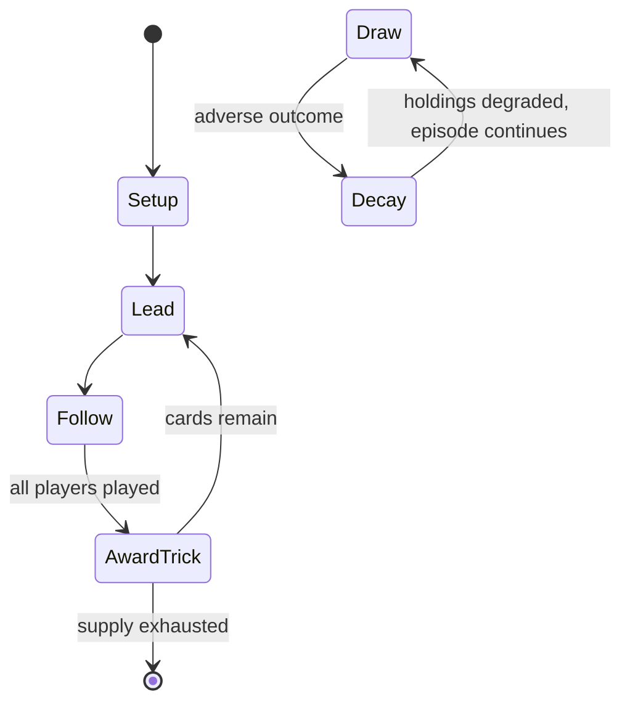

# Rödskägg

*Swedish card game*

`r_dsk_gg` &nbsp; state: **DEEPENED** &nbsp; method: **heuristic**

## Found layer (recorded, not trusted)

| field | value |
| --- | --- |
| wikidata | Q10658948 |
| wikipedia | Rödskägg |
| genres (source) | -- |
| instance of (source) | card game |
| country of origin | -- |

## Declared layer (orders bench work)

| field | value |
| --- | --- |
| year created | -- |
| epoch | -- |
| region | -- |
| media | CARD |
| players | -- |
| age band | -- |
| exogenous process | DEPLETING_DECK |
| loss shape | PARTIAL_DECAY |
| live axes | BID |
| horizon | -- |
| scoring shape | NEGATIVE_AVOIDANCE |
| information | HIDDEN_PRIVATE |
| interaction | COMPETITIVE |
| turn structure | TRICK_ROUND |
| tractability | EXACT_WITH_CUT |
| randomness | DECK_SHUFFLE |
| luck factor | 0.48 |
| rules complexity | 2.27 |
| strategic depth | 2.25 |
| novelty | 0.8319 |
| solved status | -- |
| strategies | spatial_packing |
| algorithms | -- |

## Object model

```
Episode
  players      : ?
  turn_structure: TRICK_ROUND
  horizon       : ?
  scoring       : NEGATIVE_AVOIDANCE

Deck           -- ordered multiset, drawn without replacement
Hand           -- private multiset held by one player
DiscardPile    -- public accumulation of spent cards
Auction        -- priced competition resolving to one winner
```

## State transition diagram



## Research item -- turn trace

```
# Rödskägg -- simulated turn events
# generated from the DECLARED vector, not from a rulebook.
# structure: exo=DEPLETING_DECK loss=PARTIAL_DECAY horizon=None scoring=NEGATIVE_AVOIDANCE axes=BID

t=0    SETUP        players=2  pot=0  capacity=7
t=1    DRAW         p1 draw from deck -> outcome #1  (p=0.098)
t=2    FORCED       p1 single legal option taken (pot_gain=+1.8)
t=3    DRAW         p1 draw from deck -> outcome #2  (p=0.057)
t=4    FORCED       p1 single legal option taken (pot_gain=+1.0)
t=5    ENDTURN      turn passes to p2
t=6    DRAW         p2 draw from deck -> outcome #5  (p=0.027)
t=7    FORCED       p2 single legal option taken (pot_gain=+2.0)
t=8    DRAW         p2 draw from deck -> outcome #2  (p=0.004)
t=9    FORCED       p2 single legal option taken (pot_gain=+1.3)
t=10   DRAW         p2 draw from deck -> outcome #2  (p=0.285)
t=11   FORCED       p2 single legal option taken (pot_gain=+0.7)
t=12   BID          p2 sealed bid of 9 against 1 rivals
t=13   DRAW         p2 draw from deck -> outcome #5  (p=0.155)
t=14   FORCED       p2 single legal option taken (pot_gain=+1.2)
t=15   BID          p2 sealed bid of 5 against 1 rivals
t=16   DRAW         p2 draw from deck -> outcome #2  (p=0.121)
t=17   FORCED       p2 single legal option taken (pot_gain=+1.1)
t=18   BID          p2 sealed bid of 3 against 1 rivals
t=19   ENDTURN      turn passes to p1
t=20   DRAW         p1 draw from deck -> outcome #5  (p=0.270)
t=21   FORCED       p1 single legal option taken (pot_gain=+1.0)
t=22   DRAW         p1 draw from deck -> outcome #3  (p=0.087)
t=23   FORCED       p1 single legal option taken (pot_gain=+0.6)
t=24   DRAW         p1 draw from deck -> outcome #2  (p=0.045)
t=25   FORCED       p1 single legal option taken (pot_gain=+1.0)
t=26   BID          p1 sealed bid of 4 against 1 rivals

terminal: VARIABLE
```

## Conditions

| kind | threshold | effect | trigger |
| --- | --- | --- | --- |
| BOUNDARY | 1 trick | -- | Players who have at least one trick must play on; players who have no tricks may fold with no penalty, discarding their hand, face down. |
| BOUNDARY | 1 trick | -- | If the declarer forgets to ask players if they want to play on, play continues as if everyone had taken at least one trick; tricks are still worth -1 point and there is no penalty for failing to take none, but the declar |
| PENALTY | 7 players | -- | Rödskägg ("redbeard") also called fem opp ("five up"), is a Swedish card game for three to seven players in which penalties are incurred for failing to follow certain rituals as well as for failing to take a declared num |
| PENALTY | 12 points | -- | Players start with 12 points each and the aim is to get down to zero by winning tricks while avoiding penalty points for failing to achieve a declared bid or failing to follow certain rituals. |
| PENALTY | 1 point | -- | For each trick won, 1 point is deducted from a player's starting total of 12 points, but penalties of +5 or +6 points may be incurred during play. |
| PENALTY | 6 penalty | -- | If they play on, they score -2 for each trick taken, but incur +6 penalty points if they remain trick-less. |
| PENALTY | 5 penalty | -- | However, if the declarer (highest bidder) fails to take the exact number of tricks bid, +5 penalty points are incurred, although any tricks taken still score -1 point. |
| PENALTY | 6 penalty | -- | The transgressor is then penalized +5 or +6 penalty points. |
| PENALTY | 5 point | -- | Picking up one's cards before the dealer has uttered the phrase "Knock for cards and infractions". 5 point penalty. |
| PENALTY | 2 tricks | -- | Forgetting to ask opponents if they want to continue playing with 2 tricks to go. 5 or 6 point penalty, as agreed. |
| PENALTY | 1 point | -- | Failing to notify the others when within 1 point of zero or on zero. 6 point penalty. |
| PENALTY | -- | -- | The infractions that incur these penalty points vary, but may include: |

## Source extract

Rödskägg ("redbeard") also called fem opp ("five up"), is a Swedish card game for three to seven
players in which penalties are incurred for failing to follow certain rituals as well as for
failing to take a declared number of tricks. Some rules describe Fem Opp as a variant of
Rödskägg. It is an advanced and tactically demanding game and, of games played in Sweden, only
Bridge and Poker are considered more difficult.   == History == Redbeard is a Swedish card game
that was invented in the early 20th century and is mentioned in the literature as early as 1925.
The name may have come from the notion that people with red beards were unreliable and although
"no one believes in that legend anymore", the name has stuck.   == Cards == The game is played
with a standard 52-card pack minus the Jokers. In Sweden the "modern Swedish" pattern pack is
commonly used.   == Aim == Players start with 12 points each and the aim is to get down to zero
by winning tricks while avoiding penalty points for failing to achieve a declared bid or failing
to follow certain rituals. For each trick won, 1 point is deducted from a player's starting
total of 12 points, but penalties of +5 or +6 points may be inc

<sub>Wikipedia, CC BY-SA. Retained as evidence for the structural
classification above. Every rule inferred from it is HYPOTHESIZED
until audited against a rulebook.</sub>
