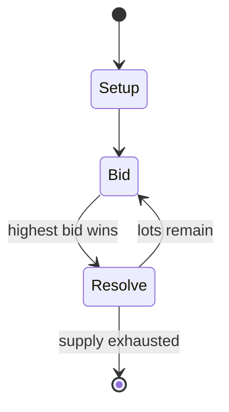

# Ra (board game)

`ra_board_game` &nbsp; state: **DEEPENED** &nbsp; method: **heuristic**

## Found layer (recorded, not trusted)

| field | value |
| --- | --- |
| wikidata | Q3278277 |
| wikipedia | Ra (board game) |
| genres (source) | -- |
| instance of (source) | -- |
| country of origin | -- |

## Declared layer (orders bench work)

| field | value |
| --- | --- |
| year created | 1999 |
| epoch | DIGITAL |
| region | -- |
| media | BOARD, TILE |
| players | -- |
| age band | -- |
| exogenous process | -- |
| loss shape | -- |
| live axes | BID |
| horizon | -- |
| scoring shape | -- |
| information | -- |
| interaction | COMPETITIVE |
| turn structure | AUCTION_ROUND |
| tractability | SAMPLING_ONLY |
| randomness | -- |
| luck factor | 0.35 |
| rules complexity | 2.02 |
| strategic depth | 2.0 |
| novelty | 0.56 |
| solved status | -- |
| strategies | -- |
| algorithms | -- |

## Object model

```
Episode
  players      : ?
  turn_structure: AUCTION_ROUND
  horizon       : ?
  scoring       : ?

Board          -- spatial substrate; cells carry position and occupancy
Piece          -- movable token owned by a player
TileBag        -- unordered draw source
Layout         -- placed tiles and their adjacencies
Auction        -- priced competition resolving to one winner
```

## State transition diagram



## Research item -- turn trace

```
# Ra (board game) -- simulated turn events
# generated from the DECLARED vector, not from a rulebook.
# structure: exo=None loss=None horizon=None scoring=None axes=BID

t=0    SETUP        players=2  pot=0  capacity=8
t=1    FORCED       p1 single legal option taken (pot_gain=+1.8)
t=2    ENDTURN      turn passes to p2
t=3    FORCED       p2 single legal option taken (pot_gain=+0.7)
t=4    BID          p2 sealed bid of 2 against 1 rivals
t=5    FORCED       p2 single legal option taken (pot_gain=+0.8)
t=6    FORCED       p2 single legal option taken (pot_gain=+1.1)
t=7    BID          p2 sealed bid of 1 against 1 rivals
t=8    FORCED       p2 single legal option taken (pot_gain=+1.6)
t=9    BID          p2 sealed bid of 5 against 1 rivals
t=10   FORCED       p2 single legal option taken (pot_gain=+1.3)
t=11   FORCED       p2 single legal option taken (pot_gain=+1.8)
t=12   BID          p2 sealed bid of 1 against 1 rivals
t=13   FORCED       p2 single legal option taken (pot_gain=+1.9)
t=14   BID          p2 sealed bid of 7 against 1 rivals
t=15   FORCED       p2 single legal option taken (pot_gain=+1.4)
t=16   BID          p2 sealed bid of 6 against 1 rivals
t=17   ENDTURN      turn passes to p1
t=18   FORCED       p1 single legal option taken (pot_gain=+1.5)
t=19   BID          p1 sealed bid of 2 against 1 rivals
t=20   FORCED       p1 single legal option taken (pot_gain=+1.2)
t=21   BID          p1 sealed bid of 6 against 1 rivals
t=22   ENDTURN      turn passes to p2
t=23   FORCED       p2 single legal option taken (pot_gain=+0.8)
t=24   FORCED       p2 single legal option taken (pot_gain=+1.2)
t=25   FORCED       p2 single legal option taken (pot_gain=+0.7)
t=26   FORCED       p2 single legal option taken (pot_gain=+1.9)

terminal: VARIABLE
```

## Source extract

Ra is a board game for two to five players designed by Reiner Knizia and themed around Ra, the
sun-god of Heliopolis in ancient Egyptian culture. It is one of three auction games designed by
Knizia, the others being Medici and Modern Art. Originally published in Germany, it was
republished in an English language translation by Rio Grande Games. Subsequent English language
editions have been published by Überplay and again by Rio Grande Games. The last of these
increased the number of players from the original 3-5 to 2-5, but otherwise all editions have
used the same rules. Ra won the 2000 International Gamers Award and placed 2nd in the 1999
Deutscher Spiele Preis.    == Gameplay == Ra is an auction game, in which the players compete
for the same resources. The game is played in three rounds, called Epochs, reflecting the
history of ancient Egypt. Players use their sun tokens to bid against each other on auctions for
tiles. At the end of an epoch, points will be scored for the number and types of tiles a player
managed to win. The price of the tiles is determined by the players bidding for them, and values
can shift rapidly. Players are faced with a constant balance between "what s

<sub>Wikipedia, CC BY-SA. Retained as evidence for the structural
classification above. Every rule inferred from it is HYPOTHESIZED
until audited against a rulebook.</sub>
