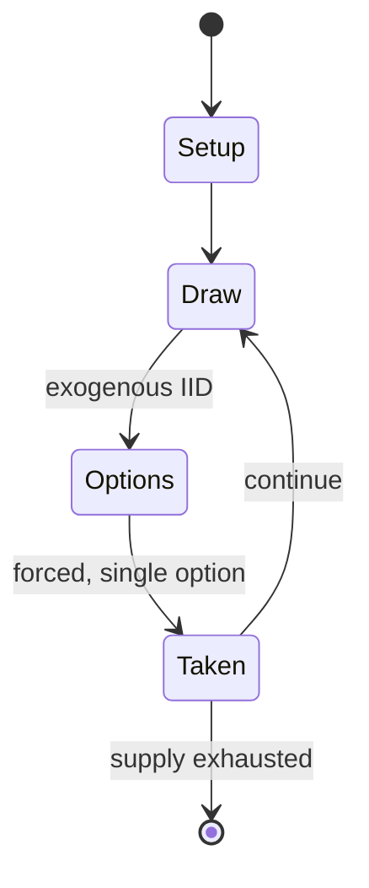

# Rattle and snap (game)

`rattle_and_snap_game` &nbsp; state: **DEEPENED** &nbsp; method: **heuristic**

## Found layer (recorded, not trusted)

| field | value |
| --- | --- |
| wikidata | Q134984638 |
| wikipedia | Rattle and snap (game) |
| genres (source) | -- |
| instance of (source) | -- |
| country of origin | -- |

## Declared layer (orders bench work)

| field | value |
| --- | --- |
| year created | -- |
| epoch | -- |
| region | -- |
| media | DICE, GAMBLING |
| players | -- |
| age band | -- |
| exogenous process | IID |
| loss shape | -- |
| live axes | BLUFF |
| horizon | -- |
| scoring shape | -- |
| information | IMPERFECT |
| interaction | -- |
| turn structure | -- |
| tractability | EXACT_WITH_CUT |
| randomness | DICE |
| luck factor | 0.58 |
| rules complexity | 2.08 |
| strategic depth | 2.12 |
| novelty | 0.7234 |
| solved status | -- |
| strategies | bluffing |
| algorithms | -- |

## Object model

```
Episode
  players      : ?
  turn_structure: ?
  horizon       : ?
  scoring       : ?

DicePool       -- n dice, each an iid categorical draw
Roll           -- realised outcome of a pool
Belief         -- what an observer is induced to think is true
```

## State transition diagram



## Research item -- turn trace

```
# Rattle and snap (game) -- simulated turn events
# generated from the DECLARED vector, not from a rulebook.
# structure: exo=IID loss=None horizon=None scoring=None axes=BLUFF

t=0    SETUP        players=2  pot=0  capacity=6
t=1    DRAW         p1 roll from d6 pool -> outcome #5  (p=0.073)
t=2    FORCED       p1 single legal option taken (pot_gain=+0.7)
t=3    DRAW         p1 roll from d6 pool -> outcome #5  (p=0.043)
t=4    FORCED       p1 single legal option taken (pot_gain=+1.0)
t=5    DRAW         p1 roll from d6 pool -> outcome #5  (p=0.029)
t=6    FORCED       p1 single legal option taken (pot_gain=+0.9)
t=7    BLUFF        p1 represents a holding it does not have
t=8    DRAW         p1 roll from d6 pool -> outcome #6  (p=0.160)
t=9    FORCED       p1 single legal option taken (pot_gain=+1.2)
t=10   ENDTURN      turn passes to p2
t=11   DRAW         p2 roll from d6 pool -> outcome #4  (p=0.286)
t=12   FORCED       p2 single legal option taken (pot_gain=+1.0)
t=13   BLUFF        p2 represents a holding it does not have
t=14   DRAW         p2 roll from d6 pool -> outcome #3  (p=0.018)
t=15   FORCED       p2 single legal option taken (pot_gain=+2.0)
t=16   BLUFF        p2 represents a holding it does not have
t=17   DRAW         p2 roll from d6 pool -> outcome #3  (p=0.166)
t=18   FORCED       p2 single legal option taken (pot_gain=+1.6)
t=19   DRAW         p2 roll from d6 pool -> outcome #4  (p=0.021)
t=20   FORCED       p2 single legal option taken (pot_gain=+0.8)
t=21   BLUFF        p2 represents a holding it does not have
t=22   ENDTURN      turn passes to p1
t=23   DRAW         p1 roll from d6 pool -> outcome #4  (p=0.280)
t=24   FORCED       p1 single legal option taken (pot_gain=+1.2)
t=25   DRAW         p1 roll from d6 pool -> outcome #3  (p=0.160)
t=26   FORCED       p1 single legal option taken (pot_gain=+1.6)

terminal: VARIABLE
```

## Source extract

Rattle and snap was a game of chance played with dice that was popular in the United States in
the 18th and 19th centuries. One source says rattle and snap was similar to the game of craps.
People gambled cash and property on the outcome, as they did with card games like faro. Andrew
Jackson reportedly made $200 and "saved his horse from having a new owner" playing rattle and
snap in Charleston, South Carolina in the 1780s. The Rattle and Snap plantation was named for
William Polk's fortunate roll of the dice while playing the game shortly after the American
Revolutionary War. In 1857 a Lynchburg, Virginia newspaper complained about "gambling hells"
where the popular games included "crack-lew, rattle-and-snap, all-fours, bluff, eucre, &c &c."
The game was popular in Charleston's black community until the American Civil War. Gaming venues
where "seven up, rattle-and-snap, pitch-and-toss, or chuck-a-luck" were played were more
commonly sites of interracial intersection than were many other sectors of the antebellum U.S.
south. An 1865 column about the speculative nature of oil stocks described the game as it had
been played in olden times in Maryland:  An individual with a fine cast

<sub>Wikipedia, CC BY-SA. Retained as evidence for the structural
classification above. Every rule inferred from it is HYPOTHESIZED
until audited against a rulebook.</sub>
