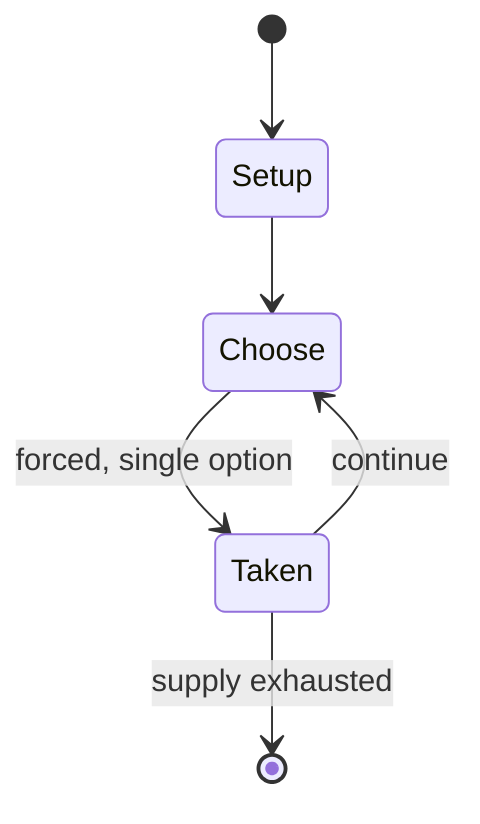

# Red Rover

`red_rover` &nbsp; state: **DEEPENED** &nbsp; method: **heuristic**

## Found layer (recorded, not trusted)

| field | value |
| --- | --- |
| wikidata | Q7304971 |
| wikipedia | Red Rover |
| genres (source) | -- |
| instance of (source) | -- |
| country of origin | -- |

## Declared layer (orders bench work)

| field | value |
| --- | --- |
| year created | 1945 |
| epoch | MODERN |
| region | -- |
| media | PLAYGROUND |
| players | -- |
| age band | CHILD |
| exogenous process | -- |
| loss shape | -- |
| live axes | COMMIT_BLIND |
| horizon | -- |
| scoring shape | -- |
| information | -- |
| interaction | SOLITAIRE |
| turn structure | -- |
| tractability | SAMPLING_ONLY |
| randomness | -- |
| luck factor | 0.35 |
| rules complexity | 2.63 |
| strategic depth | 2.25 |
| novelty | 0.3843 |
| solved status | -- |
| strategies | area_control |
| algorithms | -- |

## Object model

```
Episode
  players      : ?
  turn_structure: ?
  horizon       : ?
  scoring       : ?

SealedChoice   -- irrevocable choice made without observation
```

## State transition diagram



## Research item -- turn trace

```
# Red Rover -- simulated turn events
# generated from the DECLARED vector, not from a rulebook.
# structure: exo=None loss=None horizon=None scoring=None axes=COMMIT_BLIND

t=0    SETUP        players=2  pot=0  capacity=4
t=1    FORCED       p1 single legal option taken (pot_gain=+0.8)
t=2    FORCED       p1 single legal option taken (pot_gain=+1.9)
t=3    FORCED       p1 single legal option taken (pot_gain=+1.9)
t=4    FORCED       p1 single legal option taken (pot_gain=+1.7)
t=5    ENDTURN      turn passes to p2
t=6    FORCED       p2 single legal option taken (pot_gain=+1.2)
t=7    FORCED       p2 single legal option taken (pot_gain=+1.3)
t=8    ENDTURN      turn passes to p1
t=9    FORCED       p1 single legal option taken (pot_gain=+1.1)
t=10   FORCED       p1 single legal option taken (pot_gain=+1.2)
t=11   FORCED       p1 single legal option taken (pot_gain=+1.8)
t=12   FORCED       p1 single legal option taken (pot_gain=+1.8)
t=13   ENDTURN      turn passes to p2
t=14   FORCED       p2 single legal option taken (pot_gain=+1.3)
t=15   FORCED       p2 single legal option taken (pot_gain=+1.4)
t=16   FORCED       p2 single legal option taken (pot_gain=+0.8)
t=17   FORCED       p2 single legal option taken (pot_gain=+0.6)
t=18   FORCED       p2 single legal option taken (pot_gain=+1.9)
t=19   FORCED       p2 single legal option taken (pot_gain=+0.6)
t=20   FORCED       p2 single legal option taken (pot_gain=+0.5)
t=21   ENDTURN      turn passes to p1
t=22   FORCED       p1 single legal option taken (pot_gain=+1.0)
t=23   ENDTURN      turn passes to p2
t=24   FORCED       p2 single legal option taken (pot_gain=+1.2)
t=25   ENDTURN      turn passes to p1
t=26   FORCED       p1 single legal option taken (pot_gain=+0.9)
t=27   ENDTURN      turn passes to p2

terminal: VARIABLE
```

## Source extract

Red Rover (also known as the king's run and forcing the city gates) is a team game played
primarily by children on playgrounds, requiring 10+ players. The game has changed over several
decades, evolving from a regular "running across" game, with one single catcher in the center of
the playground, to a combat game with two opposing teams. The change basically consisted of
merging pre-existing rules from other games with those of the original Red Rover.   == The
original Red Rover ==   === Origin of the game === Originally, Red Rover was a regular tag and
running game with several players on one side and one person (the "Red Rover") placed in the
center of the playing field. The person in the center calls, "Red Rover, Red Rover, let
[player's name] come over!" to challenge and catch one of the players who tries to reach the
other side of the playing area. If the Red Rover succeeds, they both return to the center. Each
player tagged joins the center and helps tag the others. According to Katherine Barber, the name
of the game could be based on the novel of The Red Rover by New York author James Fenimore
Cooper, in which a pirate ship by that name ravages the British seas. The game was

<sub>Wikipedia, CC BY-SA. Retained as evidence for the structural
classification above. Every rule inferred from it is HYPOTHESIZED
until audited against a rulebook.</sub>
