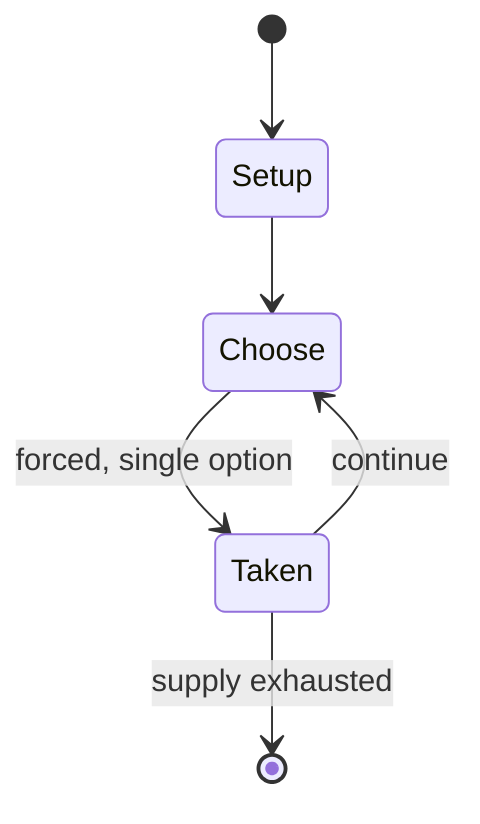

# Renju

*traditional board game*

`renju` &nbsp; state: **DEEPENED** &nbsp; method: **heuristic**

## Found layer (recorded, not trusted)

| field | value |
| --- | --- |
| wikidata | Q1139103 |
| wikipedia | Renju |
| genres (source) | -- |
| instance of (source) | abstract strategy game, board game, mind sport |
| country of origin | -- |

## Declared layer (orders bench work)

| field | value |
| --- | --- |
| year created | -- |
| epoch | -- |
| region | -- |
| media | ABSTRACT, BOARD |
| players | -- |
| age band | -- |
| exogenous process | -- |
| loss shape | -- |
| live axes | ORDER |
| horizon | -- |
| scoring shape | SET_COLLECTION_CONVEX |
| information | -- |
| interaction | COMPETITIVE |
| turn structure | STRICT_TURN |
| tractability | SAMPLING_ONLY |
| randomness | -- |
| luck factor | 0.35 |
| rules complexity | 2.25 |
| strategic depth | 2.25 |
| novelty | 0.5644 |
| solved status | -- |
| strategies | set_collection |
| algorithms | -- |

## Object model

```
Episode
  players      : ?
  turn_structure: STRICT_TURN
  horizon       : ?
  scoring       : SET_COLLECTION_CONVEX

Board          -- spatial substrate; cells carry position and occupancy
Piece          -- movable token owned by a player
Sequence       -- the permutation under the player's control
```

## State transition diagram



## Research item -- turn trace

```
# Renju -- simulated turn events
# generated from the DECLARED vector, not from a rulebook.
# structure: exo=None loss=None horizon=None scoring=SET_COLLECTION_CONVEX axes=ORDER

t=0    SETUP        players=2  pot=0  capacity=4
t=1    FORCED       p1 single legal option taken (pot_gain=+2.0)
t=2    ENDTURN      turn passes to p2
t=3    FORCED       p2 single legal option taken (pot_gain=+0.6)
t=4    ENDTURN      turn passes to p1
t=5    FORCED       p1 single legal option taken (pot_gain=+1.8)
t=6    ENDTURN      turn passes to p2
t=7    FORCED       p2 single legal option taken (pot_gain=+1.1)
t=8    ENDTURN      turn passes to p1
t=9    FORCED       p1 single legal option taken (pot_gain=+0.5)
t=10   FORCED       p1 single legal option taken (pot_gain=+1.5)
t=11   FORCED       p1 single legal option taken (pot_gain=+1.7)
t=12   FORCED       p1 single legal option taken (pot_gain=+0.6)
t=13   FORCED       p1 single legal option taken (pot_gain=+1.8)
t=14   ENDTURN      turn passes to p2
t=15   FORCED       p2 single legal option taken (pot_gain=+1.8)
t=16   FORCED       p2 single legal option taken (pot_gain=+0.6)
t=17   FORCED       p2 single legal option taken (pot_gain=+0.8)
t=18   FORCED       p2 single legal option taken (pot_gain=+1.9)
t=19   FORCED       p2 single legal option taken (pot_gain=+1.8)
t=20   ENDTURN      turn passes to p1
t=21   FORCED       p1 single legal option taken (pot_gain=+0.6)
t=22   FORCED       p1 single legal option taken (pot_gain=+0.6)
t=23   FORCED       p1 single legal option taken (pot_gain=+0.8)
t=24   ENDTURN      turn passes to p2
t=25   FORCED       p2 single legal option taken (pot_gain=+1.7)
t=26   FORCED       p2 single legal option taken (pot_gain=+1.5)

terminal: VARIABLE
```

## Conditions

| kind | threshold | effect | trigger |
| --- | --- | --- | --- |
| WIN | -- | -- | Black can win the game only by placing exactly five black stones in a row (vertically, horizontally or diagonally). |

## Source extract

Renju (Japanese: 連珠) is a professional variant of the abstract strategy board game gomoku. It
was named renju by Japanese journalist Ruikou Kuroiwa (黒岩涙香) on December 6, 1899, in a Japanese
newspaper Yorozu chouhou (萬朝報). The name "renju" means "connected pearls" in Japanese. The game
is played with black and white stones on a 15×15 gridded go board. The rule of renju weakens the
advantages for the first player (Black) in gomoku by adding special restrictions for Black.   ==
Rules == Renju has its origins in gomoku and therefore shares most of its rules. There are two
key differences between these games, however. First, renju has the rule of forbidden moves to
limit Black's advantage, something gomoku does not have. Second, renju utilizes special opening
rules to balance the starting positions of games.   === Forbidden moves === There are certain
moves that Black is not allowed to make:  Double three – Placing a stone on an intersection,
which makes more than one three that meet each other in this intersection. Three – A row with
three stones to which one can add one more stone to attain a straight four. Straight four – An
unbroken row with four stones to which one can add one more

<sub>Wikipedia, CC BY-SA. Retained as evidence for the structural
classification above. Every rule inferred from it is HYPOTHESIZED
until audited against a rulebook.</sub>
