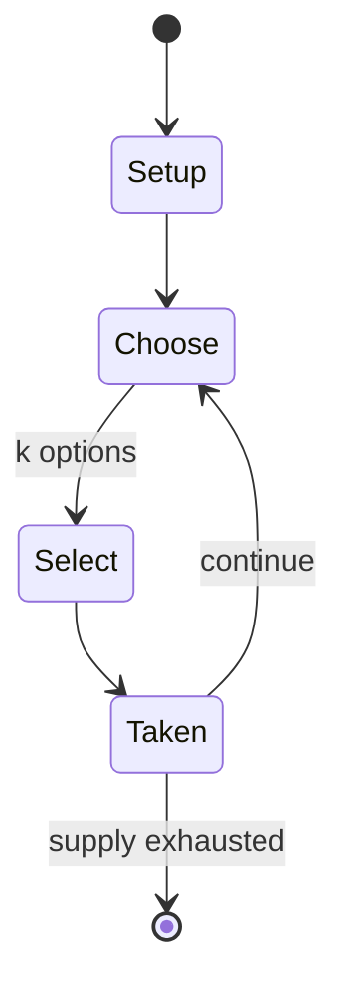

# Reversi

`reversi` &nbsp; state: **DEEPENED** &nbsp; method: **heuristic**

## Found layer (recorded, not trusted)

| field | value |
| --- | --- |
| wikidata | Q748139 |
| wikipedia | Reversi |
| genres (source) | -- |
| instance of (source) | -- |
| country of origin | -- |

## Declared layer (orders bench work)

| field | value |
| --- | --- |
| year created | 1883 |
| epoch | INDUSTRIAL |
| region | -- |
| media | ABSTRACT, BOARD, MEMORY |
| players | 2 |
| age band | -- |
| exogenous process | NONE |
| loss shape | OPPORTUNITY_ONLY |
| live axes | SELECT, SPATIAL |
| horizon | VARIABLE |
| scoring shape | LINEAR_ACCUMULATION |
| information | PERFECT |
| interaction | SOLITAIRE |
| turn structure | STRICT_TURN |
| tractability | EXACT_WITH_CUT |
| randomness | NONE |
| luck factor | 0.02 |
| rules complexity | 2.74 |
| strategic depth | 2.9 |
| novelty | 0.7727 |
| solved status | -- |
| strategies | memory_recall, signalling |
| algorithms | -- |

## Object model

```
Episode
  players      : 2
  turn_structure: STRICT_TURN
  horizon       : VARIABLE
  scoring       : LINEAR_ACCUMULATION

Board          -- spatial substrate; cells carry position and occupancy
Piece          -- movable token owned by a player
OptionSet      -- the choices available after an exogenous draw
Placement      -- position subject to geometric legality
```

## State transition diagram



## Research item -- turn trace

```
# Reversi -- simulated turn events
# generated from the DECLARED vector, not from a rulebook.
# structure: exo=NONE loss=OPPORTUNITY_ONLY horizon=VARIABLE scoring=LINEAR_ACCUMULATION axes=SELECT,SPATIAL

t=0    SETUP        players=2  pot=0  capacity=7
t=1    SELECT       p1 3 options; take #2  (pot_gain=+2.8, capacity=-1)
t=2    SPATIAL      p1 places at (1,7); adjacency legal
t=3    SELECT       p1 4 options; take #3  (pot_gain=+2.1, capacity=-0)
t=4    SELECT       p1 1 options; take #1  (pot_gain=+1.9, capacity=-0)
t=5    SPATIAL      p1 places at (3,3); adjacency legal
t=6    ENDTURN      turn passes to p2
t=7    SELECT       p2 2 options; take #1  (pot_gain=+0.9, capacity=-1)
t=8    SPATIAL      p2 places at (2,1); adjacency legal
t=9    SELECT       p2 4 options; take #4  (pot_gain=+2.0, capacity=-1)
t=10   ENDTURN      turn passes to p1
t=11   SELECT       p1 2 options; take #1  (pot_gain=+1.3, capacity=-1)
t=12   SPATIAL      p1 places at (2,5); adjacency legal
t=13   SELECT       p1 4 options; take #3  (pot_gain=+3.5, capacity=-1)
t=14   ENDTURN      turn passes to p2
t=15   SELECT       p2 3 options; take #3  (pot_gain=+0.9, capacity=-2)
t=16   SELECT       p2 1 options; take #1  (pot_gain=+1.1, capacity=-0)
t=17   SELECT       p2 2 options; take #1  (pot_gain=+1.9, capacity=-0)
t=18   SPATIAL      p2 places at (3,7); adjacency legal
t=19   ENDTURN      turn passes to p1
t=20   SELECT       p1 3 options; take #2  (pot_gain=+2.8, capacity=-1)
t=21   SPATIAL      p1 places at (3,0); adjacency legal
t=22   SELECT       p1 3 options; take #3  (pot_gain=+3.2, capacity=-0)
t=23   SPATIAL      p1 places at (5,1); adjacency legal
t=24   SELECT       p1 2 options; take #1  (pot_gain=+1.3, capacity=-1)
t=25   SELECT       p1 3 options; take #3  (pot_gain=+2.3, capacity=-1)
t=26   SPATIAL      p1 places at (1,6); adjacency legal
t=27   ENDTURN      turn passes to p2

terminal: VARIABLE
```

## Conditions

| kind | threshold | effect | trigger |
| --- | --- | --- | --- |
| BOUNDARY | 1 piece | -- | A valid move is one where at least one piece is reversed (flipped over). |
| WIN | -- | -- | When all playable empty squares are filled, the player with more disks showing in their own color wins the game. |
| TERMINATE | -- | -- | The game ends when the grid has filled up or if neither player can make a valid move. |
| TERMINATE | -- | -- | Examples where the game ends before the grid is completely filled: |
| BOUNDARY | -- | -- | Dark must place a piece (dark-side-up) on the board and so that there exists at least one straight (horizontal, vertical, or diagonal) occupied line between the new piece and another dark piece, with one or more contiguo |
| BOUNDARY | -- | -- | Analysts have estimated the number of legal positions in Othello is at most 1028, and it has a game-tree complexity of approximately 1058. |

## Source extract

Reversi is an abstract strategy board game for two players, played on an 8×8 uncheckered board.
It was invented in 1883. Othello, a variant with a fixed initial setup of the board, was
patented in 1971. Two players compete, using 64 identical game pieces ("disks") that are light
on one side and dark on the other. Each player chooses one color to use throughout the game.
Players take turns placing one disk on an empty square, with their assigned color facing up.
After a play is made, any disks of the opponent's color that lie in a straight line bounded by
the one just played and another one in the current player's color are turned over. When all
playable empty squares are filled, the player with more disks showing in their own color wins
the game.   == History ==   === Original version === Englishmen Lewis Waterman and John W.
Mollett both claim to have invented the game of reversi in 1883, each denouncing the other as a
fraud. The game gained considerable popularity in England at the end of the 19th century. The
game's first reliable mention is in the 21 August 1886 edition of The Saturday Review. Later
mention includes an 1895 article in The New York Times, which describes reversi

<sub>Wikipedia, CC BY-SA. Retained as evidence for the structural
classification above. Every rule inferred from it is HYPOTHESIZED
until audited against a rulebook.</sub>
