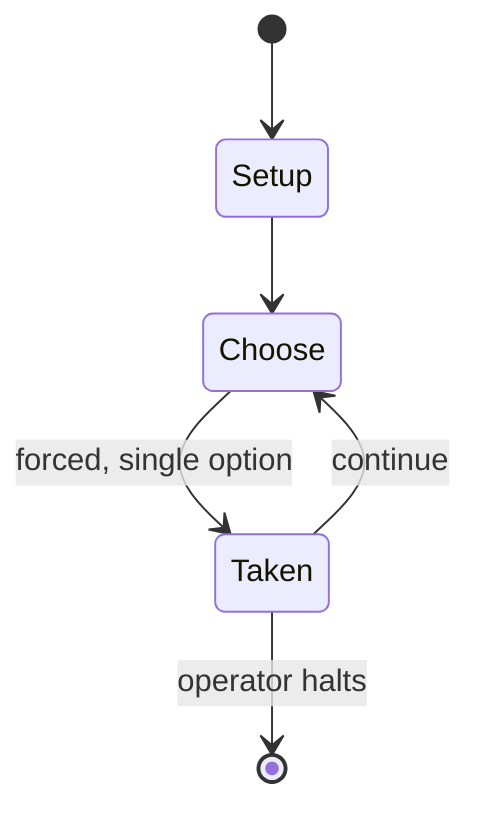

# Richthofen's War

*board game*

`richthofen_s_war` &nbsp; state: **DEEPENED** &nbsp; method: **heuristic**

## Found layer (recorded, not trusted)

| field | value |
| --- | --- |
| wikidata | Q10361299 |
| wikipedia | Richthofen's War |
| genres (source) | board wargame |
| instance of (source) | board game |
| country of origin | -- |

## Declared layer (orders bench work)

| field | value |
| --- | --- |
| year created | 1973 |
| epoch | DIGITAL |
| region | -- |
| media | BOARD, WARGAME |
| players | -- |
| age band | -- |
| exogenous process | -- |
| loss shape | -- |
| live axes | SPATIAL |
| horizon | OPEN_ENDED |
| scoring shape | -- |
| information | ASYMMETRIC |
| interaction | SOLITAIRE |
| turn structure | -- |
| tractability | SAMPLING_ONLY |
| randomness | DICE |
| luck factor | 0.58 |
| rules complexity | 3.6 |
| strategic depth | 1.87 |
| novelty | 0.6608 |
| solved status | -- |
| strategies | -- |
| algorithms | -- |

## Object model

```
Episode
  players      : ?
  turn_structure: ?
  horizon       : OPEN_ENDED
  scoring       : ?

Board          -- spatial substrate; cells carry position and occupancy
Piece          -- movable token owned by a player
Placement      -- position subject to geometric legality
```

## State transition diagram



## Research item -- turn trace

```
# Richthofen's War -- simulated turn events
# generated from the DECLARED vector, not from a rulebook.
# structure: exo=None loss=None horizon=OPEN_ENDED scoring=None axes=SPATIAL

t=0    SETUP        players=2  pot=0  capacity=4
t=1    FORCED       p1 single legal option taken (pot_gain=+1.4)
t=2    SPATIAL      p1 places at (7,7); adjacency legal
t=3    FORCED       p1 single legal option taken (pot_gain=+1.5)
t=4    SPATIAL      p1 places at (2,3); adjacency legal
t=5    FORCED       p1 single legal option taken (pot_gain=+1.8)
t=6    ENDTURN      turn passes to p2
t=7    FORCED       p2 single legal option taken (pot_gain=+1.3)
t=8    FORCED       p2 single legal option taken (pot_gain=+1.0)
t=9    FORCED       p2 single legal option taken (pot_gain=+1.0)
t=10   FORCED       p2 single legal option taken (pot_gain=+1.2)
t=11   ENDTURN      turn passes to p1
t=12   FORCED       p1 single legal option taken (pot_gain=+1.3)
t=13   SPATIAL      p1 places at (0,5); adjacency legal
t=14   FORCED       p1 single legal option taken (pot_gain=+0.7)
t=15   FORCED       p1 single legal option taken (pot_gain=+0.6)
t=16   ENDTURN      turn passes to p2
t=17   FORCED       p2 single legal option taken (pot_gain=+0.8)
t=18   FORCED       p2 single legal option taken (pot_gain=+1.9)
t=19   FORCED       p2 single legal option taken (pot_gain=+0.9)
t=20   SPATIAL      p2 places at (0,4); adjacency legal
t=21   FORCED       p2 single legal option taken (pot_gain=+1.8)
t=22   SPATIAL      p2 places at (6,2); adjacency legal
t=23   FORCED       p2 single legal option taken (pot_gain=+1.8)
t=24   SPATIAL      p2 places at (1,6); adjacency legal
t=25   FORCED       p2 single legal option taken (pot_gain=+0.6)
t=26   ENDTURN      turn passes to p1

terminal: OPEN_ENDED
```

## Source extract

Richthofen's War, subtitled "The Air War 1916–1918", is a board wargame published by Avalon Hill
in 1973 that simulates aerial combat during World War I.   == Description == Richthofen's War is
a two-player game in which one player controls one or more German airplanes of the First World
War, and the other player controls Allied aircraft.    === Components === The game box contains:
22" x 24" mounted hex grid map of a section of the Western Front, including lines of trenches
and no man's land 80 die-cut counters rulebook eight scenario cards playing aids and charts
airplane data card six-sided die   === Scenarios and gameplay === The first edition of the game
comes with eight scenarios. In some of the scenarios, several alternative pairings of aircraft
are given. Using Basic Rules, players control one aircraft each; both have identical flight
properties. The Advanced rules allow for more aircraft that have varied flight characteristics.
The second edition released in 1977 has 23 missions that can be played as a campaign game.   ==
Publication history == In 1966, Mike Carr designed a game of First World War aerial combat,
Fight in the Skies, after watching the movie The Blue Max. I

<sub>Wikipedia, CC BY-SA. Retained as evidence for the structural
classification above. Every rule inferred from it is HYPOTHESIZED
until audited against a rulebook.</sub>
