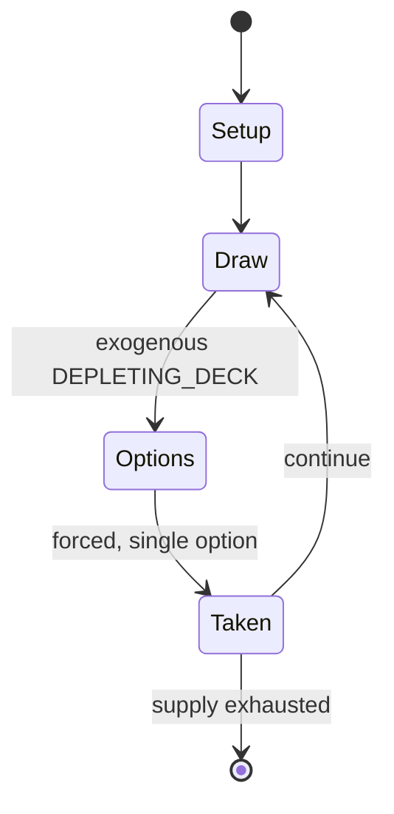

# Riddle of the Ring

*board game*

`riddle_of_the_ring` &nbsp; state: **DEEPENED** &nbsp; method: **heuristic**

## Found layer (recorded, not trusted)

| field | value |
| --- | --- |
| wikidata | Q104856156 |
| wikipedia | Riddle of the Ring |
| genres (source) | -- |
| instance of (source) | board game |
| country of origin | -- |

## Declared layer (orders bench work)

| field | value |
| --- | --- |
| year created | 1977 |
| epoch | DIGITAL |
| region | -- |
| media | BOARD, PUZZLE |
| players | -- |
| age band | -- |
| exogenous process | DEPLETING_DECK |
| loss shape | -- |
| live axes | - |
| horizon | -- |
| scoring shape | SURVIVAL |
| information | -- |
| interaction | COMPETITIVE |
| turn structure | -- |
| tractability | EXACT_WITH_CUT |
| randomness | DECK_SHUFFLE, DICE |
| luck factor | 0.76 |
| rules complexity | 2.17 |
| strategic depth | 1.58 |
| novelty | 0.7472 |
| solved status | -- |
| strategies | -- |
| algorithms | -- |

## Object model

```
Episode
  players      : ?
  turn_structure: ?
  horizon       : ?
  scoring       : SURVIVAL

Board          -- spatial substrate; cells carry position and occupancy
Piece          -- movable token owned by a player
Configuration  -- the arrangement to be resolved
Constraint     -- predicate a legal configuration must satisfy
```

## State transition diagram



## Research item -- turn trace

```
# Riddle of the Ring -- simulated turn events
# generated from the DECLARED vector, not from a rulebook.
# structure: exo=DEPLETING_DECK loss=None horizon=None scoring=SURVIVAL axes=-

t=0    SETUP        players=2  pot=0  capacity=6
t=1    DRAW         p1 draw from deck -> outcome #3  (p=0.207)
t=2    FORCED       p1 single legal option taken (pot_gain=+0.6)
t=3    DRAW         p1 draw from deck -> outcome #4  (p=0.092)
t=4    FORCED       p1 single legal option taken (pot_gain=+1.9)
t=5    DRAW         p1 draw from deck -> outcome #6  (p=0.139)
t=6    FORCED       p1 single legal option taken (pot_gain=+1.7)
t=7    DRAW         p1 draw from deck -> outcome #6  (p=0.069)
t=8    FORCED       p1 single legal option taken (pot_gain=+0.5)
t=9    ENDTURN      turn passes to p2
t=10   DRAW         p2 draw from deck -> outcome #5  (p=0.187)
t=11   FORCED       p2 single legal option taken (pot_gain=+0.5)
t=12   DRAW         p2 draw from deck -> outcome #4  (p=0.099)
t=13   FORCED       p2 single legal option taken (pot_gain=+1.5)
t=14   DRAW         p2 draw from deck -> outcome #3  (p=0.106)
t=15   FORCED       p2 single legal option taken (pot_gain=+1.6)
t=16   DRAW         p2 draw from deck -> outcome #4  (p=0.106)
t=17   FORCED       p2 single legal option taken (pot_gain=+1.6)
t=18   ENDTURN      turn passes to p1
t=19   DRAW         p1 draw from deck -> outcome #3  (p=0.234)
t=20   FORCED       p1 single legal option taken (pot_gain=+1.5)
t=21   DRAW         p1 draw from deck -> outcome #3  (p=0.033)
t=22   FORCED       p1 single legal option taken (pot_gain=+1.4)
t=23   DRAW         p1 draw from deck -> outcome #4  (p=0.021)
t=24   FORCED       p1 single legal option taken (pot_gain=+1.7)
t=25   ENDTURN      turn passes to p2
t=26   DRAW         p2 draw from deck -> outcome #4  (p=0.073)
t=27   FORCED       p2 single legal option taken (pot_gain=+1.6)

terminal: VARIABLE
```

## Source extract

Riddle of the Ring is a board game published by Fellowship Games in 1977 based on J.R.R.
Tolkien's The Lord of the Rings; an authorized version was published by Iron Crown Enterprises
(I.C.E.) in 1982.   == Description == Riddle of the Ring is a board game for 2–8 players who
take the roles of important characters from The Lord of the Rings. Players draw and play cards
for all the actions, and options during game play.   === Components === A board depicting a
portion of Tolkien's Middle Earth Basic rules (8 pages) Advanced rules (4 pages) Eight plastic
rings, tokens or stones (depending on which edition) representing the characters: Frodo (white),
Sam (green), Merry (blue), Pippin (Yellow), and the four Black Riders (Black, Red, Brown, and
Grey) 96 cards (25 Travel cards, 18 Army cards, 28 Character cards, 25 Special cards) a six-
sided die   === Setup === The players first decide on factions. In a two-player game, each takes
either the four hobbits or the four Black Riders. Three or four players can each take multiple
characters from the same faction. More than four players can choose or draw individual
characters. Once roles are decided, players place their markers on the hex mark

<sub>Wikipedia, CC BY-SA. Retained as evidence for the structural
classification above. Every rule inferred from it is HYPOTHESIZED
until audited against a rulebook.</sub>
