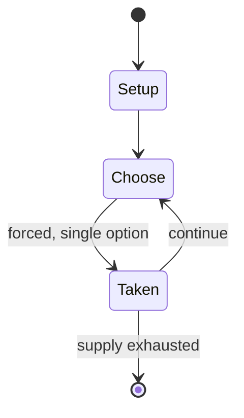

# Riftbound: League of Legends Trading Card Game

*2025 collectible card game*

`riftbound_league_of_legends_trading_card_game` &nbsp; state: **DEEPENED** &nbsp; method: **heuristic**

## Found layer (recorded, not trusted)

| field | value |
| --- | --- |
| wikidata | Q137319225 |
| wikipedia | Riftbound |
| genres (source) | fantasy |
| instance of (source) | collectible card game, deck-building game |
| country of origin | -- |

## Declared layer (orders bench work)

| field | value |
| --- | --- |
| year created | 2025 |
| epoch | CONTEMPORARY |
| region | -- |
| media | CARD, COLLECTIBLE |
| players | -- |
| age band | -- |
| exogenous process | -- |
| loss shape | -- |
| live axes | TRADE |
| horizon | -- |
| scoring shape | LINEAR_ACCUMULATION |
| information | SIMULTANEOUS |
| interaction | TEAM |
| turn structure | -- |
| tractability | SAMPLING_ONLY |
| randomness | SIMULTANEOUS_CHOICE |
| luck factor | 0.35 |
| rules complexity | 1.99 |
| strategic depth | 2.0 |
| novelty | 0.4958 |
| solved status | -- |
| strategies | spatial_packing |
| algorithms | -- |

## Object model

```
Episode
  players      : ?
  turn_structure: ?
  horizon       : ?
  scoring       : LINEAR_ACCUMULATION

Deck           -- ordered multiset, drawn without replacement
Hand           -- private multiset held by one player
DiscardPile    -- public accumulation of spent cards
Offer          -- proposed exchange between two agents
```

## State transition diagram



## Research item -- turn trace

```
# Riftbound: League of Legends Trading Card Game -- simulated turn events
# generated from the DECLARED vector, not from a rulebook.
# structure: exo=None loss=None horizon=None scoring=LINEAR_ACCUMULATION axes=TRADE

t=0    SETUP        players=2  pot=0  capacity=3
t=1    FORCED       p1 single legal option taken (pot_gain=+0.9)
t=2    TRADE        p1 offers 2:1 exchange to p2
t=3    FORCED       p1 single legal option taken (pot_gain=+0.9)
t=4    TRADE        p1 offers 2:1 exchange to p2
t=5    FORCED       p1 single legal option taken (pot_gain=+1.0)
t=6    TRADE        p1 offers 2:1 exchange to p2
t=7    FORCED       p1 single legal option taken (pot_gain=+1.0)
t=8    TRADE        p1 offers 2:1 exchange to p2
t=9    ENDTURN      turn passes to p2
t=10   FORCED       p2 single legal option taken (pot_gain=+1.6)
t=11   FORCED       p2 single legal option taken (pot_gain=+1.2)
t=12   ENDTURN      turn passes to p1
t=13   FORCED       p1 single legal option taken (pot_gain=+1.8)
t=14   ENDTURN      turn passes to p2
t=15   FORCED       p2 single legal option taken (pot_gain=+0.7)
t=16   FORCED       p2 single legal option taken (pot_gain=+0.8)
t=17   FORCED       p2 single legal option taken (pot_gain=+0.5)
t=18   TRADE        p2 offers 2:1 exchange to p1
t=19   FORCED       p2 single legal option taken (pot_gain=+0.9)
t=20   TRADE        p2 offers 2:1 exchange to p1
t=21   FORCED       p2 single legal option taken (pot_gain=+1.9)
t=22   FORCED       p2 single legal option taken (pot_gain=+1.8)
t=23   FORCED       p2 single legal option taken (pot_gain=+0.6)
t=24   FORCED       p2 single legal option taken (pot_gain=+1.4)
t=25   TRADE        p2 offers 2:1 exchange to p1
t=26   FORCED       p2 single legal option taken (pot_gain=+0.7)

terminal: VARIABLE
```

## Conditions

| kind | threshold | effect | trigger |
| --- | --- | --- | --- |
| BOUNDARY | 40 cards | -- | The main deck must contain at least 40 cards, including spells, units and gear cards. |

## Source extract

Riftbound: League of Legends Trading Card Game, also known as Riftbound, is a trading card game
developed by Riot Games, set in the League of Legends universe. The worldwide version is being
published by UVS Games, while the Chinese release is handled by Shining Soul.   == Development
and release == Development of Riftbound began in 2023, led by game director Dave Guskin, who
previously served as director for Riot Games' digital trading card game (TCG) Legends of
Runeterra, and executive producer Chengran Chai. In September 2024, a trailer for Rune
Battlegrounds, an upcoming TCG based on the League of Legends intellectual property, was leaked
on Twitter. The game was scheduled for release in early 2025 exclusively in China, with no plans
for a global release. In December 2024, Riot Games officially announced the TCG under the
working title Project K, confirming its release for early 2025 in China. A global release was
also confirmed; however, no release date was provided, as Riot had yet to secure a publishing
partner for other regions. In February 2025, UVS Games was announced as official publishing and
distribution partner for English-speaking countries, with additional global re

<sub>Wikipedia, CC BY-SA. Retained as evidence for the structural
classification above. Every rule inferred from it is HYPOTHESIZED
until audited against a rulebook.</sub>
