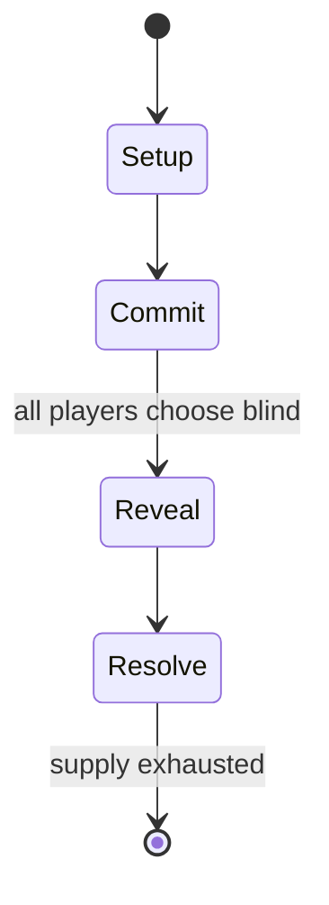

# Rigs of Rods

*free and open source vehicle-simulation game*

`rigs_of_rods` &nbsp; state: **DEEPENED** &nbsp; method: **heuristic**

## Found layer (recorded, not trusted)

| field | value |
| --- | --- |
| wikidata | Q2501239 |
| wikipedia | Rigs of Rods |
| genres (source) | vehicle simulation game |
| instance of (source) | video game |
| country of origin | France |

## Declared layer (orders bench work)

| field | value |
| --- | --- |
| year created | 2005 |
| epoch | CONTEMPORARY |
| region | EUROPE_WEST |
| media | VIDEO |
| players | -- |
| age band | -- |
| exogenous process | -- |
| loss shape | -- |
| live axes | COMMIT_BLIND, TIMING |
| horizon | -- |
| scoring shape | -- |
| information | SIMULTANEOUS |
| interaction | -- |
| turn structure | SIMULTANEOUS |
| tractability | SAMPLING_ONLY |
| randomness | SIMULTANEOUS_CHOICE |
| luck factor | 0.3 |
| rules complexity | 2.8 |
| strategic depth | 2.25 |
| novelty | 0.6299 |
| solved status | -- |
| strategies | route_optimisation |
| algorithms | -- |

## Object model

```
Episode
  players      : ?
  turn_structure: SIMULTANEOUS
  horizon       : ?
  scoring       : ?

WorldState     -- simulation state advanced by the engine
Avatar         -- player-controlled agent
Clock          -- frame or tick counter
SealedChoice   -- irrevocable choice made without observation
Initiative     -- who acts, and when, relative to others
```

## State transition diagram



## Research item -- turn trace

```
# Rigs of Rods -- simulated turn events
# generated from the DECLARED vector, not from a rulebook.
# structure: exo=None loss=None horizon=None scoring=None axes=COMMIT_BLIND,TIMING

t=0    SETUP        players=2  pot=0  capacity=4
t=1    FORCED       p1 single legal option taken (pot_gain=+0.6)
t=2    FORCED       p1 single legal option taken (pot_gain=+0.9)
t=3    ENDTURN      turn passes to p2
t=4    FORCED       p2 single legal option taken (pot_gain=+1.7)
t=5    FORCED       p2 single legal option taken (pot_gain=+1.9)
t=6    FORCED       p2 single legal option taken (pot_gain=+1.3)
t=7    FORCED       p2 single legal option taken (pot_gain=+1.2)
t=8    FORCED       p2 single legal option taken (pot_gain=+0.7)
t=9    FORCED       p2 single legal option taken (pot_gain=+0.8)
t=10   FORCED       p2 single legal option taken (pot_gain=+0.6)
t=11   ENDTURN      turn passes to p1
t=12   FORCED       p1 single legal option taken (pot_gain=+1.0)
t=13   FORCED       p1 single legal option taken (pot_gain=+1.1)
t=14   FORCED       p1 single legal option taken (pot_gain=+1.1)
t=15   FORCED       p1 single legal option taken (pot_gain=+1.6)
t=16   FORCED       p1 single legal option taken (pot_gain=+0.6)
t=17   FORCED       p1 single legal option taken (pot_gain=+1.7)
t=18   FORCED       p1 single legal option taken (pot_gain=+1.8)
t=19   ENDTURN      turn passes to p2
t=20   FORCED       p2 single legal option taken (pot_gain=+1.5)
t=21   FORCED       p2 single legal option taken (pot_gain=+1.3)
t=22   FORCED       p2 single legal option taken (pot_gain=+0.9)
t=23   FORCED       p2 single legal option taken (pot_gain=+1.9)
t=24   ENDTURN      turn passes to p1
t=25   FORCED       p1 single legal option taken (pot_gain=+0.9)
t=26   ENDTURN      turn passes to p2

terminal: VARIABLE
```

## Source extract

Rigs of Rods is a free and open source vehicle-simulation game which uses soft-body physics to
simulate the motion destruction and deformation of vehicles. The game uses a soft-body physics
engine to simulate a network of interconnected nodes (forming the chassis and the wheels) and
gives the ability to simulate deformable objects. With this engine, vehicles and their loads
flex and deform as stresses are applied. Crashing into walls or terrain can permanently deform a
vehicle until it is reset; however, not all vehicles in the game have flexible bodies.   ==
Gameplay ==  Rigs of Rods was initially created as an off-road truck simulator, but has
developed into a versatile physics sandbox game. Prior to version 0.28, the game was limited to
typical land vehicles with wheels, but plane and boat engines have been added since.  All
engines allow for a wide range of customization, leaving virtually no boundaries.  Vehicles are
built using vertices connected by beams. Vertices (or "nodes") are influenced by the stress on
the beams that connect them. If a beam is too stressed, it will deform, thus altering the
associated nodes position which ultimately alters the appearance and handling o

<sub>Wikipedia, CC BY-SA. Retained as evidence for the structural
classification above. Every rule inferred from it is HYPOTHESIZED
until audited against a rulebook.</sub>
