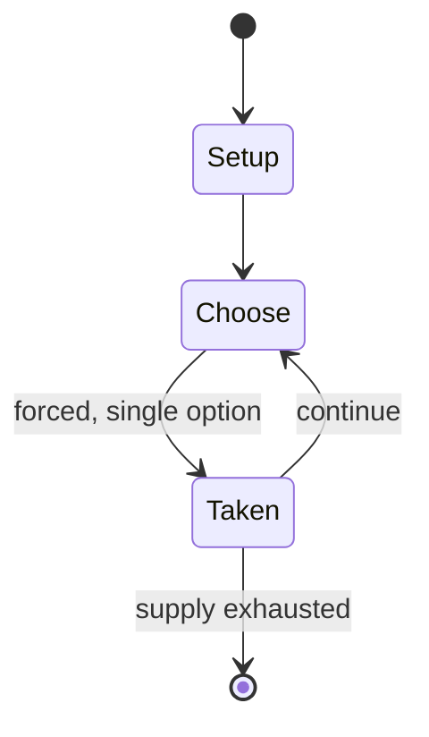

# Rimau

*Board game from Malaysia*

`rimau` &nbsp; state: **DEEPENED** &nbsp; method: **heuristic**

## Found layer (recorded, not trusted)

| field | value |
| --- | --- |
| wikidata | Q7334395 |
| wikipedia | Rimau |
| genres (source) | -- |
| instance of (source) | board game |
| country of origin | Malaysia |

## Declared layer (orders bench work)

| field | value |
| --- | --- |
| year created | -- |
| epoch | -- |
| region | SOUTHEAST_ASIA |
| media | BOARD |
| players | -- |
| age band | -- |
| exogenous process | -- |
| loss shape | -- |
| live axes | SPATIAL |
| horizon | -- |
| scoring shape | NONLINEAR |
| information | -- |
| interaction | COMPETITIVE |
| turn structure | -- |
| tractability | SAMPLING_ONLY |
| randomness | -- |
| luck factor | 0.35 |
| rules complexity | 2.42 |
| strategic depth | 2.0 |
| novelty | 0.5469 |
| solved status | -- |
| strategies | -- |
| algorithms | -- |

## Object model

```
Episode
  players      : ?
  turn_structure: ?
  horizon       : ?
  scoring       : NONLINEAR

Board          -- spatial substrate; cells carry position and occupancy
Piece          -- movable token owned by a player
Placement      -- position subject to geometric legality
```

## State transition diagram



## Research item -- turn trace

```
# Rimau -- simulated turn events
# generated from the DECLARED vector, not from a rulebook.
# structure: exo=None loss=None horizon=None scoring=NONLINEAR axes=SPATIAL

t=0    SETUP        players=2  pot=0  capacity=4
t=1    FORCED       p1 single legal option taken (pot_gain=+0.9)
t=2    FORCED       p1 single legal option taken (pot_gain=+1.8)
t=3    FORCED       p1 single legal option taken (pot_gain=+1.1)
t=4    SPATIAL      p1 places at (0,5); adjacency legal
t=5    FORCED       p1 single legal option taken (pot_gain=+2.0)
t=6    SPATIAL      p1 places at (4,4); adjacency legal
t=7    FORCED       p1 single legal option taken (pot_gain=+0.5)
t=8    SPATIAL      p1 places at (3,1); adjacency legal
t=9    FORCED       p1 single legal option taken (pot_gain=+1.9)
t=10   FORCED       p1 single legal option taken (pot_gain=+0.5)
t=11   FORCED       p1 single legal option taken (pot_gain=+1.5)
t=12   FORCED       p1 single legal option taken (pot_gain=+1.8)
t=13   SPATIAL      p1 places at (1,7); adjacency legal
t=14   FORCED       p1 single legal option taken (pot_gain=+1.0)
t=15   FORCED       p1 single legal option taken (pot_gain=+1.2)
t=16   FORCED       p1 single legal option taken (pot_gain=+1.9)
t=17   SPATIAL      p1 places at (0,1); adjacency legal
t=18   FORCED       p1 single legal option taken (pot_gain=+2.0)
t=19   FORCED       p1 single legal option taken (pot_gain=+0.7)
t=20   SPATIAL      p1 places at (2,7); adjacency legal
t=21   ENDTURN      turn passes to p2
t=22   FORCED       p2 single legal option taken (pot_gain=+1.9)
t=23   FORCED       p2 single legal option taken (pot_gain=+0.9)
t=24   FORCED       p2 single legal option taken (pot_gain=+1.1)
t=25   FORCED       p2 single legal option taken (pot_gain=+1.5)
t=26   SPATIAL      p2 places at (2,5); adjacency legal

terminal: VARIABLE
```

## Conditions

| kind | threshold | effect | trigger |
| --- | --- | --- | --- |
| ELIMINATE | -- | -- | The goal of the tiger is to eliminate as many men as possible which would prevent the men from blocking its movements. |

## Source extract

Rimau is a two-player abstract strategy board game from Malaysia.  It is a hunt game, and
specifically a tiger hunt game (or tiger game) since it uses an expanded alquerque board.  One
tiger is being hunted by 24 men.  The tiger attempts to eat the men, and the men attempt to trap
the tiger.  Unique to rimau (and the two-tiger variant rimau-rimau), the tiger can capture a
line of men in a single leap.  There must be an odd number of men in the line, and they must be
adjacent to one another.  In most hunt games, the tiger, leopard, or fox is only able to capture
one prey in a leap.   == Origins ==  Rimau in Malay means "tiger".  The men are called orang-
orang, the plural of orang which means "man". Rimau is played on the same board as the game
rimau-rimau, which has two tigers and 22 or 24 men. Both games share similar rules. Rimau is a
hunt game, specifically a tiger hunt game (or tiger game); this family of hunt games uses an
alquerque board or a variant thereof, including games like rimau-rimau, bagh-chal ("tigers and
goats" in Nepali), and main tapal empat.  In contrast, leopard hunt games use a more triangular
board and not an alquerque-based board.  Similarly, fox games are al

<sub>Wikipedia, CC BY-SA. Retained as evidence for the structural
classification above. Every rule inferred from it is HYPOTHESIZED
until audited against a rulebook.</sub>
