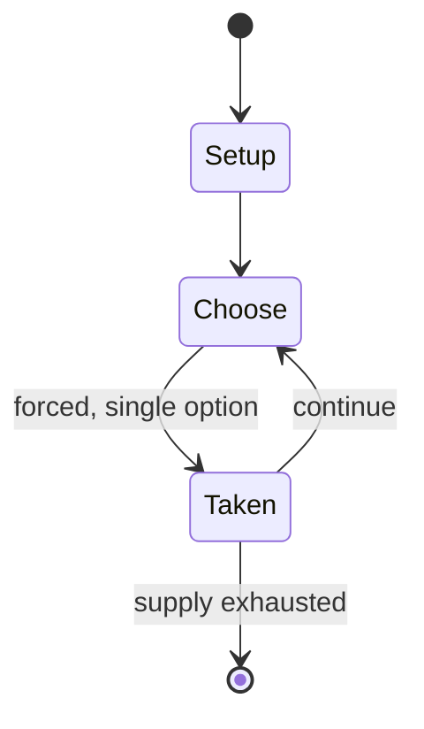

# Rimau-rimau

*Malaysian board game*

`rimau_rimau` &nbsp; state: **DEEPENED** &nbsp; method: **heuristic**

## Found layer (recorded, not trusted)

| field | value |
| --- | --- |
| wikidata | Q10566481 |
| wikipedia | Rimau-rimau |
| genres (source) | -- |
| instance of (source) | abstract strategy game |
| country of origin | -- |

## Declared layer (orders bench work)

| field | value |
| --- | --- |
| year created | -- |
| epoch | -- |
| region | -- |
| media | ABSTRACT, BOARD, CARD |
| players | -- |
| age band | -- |
| exogenous process | -- |
| loss shape | -- |
| live axes | - |
| horizon | -- |
| scoring shape | NONLINEAR |
| information | -- |
| interaction | COMPETITIVE |
| turn structure | -- |
| tractability | SAMPLING_ONLY |
| randomness | -- |
| luck factor | 0.35 |
| rules complexity | 1.83 |
| strategic depth | 2.0 |
| novelty | 0.5514 |
| solved status | -- |
| strategies | -- |
| algorithms | -- |

## Object model

```
Episode
  players      : ?
  turn_structure: ?
  horizon       : ?
  scoring       : NONLINEAR

Board          -- spatial substrate; cells carry position and occupancy
Piece          -- movable token owned by a player
Deck           -- ordered multiset, drawn without replacement
Hand           -- private multiset held by one player
DiscardPile    -- public accumulation of spent cards
```

## State transition diagram



## Research item -- turn trace

```
# Rimau-rimau -- simulated turn events
# generated from the DECLARED vector, not from a rulebook.
# structure: exo=None loss=None horizon=None scoring=NONLINEAR axes=-

t=0    SETUP        players=2  pot=0  capacity=8
t=1    FORCED       p1 single legal option taken (pot_gain=+1.3)
t=2    ENDTURN      turn passes to p2
t=3    FORCED       p2 single legal option taken (pot_gain=+1.0)
t=4    ENDTURN      turn passes to p1
t=5    FORCED       p1 single legal option taken (pot_gain=+1.0)
t=6    FORCED       p1 single legal option taken (pot_gain=+0.8)
t=7    FORCED       p1 single legal option taken (pot_gain=+1.9)
t=8    ENDTURN      turn passes to p2
t=9    FORCED       p2 single legal option taken (pot_gain=+1.9)
t=10   FORCED       p2 single legal option taken (pot_gain=+1.9)
t=11   FORCED       p2 single legal option taken (pot_gain=+1.0)
t=12   FORCED       p2 single legal option taken (pot_gain=+1.8)
t=13   FORCED       p2 single legal option taken (pot_gain=+1.3)
t=14   ENDTURN      turn passes to p1
t=15   FORCED       p1 single legal option taken (pot_gain=+0.7)
t=16   FORCED       p1 single legal option taken (pot_gain=+1.7)
t=17   FORCED       p1 single legal option taken (pot_gain=+1.5)
t=18   FORCED       p1 single legal option taken (pot_gain=+1.0)
t=19   FORCED       p1 single legal option taken (pot_gain=+2.0)
t=20   FORCED       p1 single legal option taken (pot_gain=+1.5)
t=21   FORCED       p1 single legal option taken (pot_gain=+0.8)
t=22   FORCED       p1 single legal option taken (pot_gain=+1.0)
t=23   FORCED       p1 single legal option taken (pot_gain=+0.5)
t=24   FORCED       p1 single legal option taken (pot_gain=+1.2)
t=25   FORCED       p1 single legal option taken (pot_gain=+1.3)
t=26   FORCED       p1 single legal option taken (pot_gain=+0.7)

terminal: VARIABLE
```

## Conditions

| kind | threshold | effect | trigger |
| --- | --- | --- | --- |
| ELIMINATE | -- | -- | The goal of the tigers is to eliminate as many men as possible which would prevent the men from blocking their movements. |
| BOUNDARY | -- | -- | This means that only at most eight sheep are allowed on the board at any time, but can eight sheep effectively block the two tigers? |
| BOUNDARY | -- | -- | If playing with the version with two rimoe, the rimoe may capture no more than one ana per turn. |

## Source extract

Rimau-rimau is a two-player abstract strategy board game that belongs to the hunt game family.
This family includes games like bagh-chal, main tapal empat, aadu puli attam, catch the hare,
sua ghin gnua, the fox games, buga-shadara, and many more.  Rimau-rimau is the plural of rimau
which is an abbreviation of the word harimau, meaning 'tiger' in the Malay language.  Therefore,
rimau-rimau means 'tigers'.  The several hunters attempting to surround and immobilize the
tigers are called orang-orang, which is the plural of orang, meaning 'man'.  Therefore, orang-
orang means 'men' and there are twenty-two or twenty-four of them, depending on which version of
the game is played.  The game originates from Malaysia. Rimau-rimau is specifically part of the
tiger hunt game family (or tiger game family) since its board consists in part of an alquerque
board.  In contrast, leopard games are also hunt games, but use a more triangular-patterned
board and not an alquerque-based board.  Fox games are also hunt games, but use a patterned
board that resembles a cross. Two versions of this game are described below:  Version A and
Version B.  Both use two rimau-rimau (two tigers).  The main differen

<sub>Wikipedia, CC BY-SA. Retained as evidence for the structural
classification above. Every rule inferred from it is HYPOTHESIZED
until audited against a rulebook.</sub>
