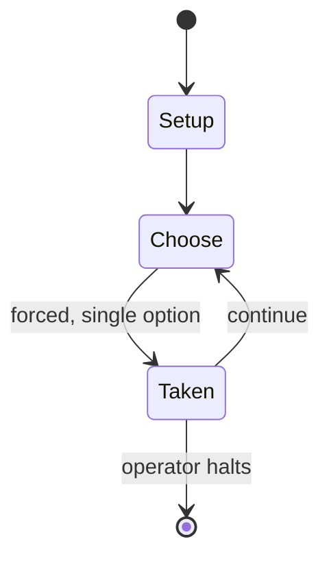

# Rise and Decline of the Third Reich

*1974 grand strategy wargame set during World War II*

`rise_and_decline_of_the_third_reich` &nbsp; state: **DEEPENED** &nbsp; method: **heuristic**

## Found layer (recorded, not trusted)

| field | value |
| --- | --- |
| wikidata | Q10363000 |
| wikipedia | Rise and Decline of the Third Reich |
| genres (source) | board wargame, grand strategy wargame |
| instance of (source) | board game |
| country of origin | -- |

## Declared layer (orders bench work)

| field | value |
| --- | --- |
| year created | 1974 |
| epoch | DIGITAL |
| region | -- |
| media | BOARD, WARGAME |
| players | 2-6 |
| age band | -- |
| exogenous process | -- |
| loss shape | -- |
| live axes | - |
| horizon | OPEN_ENDED |
| scoring shape | -- |
| information | -- |
| interaction | -- |
| turn structure | -- |
| tractability | SAMPLING_ONLY |
| randomness | -- |
| luck factor | 0.35 |
| rules complexity | 2.98 |
| strategic depth | 2.5 |
| novelty | 0.4885 |
| solved status | -- |
| strategies | sacrifice, signalling |
| algorithms | -- |

## Object model

```
Episode
  players      : 2-6
  turn_structure: ?
  horizon       : OPEN_ENDED
  scoring       : ?

Board          -- spatial substrate; cells carry position and occupancy
Piece          -- movable token owned by a player
```

## State transition diagram



## Research item -- turn trace

```
# Rise and Decline of the Third Reich -- simulated turn events
# generated from the DECLARED vector, not from a rulebook.
# structure: exo=None loss=None horizon=OPEN_ENDED scoring=None axes=-

t=0    SETUP        players=2  pot=0  capacity=5
t=1    FORCED       p1 single legal option taken (pot_gain=+1.3)
t=2    FORCED       p1 single legal option taken (pot_gain=+1.5)
t=3    FORCED       p1 single legal option taken (pot_gain=+1.1)
t=4    FORCED       p1 single legal option taken (pot_gain=+1.5)
t=5    FORCED       p1 single legal option taken (pot_gain=+0.8)
t=6    FORCED       p1 single legal option taken (pot_gain=+1.2)
t=7    ENDTURN      turn passes to p2
t=8    FORCED       p2 single legal option taken (pot_gain=+1.0)
t=9    FORCED       p2 single legal option taken (pot_gain=+1.1)
t=10   FORCED       p2 single legal option taken (pot_gain=+1.3)
t=11   ENDTURN      turn passes to p1
t=12   FORCED       p1 single legal option taken (pot_gain=+0.6)
t=13   FORCED       p1 single legal option taken (pot_gain=+1.1)
t=14   FORCED       p1 single legal option taken (pot_gain=+0.6)
t=15   FORCED       p1 single legal option taken (pot_gain=+1.1)
t=16   FORCED       p1 single legal option taken (pot_gain=+1.0)
t=17   FORCED       p1 single legal option taken (pot_gain=+1.0)
t=18   FORCED       p1 single legal option taken (pot_gain=+0.5)
t=19   FORCED       p1 single legal option taken (pot_gain=+0.8)
t=20   FORCED       p1 single legal option taken (pot_gain=+0.9)
t=21   ENDTURN      turn passes to p2
t=22   FORCED       p2 single legal option taken (pot_gain=+1.4)
t=23   FORCED       p2 single legal option taken (pot_gain=+1.2)
t=24   FORCED       p2 single legal option taken (pot_gain=+1.2)
t=25   FORCED       p2 single legal option taken (pot_gain=+1.9)
t=26   ENDTURN      turn passes to p1

terminal: OPEN_ENDED
```

## Conditions

| kind | threshold | effect | trigger |
| --- | --- | --- | --- |
| BOUNDARY | -- | -- | Provided at least one attacking unit was armor, any other armor unit which did not attack, but which was adjacent to an attacking unit, may now be placed on the newly gained hex (the "breakthrough hex"). |
| BOUNDARY | -- | -- | These armored units may then "exploit", i.e. move again, provided they keep to a chain with no more than one empty hex between each unit, and then attack – a key tactic in surrounding enemy units. |

## Source extract

Rise and Decline of the Third Reich or more commonly Third Reich is a grand strategy wargame
covering the European theater of World War II, designed by John Prados and released in 1974 by
Avalon Hill. Players take on the roles of major powers—Germany, Italy, United Kingdom, France,
the Soviet Union, and the United States—from 1939 to 1946. The game was popular because of the
balance between economics, politics, and land, sea, air and strategic warfare. Players can try
alternate history strategies (e.g., a German invasion of Spain or the United Kingdom). The game
is complex and can take many hours to complete. Revised editions of the game were published in
the 1980s. A further redesign of the game, Advanced Third Reich, was published in 1992, followed
by a Pacific theater counterpart, Empire of the Rising Sun, in 1995. In 2003, yet another
redesign of these two games was published by GMT Games as A World at War. In 2001, Avalanche
Press released a separate new version, more closely resembling the original game, known as John
Prados' Third Reich.   == Gameplay == The game normally starts in Fall 1939, although scenarios
are provided for starting in 1942 and 1944 (the latter is recomm

<sub>Wikipedia, CC BY-SA. Retained as evidence for the structural
classification above. Every rule inferred from it is HYPOTHESIZED
until audited against a rulebook.</sub>
