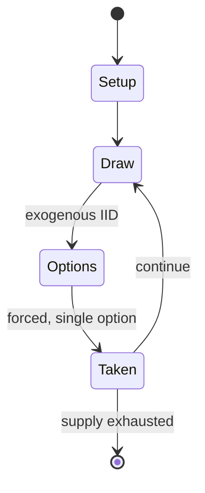

# RisiKo!

*strategy game, variant of Risk*

`risiko` &nbsp; state: **DEEPENED** &nbsp; method: **heuristic**

## Found layer (recorded, not trusted)

| field | value |
| --- | --- |
| wikidata | Q16596837 |
| wikipedia | RisiKo! |
| genres (source) | -- |
| instance of (source) | board game, wargame |
| country of origin | -- |

## Declared layer (orders bench work)

| field | value |
| --- | --- |
| year created | 1968 |
| epoch | MODERN |
| region | -- |
| media | BOARD, DICE |
| players | -- |
| age band | -- |
| exogenous process | IID |
| loss shape | -- |
| live axes | SPATIAL |
| horizon | -- |
| scoring shape | -- |
| information | -- |
| interaction | COMPETITIVE |
| turn structure | -- |
| tractability | EXACT_WITH_CUT |
| randomness | DICE, HIDDEN_INFO |
| luck factor | 0.63 |
| rules complexity | 2.03 |
| strategic depth | 1.79 |
| novelty | 0.6332 |
| solved status | -- |
| strategies | -- |
| algorithms | -- |

## Object model

```
Episode
  players      : ?
  turn_structure: ?
  horizon       : ?
  scoring       : ?

Board          -- spatial substrate; cells carry position and occupancy
Piece          -- movable token owned by a player
DicePool       -- n dice, each an iid categorical draw
Roll           -- realised outcome of a pool
Placement      -- position subject to geometric legality
```

## State transition diagram



## Research item -- turn trace

```
# RisiKo! -- simulated turn events
# generated from the DECLARED vector, not from a rulebook.
# structure: exo=IID loss=None horizon=None scoring=None axes=SPATIAL

t=0    SETUP        players=2  pot=0  capacity=5
t=1    DRAW         p1 roll from d6 pool -> outcome #1  (p=0.126)
t=2    FORCED       p1 single legal option taken (pot_gain=+1.1)
t=3    ENDTURN      turn passes to p2
t=4    DRAW         p2 roll from d6 pool -> outcome #5  (p=0.287)
t=5    FORCED       p2 single legal option taken (pot_gain=+1.3)
t=6    SPATIAL      p2 places at (1,4); adjacency legal
t=7    DRAW         p2 roll from d6 pool -> outcome #5  (p=0.284)
t=8    FORCED       p2 single legal option taken (pot_gain=+1.3)
t=9    DRAW         p2 roll from d6 pool -> outcome #5  (p=0.143)
t=10   FORCED       p2 single legal option taken (pot_gain=+1.8)
t=11   SPATIAL      p2 places at (7,2); adjacency legal
t=12   ENDTURN      turn passes to p1
t=13   DRAW         p1 roll from d6 pool -> outcome #4  (p=0.109)
t=14   FORCED       p1 single legal option taken (pot_gain=+0.6)
t=15   DRAW         p1 roll from d6 pool -> outcome #1  (p=0.028)
t=16   FORCED       p1 single legal option taken (pot_gain=+1.1)
t=17   DRAW         p1 roll from d6 pool -> outcome #2  (p=0.206)
t=18   FORCED       p1 single legal option taken (pot_gain=+1.0)
t=19   DRAW         p1 roll from d6 pool -> outcome #3  (p=0.166)
t=20   FORCED       p1 single legal option taken (pot_gain=+0.6)
t=21   SPATIAL      p1 places at (6,6); adjacency legal
t=22   DRAW         p1 roll from d6 pool -> outcome #4  (p=0.101)
t=23   FORCED       p1 single legal option taken (pot_gain=+1.9)
t=24   ENDTURN      turn passes to p2
t=25   DRAW         p2 roll from d6 pool -> outcome #1  (p=0.056)
t=26   FORCED       p2 single legal option taken (pot_gain=+1.5)
t=27   SPATIAL      p2 places at (6,6); adjacency legal

terminal: VARIABLE
```

## Conditions

| kind | threshold | effect | trigger |
| --- | --- | --- | --- |
| ELIMINATE | -- | -- | Completely eliminate all armies of a specific color. |
| ELIMINATE | -- | -- | If that's impossible (because the player is using that color, no one is using that color, or the player using that color has already been eliminated), the mission becomes conquering 24 territories. |
| WIN | -- | -- | To win the game, they have to complete this mission. |
| BOUNDARY | -- | -- | Players then mark their territories by placing at least one army on them and give back their Territory cards, that will be used later for a different purpose. |
| BOUNDARY | -- | -- | They can distribute their armies however they like across their territories, but each territory must have at least one army. |
| BOUNDARY | -- | -- | Conquer 18 territories and control both of them with at least two armies. |
| BOUNDARY | -- | -- | At every turn, a player receives a Territory card if they conquer at least one territory (but do not get more cards for subsequent territories). |
| BOUNDARY | -- | -- | For instance, in the Italian variant, the defender can also roll up to 3 dice, thus obtaining an advantage over the attacker, while in most variants the maximum number of dice that can be used in a battle is 5, 3 for the |

## Source extract

RisiKo! is an Italian strategy board game based on Risk. Unlike classic versions of Risk, the
object of the game is the achievement of a predefined, secret target that is different for each
player: the target can be either the conquest of a certain number of territories, of two or more
continents, or the annihilation of one opponent.   == History == RisiKo! derives from the 1957
French game La Conquête du Monde, better known worldwide as Risk. The first Italian edition
dates 1968, published by Milanese publisher Giochiclub that distributed games of several
European companies and mixed features of different versions: the name RisiKo! derives from the
German version Risiko; the rules were almost identical to the French version, with some notes in
the manual taken from the Anglo-American edition; tokens were wooden cube-shaped. As in the
first French edition, 3 dice were used for defense, initial forces were distributed more
randomly, and players received one card at the beginning of their own turn as well as from
conquering territories. In 1973 Giochiclub published a new version with same rules, but
introduced plastic tank-shaped and machinegun-shaped tokens (to represent one and fiv

<sub>Wikipedia, CC BY-SA. Retained as evidence for the structural
classification above. Every rule inferred from it is HYPOTHESIZED
until audited against a rulebook.</sub>
