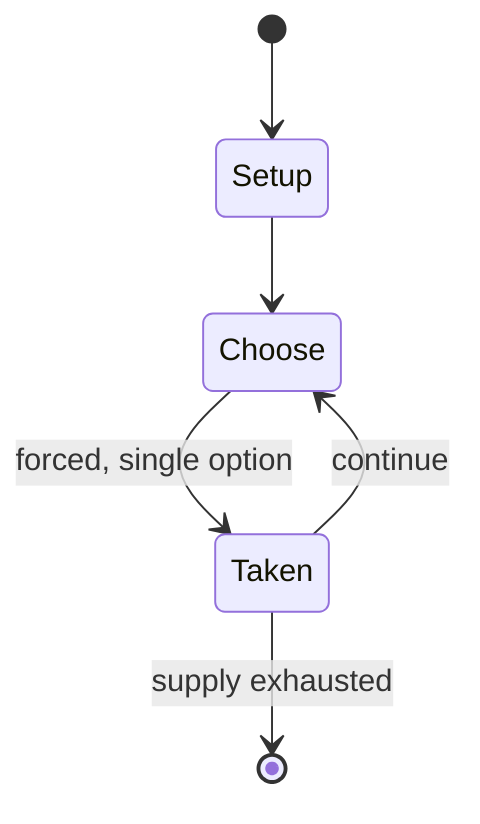

# Rithmomachia

*abstract strategy game*

`rithmomachia` &nbsp; state: **DEEPENED** &nbsp; method: **heuristic**

## Found layer (recorded, not trusted)

| field | value |
| --- | --- |
| wikidata | Q140656 |
| wikipedia | Rithmomachia |
| genres (source) | -- |
| instance of (source) | abstract strategy game, board game |
| country of origin | -- |

## Declared layer (orders bench work)

| field | value |
| --- | --- |
| year created | 1100 |
| epoch | MEDIEVAL |
| region | -- |
| media | ABSTRACT, BOARD, EDUCATIONAL |
| players | -- |
| age band | -- |
| exogenous process | NONE |
| loss shape | OPPORTUNITY_ONLY |
| live axes | - |
| horizon | -- |
| scoring shape | SURVIVAL |
| information | PERFECT |
| interaction | COMPETITIVE |
| turn structure | -- |
| tractability | EXACT_WITH_CUT |
| randomness | NONE |
| luck factor | 0.02 |
| rules complexity | 1.95 |
| strategic depth | 2.4 |
| novelty | 0.7343 |
| solved status | -- |
| strategies | -- |
| algorithms | -- |

## Object model

```
Episode
  players      : ?
  turn_structure: ?
  horizon       : ?
  scoring       : SURVIVAL

Board          -- spatial substrate; cells carry position and occupancy
Piece          -- movable token owned by a player
```

## State transition diagram



## Research item -- turn trace

```
# Rithmomachia -- simulated turn events
# generated from the DECLARED vector, not from a rulebook.
# structure: exo=NONE loss=OPPORTUNITY_ONLY horizon=None scoring=SURVIVAL axes=-

t=0    SETUP        players=2  pot=0  capacity=5
t=1    FORCED       p1 single legal option taken (pot_gain=+1.1)
t=2    ENDTURN      turn passes to p2
t=3    FORCED       p2 single legal option taken (pot_gain=+1.4)
t=4    ENDTURN      turn passes to p1
t=5    FORCED       p1 single legal option taken (pot_gain=+1.2)
t=6    ENDTURN      turn passes to p2
t=7    FORCED       p2 single legal option taken (pot_gain=+0.6)
t=8    FORCED       p2 single legal option taken (pot_gain=+0.6)
t=9    ENDTURN      turn passes to p1
t=10   FORCED       p1 single legal option taken (pot_gain=+0.5)
t=11   ENDTURN      turn passes to p2
t=12   FORCED       p2 single legal option taken (pot_gain=+0.7)
t=13   FORCED       p2 single legal option taken (pot_gain=+1.7)
t=14   ENDTURN      turn passes to p1
t=15   FORCED       p1 single legal option taken (pot_gain=+1.7)
t=16   FORCED       p1 single legal option taken (pot_gain=+0.8)
t=17   FORCED       p1 single legal option taken (pot_gain=+1.1)
t=18   FORCED       p1 single legal option taken (pot_gain=+0.5)
t=19   FORCED       p1 single legal option taken (pot_gain=+0.5)
t=20   FORCED       p1 single legal option taken (pot_gain=+1.7)
t=21   ENDTURN      turn passes to p2
t=22   FORCED       p2 single legal option taken (pot_gain=+1.7)
t=23   FORCED       p2 single legal option taken (pot_gain=+1.4)
t=24   ENDTURN      turn passes to p1
t=25   FORCED       p1 single legal option taken (pot_gain=+1.6)
t=26   FORCED       p1 single legal option taken (pot_gain=+1.6)

terminal: VARIABLE
```

## Conditions

| kind | threshold | effect | trigger |
| --- | --- | --- | --- |
| WIN | -- | -- | De corpore (Latin: "by body"): If a player captures a certain number of pieces set by both players, they win the game. |
| WIN | -- | -- | De bonis ("by goods"): If a player captures enough pieces to add up to or exceed a certain value that is set by both players, they win the game. |
| WIN | -- | -- | De lite ("by lawsuit"): If a player captures enough pieces to add up to or exceed a certain value that is set by both players, and the number of digits in their captured pieces' values are less than a number set by both  |
| WIN | -- | -- | De honore ("by honour"): If a player captures enough pieces to add up to or exceed a certain value that is set by both players, and the number of pieces they captured are less than a certain number set by both players, t |
| WIN | -- | -- | De honore liteque ("by honour and lawsuit"): If a player captures enough pieces to add up to or exceed a certain value that is set by both players, the number of digits in their captured pieces' values are less than a nu |

## Source extract

Rithmomachia (also known as rithmomachy, arithmomachia, rythmomachy, rhythmomachy, the
philosophers' game, and other variants) is an early European mathematical board game.  Its
earliest known description dates from the eleventh century.  The name comes loosely from Greek
and means "The Battle of the Numbers."  The game is somewhat like chess except that most methods
of capture depend on the numbers inscribed on each piece. The game was used as an educational
tool that teachers could introduce while teaching arithmetic as part of the quadrivium to those
in Western Europe who received a classical education during the medieval period.  David Sepkoski
wrote that between the twelfth and sixteenth centuries, "rithmomachia served as a practical
exemplar for teaching the contemplative values of Boethian mathematical philosophy, which
emphasized the natural harmony and perfection of number and proportion, that it was used both as
a mnemonic drill for the study of Boethian number theory and, more importantly, as a vehicle for
moral education, by reminding players of the mathematical harmony of creation."  The game
declined sharply in popularity in the 17th century, as it was no longer used

<sub>Wikipedia, CC BY-SA. Retained as evidence for the structural
classification above. Every rule inferred from it is HYPOTHESIZED
until audited against a rulebook.</sub>
