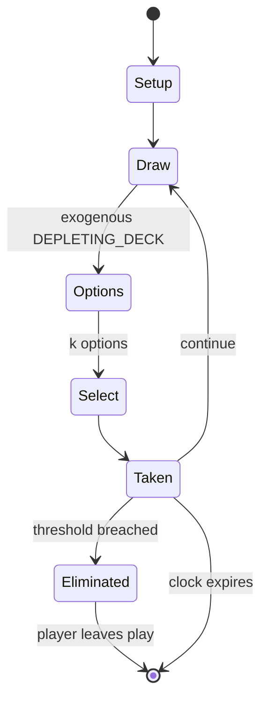

# RoboRally

`roborally` &nbsp; state: **DEEPENED** &nbsp; method: **heuristic**

## Found layer (recorded, not trusted)

| field | value |
| --- | --- |
| wikidata | Q643841 |
| wikipedia | RoboRally |
| genres (source) | -- |
| instance of (source) | -- |
| country of origin | -- |

## Declared layer (orders bench work)

| field | value |
| --- | --- |
| year created | 1994 |
| epoch | DIGITAL |
| region | -- |
| media | BOARD |
| players | 2-8 |
| age band | -- |
| exogenous process | DEPLETING_DECK |
| loss shape | ELIMINATION |
| live axes | COMMIT_BLIND, DISCARD, SELECT |
| horizon | CLOCK_LIMITED |
| scoring shape | RACE_POSITION |
| information | SIMULTANEOUS |
| interaction | -- |
| turn structure | PHASE_STRUCTURED |
| tractability | SAMPLING_ONLY |
| randomness | DECK_SHUFFLE, HIDDEN_INFO, REAL_TIME_PHYSICAL, SIMULTANEOUS_CHOICE |
| luck factor | 0.53 |
| rules complexity | 4.04 |
| strategic depth | 1.95 |
| novelty | 0.749 |
| solved status | -- |
| strategies | -- |
| algorithms | -- |

## Object model

```
Episode
  players      : 2-8
  turn_structure: PHASE_STRUCTURED
  horizon       : CLOCK_LIMITED
  scoring       : RACE_POSITION

Board          -- spatial substrate; cells carry position and occupancy
Piece          -- movable token owned by a player
SealedChoice   -- irrevocable choice made without observation
DiscardChoice  -- what is given up to satisfy a limit
OptionSet      -- the choices available after an exogenous draw
```

## State transition diagram



## Research item -- turn trace

```
# RoboRally -- simulated turn events
# generated from the DECLARED vector, not from a rulebook.
# structure: exo=DEPLETING_DECK loss=ELIMINATION horizon=CLOCK_LIMITED scoring=RACE_POSITION axes=COMMIT_BLIND,DISCARD,SELECT

t=0    SETUP        players=2  pot=0  capacity=4
t=1    DRAW         p1 draw from deck -> outcome #3  (p=0.109)
t=2    SELECT       p1 1 options; take #1  (pot_gain=+1.9, capacity=-0)
t=3    DISCARD      p1 discards to hand limit
t=4    DRAW         p1 draw from deck -> outcome #2  (p=0.015)
t=5    SELECT       p1 1 options; take #1  (pot_gain=+2.0, capacity=-0)
t=6    DISCARD      p1 discards to hand limit
t=7    ENDTURN      turn passes to p2
t=8    DRAW         p2 draw from deck -> outcome #4  (p=0.055)
t=9    SELECT       p2 1 options; take #1  (pot_gain=+1.9, capacity=-0)
t=10   DISCARD      p2 discards to hand limit
t=11   DRAW         p2 draw from deck -> outcome #2  (p=0.045)
t=12   SELECT       p2 1 options; take #1  (pot_gain=+2.0, capacity=-2)
t=13   DISCARD      p2 discards to hand limit
t=14   DRAW         p2 draw from deck -> outcome #3  (p=0.249)
t=15   SELECT       p2 2 options; take #1  (pot_gain=+3.1, capacity=-2)
t=16   DRAW         p2 draw from deck -> outcome #1  (p=0.050)
t=17   SELECT       p2 2 options; take #2  (pot_gain=+1.9, capacity=-1)
t=18   DISCARD      p2 discards to hand limit
t=19   DRAW         p2 draw from deck -> outcome #5  (p=0.171)
t=20   SELECT       p2 2 options; take #2  (pot_gain=+1.8, capacity=-2)
t=21   DRAW         p2 draw from deck -> outcome #4  (p=0.046)
t=22   SELECT       p2 1 options; take #1  (pot_gain=+0.8, capacity=-1)
t=23   DRAW         p2 draw from deck -> outcome #3  (p=0.237)
t=24   SELECT       p2 2 options; take #1  (pot_gain=+2.9, capacity=-2)
t=25   DRAW         p2 draw from deck -> outcome #3  (p=0.266)
t=26   SELECT       p2 2 options; take #2  (pot_gain=+1.2, capacity=-0)

terminal: CLOCK_LIMITED
```

## Conditions

| kind | threshold | effect | trigger |
| --- | --- | --- | --- |
| BOUNDARY | 4 players | -- | He concluded by giving it an average rating of 7 out of 10, saying, "anyone who's looking for great way to while away a couple of hours and have fun is strongly advised to check this out – it's simple to learn, extremely |
| ELIMINATE | -- | out of the game | If a player runs out of Life tokens, (four robots destroyed), the player is out of the game. |
| WIN | -- | -- | The first robot to touch the final numbered flag is the winner. |

## Source extract

RoboRally, also stylized as Robo Rally, is a board game for 2–8 players designed by Richard
Garfield and published by Wizards of the Coast (WotC) in 1994. Various expansions and revisions
have been published by WotC, Avalon Hill, and Renegade Games.   == Description ==  In RoboRally,
2–8 players assume control of "Robot Control Computers" in a dangerous widget factory filled
with moving, course-altering conveyor belts, metal-melting laser beams, bottomless pits,
crushers, and a variety of other obstacles. Using randomly dealt "program cards", the
controllers attempt to maneuver their robot to reach a pre-designated number of checkpoints in a
particular order.   === Components === The game box contains:  4 double-sided map boards 8
player mats 8 robot tokens and matching archive markers 8 Power Down tokens 84 Program cards
that either move a robot ahead or back, or turn it either 90 degrees left or right, or reverse
its direction 26 Option cards 40 Life markers 60 Damage tokens two-sided Docking Bay board
30-second hourglass timer rulebook   === Set-up === Each player chooses a robot token and its
matching archive token, and also receives three life tokens and a player mat. The play

<sub>Wikipedia, CC BY-SA. Retained as evidence for the structural
classification above. Every rule inferred from it is HYPOTHESIZED
until audited against a rulebook.</sub>
