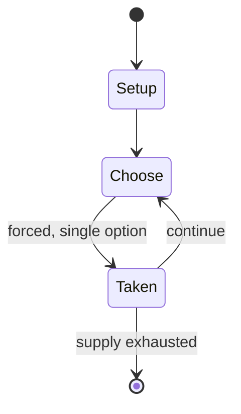

# RoboWar

*1990 open-source video game*

`robowar` &nbsp; state: **DEEPENED** &nbsp; method: **heuristic**

## Found layer (recorded, not trusted)

| field | value |
| --- | --- |
| wikidata | Q17042762 |
| wikipedia | RoboWar |
| genres (source) | programming game |
| instance of (source) | video game |
| country of origin | United States |

## Declared layer (orders bench work)

| field | value |
| --- | --- |
| year created | 1992 |
| epoch | DIGITAL |
| region | NORTH_AMERICA |
| media | VIDEO |
| players | -- |
| age band | -- |
| exogenous process | -- |
| loss shape | -- |
| live axes | - |
| horizon | -- |
| scoring shape | -- |
| information | -- |
| interaction | -- |
| turn structure | -- |
| tractability | SAMPLING_ONLY |
| randomness | -- |
| luck factor | 0.35 |
| rules complexity | 1.69 |
| strategic depth | 2.0 |
| novelty | 0.0914 |
| solved status | -- |
| strategies | -- |
| algorithms | -- |

## Object model

```
Episode
  players      : ?
  turn_structure: ?
  horizon       : ?
  scoring       : ?

WorldState     -- simulation state advanced by the engine
Avatar         -- player-controlled agent
Clock          -- frame or tick counter
```

## State transition diagram



## Research item -- turn trace

```
# RoboWar -- simulated turn events
# generated from the DECLARED vector, not from a rulebook.
# structure: exo=None loss=None horizon=None scoring=None axes=-

t=0    SETUP        players=2  pot=0  capacity=4
t=1    FORCED       p1 single legal option taken (pot_gain=+1.2)
t=2    FORCED       p1 single legal option taken (pot_gain=+0.7)
t=3    FORCED       p1 single legal option taken (pot_gain=+1.9)
t=4    FORCED       p1 single legal option taken (pot_gain=+1.1)
t=5    FORCED       p1 single legal option taken (pot_gain=+1.9)
t=6    FORCED       p1 single legal option taken (pot_gain=+1.9)
t=7    FORCED       p1 single legal option taken (pot_gain=+0.8)
t=8    FORCED       p1 single legal option taken (pot_gain=+1.9)
t=9    FORCED       p1 single legal option taken (pot_gain=+1.5)
t=10   FORCED       p1 single legal option taken (pot_gain=+1.8)
t=11   FORCED       p1 single legal option taken (pot_gain=+0.8)
t=12   ENDTURN      turn passes to p2
t=13   FORCED       p2 single legal option taken (pot_gain=+1.8)
t=14   FORCED       p2 single legal option taken (pot_gain=+1.1)
t=15   FORCED       p2 single legal option taken (pot_gain=+1.8)
t=16   FORCED       p2 single legal option taken (pot_gain=+1.3)
t=17   ENDTURN      turn passes to p1
t=18   FORCED       p1 single legal option taken (pot_gain=+1.4)
t=19   FORCED       p1 single legal option taken (pot_gain=+1.3)
t=20   FORCED       p1 single legal option taken (pot_gain=+1.9)
t=21   FORCED       p1 single legal option taken (pot_gain=+0.6)
t=22   ENDTURN      turn passes to p2
t=23   FORCED       p2 single legal option taken (pot_gain=+1.3)
t=24   ENDTURN      turn passes to p1
t=25   FORCED       p1 single legal option taken (pot_gain=+1.3)
t=26   FORCED       p1 single legal option taken (pot_gain=+1.9)

terminal: VARIABLE
```

## Source extract

RoboWar is an open-source video game in which the player programs onscreen icon-like robots to
battle each other with animation and sound effects. The syntax of the language in which the
robots are programmed is a relatively simple stack-based one, based largely on IF, THEN, and
simply-defined variables. 25 RoboWar tournaments were held in the past between 1990 until
roughly 2003, when tournaments became intermittent and many of the major coders moved on.  All
robots from all tournaments are available on the RoboWar website. The RoboWar programming
language, RoboTalk, is a stack-oriented programming language and is similar in structure to
FORTH.   == Programming features == RoboWar for the Macintosh was notable among the genre of
autonomous robot programming games for the powerful programming model it exposed to the gamer.
By the early 1990s, RoboWar included an integrated debugger that permitted stepping through code
and setting breakpoints. Later editions of the RoboTalk language used by the robots (a cognate
of the HyperTalk language for Apple's HyperCard) included support for interrupts as well.   ==
History == RoboWar was originally released as a closed source shareware game i

<sub>Wikipedia, CC BY-SA. Retained as evidence for the structural
classification above. Every rule inferred from it is HYPOTHESIZED
until audited against a rulebook.</sub>
