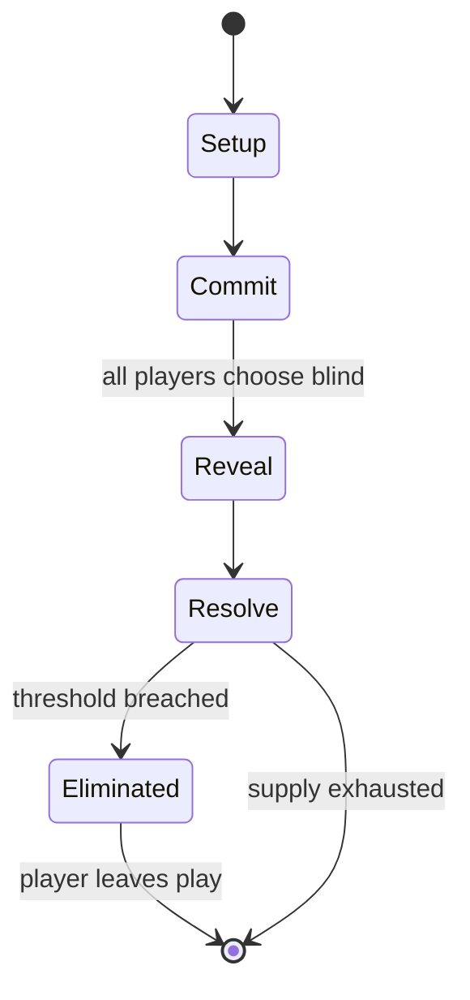

# Rock paper scissors

`rock_paper_scissors` &nbsp; state: **DEEPENED** &nbsp; method: **heuristic**

## Found layer (recorded, not trusted)

| field | value |
| --- | --- |
| wikidata | Q106631 |
| wikipedia | Rock paper scissors |
| genres (source) | -- |
| instance of (source) | -- |
| country of origin | -- |

## Declared layer (orders bench work)

| field | value |
| --- | --- |
| year created | -206 |
| epoch | ANCIENT |
| region | -- |
| media | DICE |
| players | -- |
| age band | CHILD |
| exogenous process | IID |
| loss shape | ELIMINATION |
| live axes | COMMIT_BLIND, SELECT |
| horizon | -- |
| scoring shape | -- |
| information | SIMULTANEOUS |
| interaction | COMPETITIVE |
| turn structure | SIMULTANEOUS |
| tractability | EXACT_WITH_CUT |
| randomness | DICE, SIMULTANEOUS_CHOICE, SPINNER |
| luck factor | 0.7 |
| rules complexity | 2.44 |
| strategic depth | 1.68 |
| novelty | 0.7175 |
| solved status | -- |
| strategies | bluffing |
| algorithms | heuristic_evaluation |

## Object model

```
Episode
  players      : ?
  turn_structure: SIMULTANEOUS
  horizon       : ?
  scoring       : ?

DicePool       -- n dice, each an iid categorical draw
Roll           -- realised outcome of a pool
SealedChoice   -- irrevocable choice made without observation
OptionSet      -- the choices available after an exogenous draw
```

## State transition diagram



## Research item -- turn trace

```
# Rock paper scissors -- simulated turn events
# generated from the DECLARED vector, not from a rulebook.
# structure: exo=IID loss=ELIMINATION horizon=None scoring=None axes=COMMIT_BLIND,SELECT

t=0    SETUP        players=2  pot=0  capacity=6
t=1    DRAW         p1 roll from d6 pool -> outcome #1  (p=0.151)
t=2    SELECT       p1 1 options; take #1  (pot_gain=+2.8, capacity=-1)
t=3    DRAW         p1 roll from d6 pool -> outcome #6  (p=0.031)
t=4    SELECT       p1 3 options; take #3  (pot_gain=+2.3, capacity=-0)
t=5    DRAW         p1 roll from d6 pool -> outcome #1  (p=0.163)
t=6    SELECT       p1 2 options; take #1  (pot_gain=+1.8, capacity=-0)
t=7    DRAW         p1 roll from d6 pool -> outcome #3  (p=0.187)
t=8    SELECT       p1 1 options; take #1  (pot_gain=+1.9, capacity=-2)
t=9    DRAW         p1 roll from d6 pool -> outcome #3  (p=0.224)
t=10   SELECT       p1 2 options; take #1  (pot_gain=+2.9, capacity=-0)
t=11   DRAW         p1 roll from d6 pool -> outcome #6  (p=0.219)
t=12   SELECT       p1 4 options; take #2  (pot_gain=+2.8, capacity=-2)
t=13   DRAW         p1 roll from d6 pool -> outcome #4  (p=0.183)
t=14   SELECT       p1 3 options; take #1  (pot_gain=+3.5, capacity=-0)
t=15   ENDTURN      turn passes to p2
t=16   DRAW         p2 roll from d6 pool -> outcome #5  (p=0.191)
t=17   SELECT       p2 4 options; take #3  (pot_gain=+3.4, capacity=-1)
t=18   DRAW         p2 roll from d6 pool -> outcome #6  (p=0.253)
t=19   SELECT       p2 4 options; take #1  (pot_gain=+2.6, capacity=-2)
t=20   ENDTURN      turn passes to p1
t=21   DRAW         p1 roll from d6 pool -> outcome #5  (p=0.095)
t=22   SELECT       p1 1 options; take #1  (pot_gain=+2.4, capacity=-0)
t=23   DRAW         p1 roll from d6 pool -> outcome #2  (p=0.088)
t=24   SELECT       p1 1 options; take #1  (pot_gain=+3.4, capacity=-0)
t=25   DRAW         p1 roll from d6 pool -> outcome #6  (p=0.189)
t=26   SELECT       p1 1 options; take #1  (pot_gain=+0.8, capacity=-2)

terminal: VARIABLE
```

## Conditions

| kind | threshold | effect | trigger |
| --- | --- | --- | --- |
| ELIMINATE | 257 players | -- | Following months of regional qualifying tournaments held across the US, 257 players were flown to Las Vegas for a single-elimination tournament at the House of Blues where the winner received $50,000. |
| ELIMINATE | -- | eliminated | If only two throws are present, all players with the losing throw are eliminated. |
| WIN | -- | -- | In a longer version of the game, a four-line song is sung, with hand gestures displayed at the end of each (or the final) line: "Jack-en-poy! / Hali-hali-hoy! / Sino'ng matalo, / siya'ng unggoy!" ("Jack-en-poy! / Hali-ha |
| TERMINATE | -- | -- | The winner of the game then moves on to the final round. |
| TERMINATE | -- | -- | In the final round, the player is presented with several Dabarkads, each holding different amounts of cash prize. |
| BOUNDARY | -- | -- | Frey's novels in the Campfire Girls series: The Campfire Girls Go Motoring (1916) and The Campfire Girls' Larks and Pranks (1917), which suggests that it was known in America at least that early. |
| BOUNDARY | -- | -- | This suggests that the author at least believed that the game was well known enough in America that her readers would understand the reference. |
| BOUNDARY | -- | -- | In 2004, the championships were broadcast on the U.S. television network Fox Sports Net (later known as Bally Sports), with the winner being Lee Rammage, who went on to compete in at least one subsequent championship. |

## Source extract

Rock paper scissors (also known by several other names and word orders) is an intransitive hand
game, usually played between two people, in which each player simultaneously forms one of three
shapes with an outstretched hand. These shapes are "rock" (a closed fist: ✊), "paper" (a flat
hand: ✋), and "scissors" (a fist with the index finger and middle finger extended, forming a V:
✌️). The earliest form of a "rock paper scissors"-style game originated in China and was
subsequently imported into Japan, where it reached its modern standardized form, before being
spread throughout the world in the early 20th century.  A simultaneous, zero-sum game, it has
three possible outcomes: a draw, a win, or a loss. A player who decides to play rock will beat
another player who chooses scissors ("rock crushes scissors" or "breaks scissors" or sometimes
"blunts scissors"), but will lose to one who has played paper ("paper covers rock"); a play of
paper will lose to a play of scissors ("scissors cuts paper"). If both players choose the same
shape, the game is tied, but is usually replayed until there is a winner. Rock paper scissors is
often used as a fair method of choosing between two options, sim

<sub>Wikipedia, CC BY-SA. Retained as evidence for the structural
classification above. Every rule inferred from it is HYPOTHESIZED
until audited against a rulebook.</sub>
