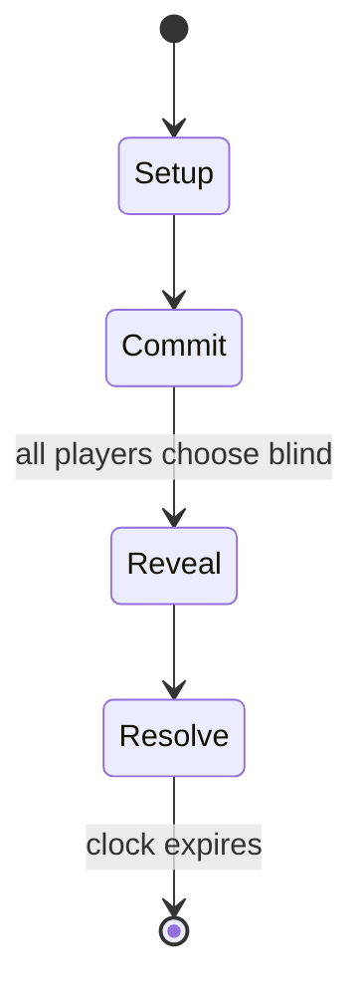

# Rocks'n'Diamonds

*puzzle video game*

`rocks_n_diamonds` &nbsp; state: **DEEPENED** &nbsp; method: **heuristic**

## Found layer (recorded, not trusted)

| field | value |
| --- | --- |
| wikidata | Q2204974 |
| wikipedia | Rocks'n'Diamonds |
| genres (source) | scrolling, tile-based game, transport puzzle |
| instance of (source) | video game |
| country of origin | Germany |

## Declared layer (orders bench work)

| field | value |
| --- | --- |
| year created | 1995 |
| epoch | DIGITAL |
| region | EUROPE_WEST |
| media | PUZZLE, VIDEO |
| players | -- |
| age band | -- |
| exogenous process | NONE |
| loss shape | OPPORTUNITY_ONLY |
| live axes | COMMIT_BLIND, SELECT |
| horizon | CLOCK_LIMITED |
| scoring shape | -- |
| information | SIMULTANEOUS |
| interaction | -- |
| turn structure | SIMULTANEOUS |
| tractability | SAMPLING_ONLY |
| randomness | SIMULTANEOUS_CHOICE |
| luck factor | 0.05 |
| rules complexity | 2.49 |
| strategic depth | 2.25 |
| novelty | 0.7461 |
| solved status | -- |
| strategies | route_optimisation |
| algorithms | -- |

## Object model

```
Episode
  players      : ?
  turn_structure: SIMULTANEOUS
  horizon       : CLOCK_LIMITED
  scoring       : ?

Configuration  -- the arrangement to be resolved
Constraint     -- predicate a legal configuration must satisfy
WorldState     -- simulation state advanced by the engine
Avatar         -- player-controlled agent
Clock          -- frame or tick counter
SealedChoice   -- irrevocable choice made without observation
OptionSet      -- the choices available after an exogenous draw
```

## State transition diagram



## Research item -- turn trace

```
# Rocks'n'Diamonds -- simulated turn events
# generated from the DECLARED vector, not from a rulebook.
# structure: exo=NONE loss=OPPORTUNITY_ONLY horizon=CLOCK_LIMITED scoring=None axes=COMMIT_BLIND,SELECT

t=0    SETUP        players=2  pot=0  capacity=5
t=1    SELECT       p1 1 options; take #1  (pot_gain=+3.5, capacity=-1)
t=2    SELECT       p1 3 options; take #3  (pot_gain=+1.7, capacity=-1)
t=3    ENDTURN      turn passes to p2
t=4    SELECT       p2 3 options; take #2  (pot_gain=+2.4, capacity=-2)
t=5    ENDTURN      turn passes to p1
t=6    SELECT       p1 3 options; take #3  (pot_gain=+3.1, capacity=-2)
t=7    SELECT       p1 4 options; take #2  (pot_gain=+2.3, capacity=-0)
t=8    ENDTURN      turn passes to p2
t=9    SELECT       p2 2 options; take #1  (pot_gain=+3.2, capacity=-1)
t=10   SELECT       p2 3 options; take #3  (pot_gain=+1.9, capacity=-2)
t=11   SELECT       p2 1 options; take #1  (pot_gain=+2.9, capacity=-2)
t=12   SELECT       p2 2 options; take #1  (pot_gain=+1.9, capacity=-0)
t=13   SELECT       p2 3 options; take #2  (pot_gain=+1.5, capacity=-2)
t=14   ENDTURN      turn passes to p1
t=15   SELECT       p1 1 options; take #1  (pot_gain=+2.2, capacity=-2)
t=16   SELECT       p1 3 options; take #2  (pot_gain=+3.0, capacity=-0)
t=17   SELECT       p1 4 options; take #1  (pot_gain=+3.2, capacity=-2)
t=18   SELECT       p1 1 options; take #1  (pot_gain=+3.0, capacity=-1)
t=19   SELECT       p1 4 options; take #4  (pot_gain=+3.1, capacity=-2)
t=20   SELECT       p1 2 options; take #2  (pot_gain=+3.0, capacity=-0)
t=21   SELECT       p1 4 options; take #4  (pot_gain=+1.0, capacity=-0)
t=22   SELECT       p1 4 options; take #1  (pot_gain=+1.4, capacity=-2)
t=23   ENDTURN      turn passes to p2
t=24   SELECT       p2 3 options; take #3  (pot_gain=+1.4, capacity=-1)
t=25   ENDTURN      turn passes to p1
t=26   SELECT       p1 4 options; take #3  (pot_gain=+3.3, capacity=-2)

terminal: CLOCK_LIMITED
```

## Conditions

| kind | threshold | effect | trigger |
| --- | --- | --- | --- |
| ELIMINATE | -- | -- | Using the tape recorder's controls, the "tapes"—the term used by the game for replays—can then be played back for viewing, or they can be overwritten or ejected for recording on a new tape. |

## Source extract

Rocks'n'Diamonds is an open source puzzle video game created by Holger Schemel and published in
1995 by Artsoft Entertainment. It is a clone of Boulder Dash, Supaplex, Emerald Mine, and
Sokoban.   == Gameplay ==  A clone of several puzzle games, Rocks'n'Diamonds features gameplay
elements from Boulder Dashand several of its variants like Emerald Mine, Diamond Caves and
Supaplex —as well as Sokoban, and comes with complete levels sets from all of them, although
levels can contain combinations of elements from any of the aforementioned games, as well as new
ones. A common element of Rocks'n'Diamonds involves collecting a set number of diamonds, opening
an exit door through which the player can enter the next level. The levels are filled with dirt,
which can be dug by simply moving through it, leaving behind empty space, as would "snapping" it
without moving the player character. Diamonds are collected in a similar manner. Rocks and
diamonds rest on dirt, walls, or other rocks and gems, but fall down once these are removed or a
space next to them is vacated. This is sometimes useful, as the player can drop objects into
"magic walls", which convert rocks passing through them into gems

<sub>Wikipedia, CC BY-SA. Retained as evidence for the structural
classification above. Every rule inferred from it is HYPOTHESIZED
until audited against a rulebook.</sub>
