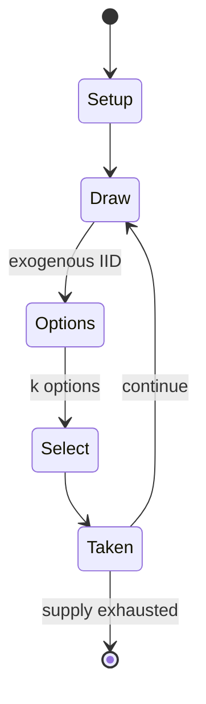

# Roll for the Galaxy

*dice game*

`roll_for_the_galaxy` &nbsp; state: **DEEPENED** &nbsp; method: **heuristic**

## Found layer (recorded, not trusted)

| field | value |
| --- | --- |
| wikidata | Q120467672 |
| wikipedia | Roll for the Galaxy |
| genres (source) | -- |
| instance of (source) | dice game |
| country of origin | -- |

## Declared layer (orders bench work)

| field | value |
| --- | --- |
| year created | 2014 |
| epoch | CONTEMPORARY |
| region | -- |
| media | DICE |
| players | 2-5 |
| age band | -- |
| exogenous process | IID |
| loss shape | -- |
| live axes | COMMIT_BLIND, SELECT, TRADE |
| horizon | -- |
| scoring shape | RACE_POSITION |
| information | SIMULTANEOUS |
| interaction | SOLITAIRE |
| turn structure | PHASE_STRUCTURED |
| tractability | SAMPLING_ONLY |
| randomness | DICE |
| luck factor | 0.58 |
| rules complexity | 3.32 |
| strategic depth | 2.12 |
| novelty | 0.6933 |
| solved status | -- |
| strategies | tableau_building |
| algorithms | -- |

## Object model

```
Episode
  players      : 2-5
  turn_structure: PHASE_STRUCTURED
  horizon       : ?
  scoring       : RACE_POSITION

DicePool       -- n dice, each an iid categorical draw
Roll           -- realised outcome of a pool
SealedChoice   -- irrevocable choice made without observation
OptionSet      -- the choices available after an exogenous draw
Offer          -- proposed exchange between two agents
```

## State transition diagram



## Research item -- turn trace

```
# Roll for the Galaxy -- simulated turn events
# generated from the DECLARED vector, not from a rulebook.
# structure: exo=IID loss=None horizon=None scoring=RACE_POSITION axes=COMMIT_BLIND,SELECT,TRADE

t=0    SETUP        players=2  pot=0  capacity=7
t=1    DRAW         p1 roll from d6 pool -> outcome #6  (p=0.231)
t=2    SELECT       p1 1 options; take #1  (pot_gain=+1.8, capacity=-0)
t=3    TRADE        p1 offers 2:1 exchange to p2
t=4    DRAW         p1 roll from d6 pool -> outcome #3  (p=0.002)
t=5    SELECT       p1 3 options; take #1  (pot_gain=+2.2, capacity=-1)
t=6    DRAW         p1 roll from d6 pool -> outcome #6  (p=0.046)
t=7    SELECT       p1 4 options; take #1  (pot_gain=+2.2, capacity=-2)
t=8    TRADE        p1 offers 2:1 exchange to p2
t=9    DRAW         p1 roll from d6 pool -> outcome #5  (p=0.055)
t=10   SELECT       p1 4 options; take #4  (pot_gain=+1.9, capacity=-1)
t=11   ENDTURN      turn passes to p2
t=12   DRAW         p2 roll from d6 pool -> outcome #2  (p=0.117)
t=13   SELECT       p2 4 options; take #2  (pot_gain=+0.7, capacity=-1)
t=14   DRAW         p2 roll from d6 pool -> outcome #4  (p=0.093)
t=15   SELECT       p2 3 options; take #3  (pot_gain=+1.5, capacity=-0)
t=16   ENDTURN      turn passes to p1
t=17   DRAW         p1 roll from d6 pool -> outcome #6  (p=0.147)
t=18   SELECT       p1 4 options; take #2  (pot_gain=+2.0, capacity=-1)
t=19   TRADE        p1 offers 2:1 exchange to p2
t=20   ENDTURN      turn passes to p2
t=21   DRAW         p2 roll from d6 pool -> outcome #2  (p=0.026)
t=22   SELECT       p2 1 options; take #1  (pot_gain=+1.7, capacity=-0)
t=23   DRAW         p2 roll from d6 pool -> outcome #4  (p=0.217)
t=24   SELECT       p2 3 options; take #3  (pot_gain=+2.6, capacity=-2)
t=25   ENDTURN      turn passes to p1
t=26   DRAW         p1 roll from d6 pool -> outcome #3  (p=0.151)
t=27   SELECT       p1 1 options; take #1  (pot_gain=+0.8, capacity=-0)
t=28   ENDTURN      turn passes to p2

terminal: VARIABLE
```

## Conditions

| kind | threshold | effect | trigger |
| --- | --- | --- | --- |
| BOUNDARY | 1 player | -- | Rounds repeat until one or both game end conditions are met: all initial VP chips have been earned, or at least one player has 12 or more tile squares in his tableau. |

## Source extract

Roll for the Galaxy is a dice game of building space empires for 2 to 5 players. Designed by
Wei-Hwa Huang and Tom Lehmann, it was published by Rio Grande Games in 2014. Player dice
represent their empire's populace, whom the players use to develop new technologies, settle
worlds, and trade. It is a dice version of an older board game Race for the Galaxy.   ==
Gameplay == In Roll for the Galaxy, each player creates a galactic civilization by recruiting
workers (represented by custom dice) to settle worlds and build developments (represented by
game tiles), over several game rounds (usually 11-14). Each round consists of several, step,
done simultaneously by all players. Players start each round by secretly rolling their workers
to see what their workers wish to do this round. Each player uses one worker to select one of
the five possible phases, and then all players reveal their workers. All player‑selected phases
occur in numerical order. Workers that complete tasks go to their player’s Citizenry. After the
phases, players manage their empires, spending Galactic Credits to recruit workers from their
Citizenries back to their cups, to be rolled next round. Rounds repeat until one o

<sub>Wikipedia, CC BY-SA. Retained as evidence for the structural
classification above. Every rule inferred from it is HYPOTHESIZED
until audited against a rulebook.</sub>
