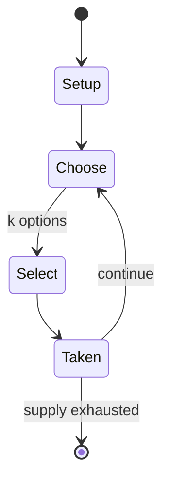

# Root

*2018 board game*

`root` &nbsp; state: **DEEPENED** &nbsp; method: **heuristic**

## Found layer (recorded, not trusted)

| field | value |
| --- | --- |
| wikidata | Q101242941 |
| wikipedia | Root (board game) |
| genres (source) | German-style board game |
| instance of (source) | board game |
| country of origin | -- |

## Declared layer (orders bench work)

| field | value |
| --- | --- |
| year created | 2020 |
| epoch | CONTEMPORARY |
| region | -- |
| media | BOARD, RPG, WARGAME |
| players | 2-4 |
| age band | -- |
| exogenous process | NONE |
| loss shape | OPPORTUNITY_ONLY |
| live axes | SELECT |
| horizon | -- |
| scoring shape | SET_COLLECTION_CONVEX |
| information | ASYMMETRIC |
| interaction | COMPETITIVE |
| turn structure | STRICT_TURN |
| tractability | SAMPLING_ONLY |
| randomness | HIDDEN_INFO |
| luck factor | 0.05 |
| rules complexity | 3.93 |
| strategic depth | 2.25 |
| novelty | 0.6955 |
| solved status | -- |
| strategies | coalition_forming |
| algorithms | -- |

## Object model

```
Episode
  players      : 2-4
  turn_structure: STRICT_TURN
  horizon       : ?
  scoring       : SET_COLLECTION_CONVEX

Board          -- spatial substrate; cells carry position and occupancy
Piece          -- movable token owned by a player
Character      -- persistent stat block owned by a player
GameMaster     -- adjudicating agent outside the scoring loop
Scenario       -- authored state the players traverse
OptionSet      -- the choices available after an exogenous draw
```

## State transition diagram



## Research item -- turn trace

```
# Root -- simulated turn events
# generated from the DECLARED vector, not from a rulebook.
# structure: exo=NONE loss=OPPORTUNITY_ONLY horizon=None scoring=SET_COLLECTION_CONVEX axes=SELECT

t=0    SETUP        players=2  pot=0  capacity=4
t=1    SELECT       p1 2 options; take #1  (pot_gain=+1.4, capacity=-1)
t=2    SELECT       p1 1 options; take #1  (pot_gain=+2.3, capacity=-0)
t=3    SELECT       p1 4 options; take #4  (pot_gain=+3.1, capacity=-0)
t=4    SELECT       p1 4 options; take #2  (pot_gain=+1.9, capacity=-1)
t=5    SELECT       p1 1 options; take #1  (pot_gain=+1.4, capacity=-2)
t=6    ENDTURN      turn passes to p2
t=7    SELECT       p2 3 options; take #1  (pot_gain=+3.2, capacity=-2)
t=8    ENDTURN      turn passes to p1
t=9    SELECT       p1 4 options; take #2  (pot_gain=+2.0, capacity=-0)
t=10   SELECT       p1 3 options; take #1  (pot_gain=+1.6, capacity=-2)
t=11   SELECT       p1 3 options; take #3  (pot_gain=+2.3, capacity=-1)
t=12   ENDTURN      turn passes to p2
t=13   SELECT       p2 1 options; take #1  (pot_gain=+1.9, capacity=-2)
t=14   ENDTURN      turn passes to p1
t=15   SELECT       p1 2 options; take #2  (pot_gain=+1.8, capacity=-2)
t=16   SELECT       p1 1 options; take #1  (pot_gain=+0.9, capacity=-2)
t=17   ENDTURN      turn passes to p2
t=18   SELECT       p2 1 options; take #1  (pot_gain=+2.7, capacity=-1)
t=19   SELECT       p2 3 options; take #1  (pot_gain=+0.6, capacity=-2)
t=20   SELECT       p2 1 options; take #1  (pot_gain=+2.5, capacity=-0)
t=21   ENDTURN      turn passes to p1
t=22   SELECT       p1 1 options; take #1  (pot_gain=+3.2, capacity=-2)
t=23   SELECT       p1 4 options; take #4  (pot_gain=+3.1, capacity=-2)
t=24   SELECT       p1 2 options; take #1  (pot_gain=+1.3, capacity=-1)
t=25   SELECT       p1 4 options; take #2  (pot_gain=+2.7, capacity=-1)
t=26   ENDTURN      turn passes to p2

terminal: VARIABLE
```

## Source extract

Root: A Game of Woodland Might and Right is a 2018 asymmetric strategy wargame board game
designed by Cole Wehrle, illustrated by Kyle Ferrin, and published by Leder Games. Players
compete for the most victory points through moving and battling using various factions with
unique abilities. Upon its release, Root received positive reviews, and was followed by four
expansions. A digital version, developed by Dire Wolf Digital, was released in 2020.   ==
Gameplay == In Root, 2-4 players compete in an asymmetric strategy wargame to control a forest.
Each player controls a different faction, each of which has different gameplay elements,
tactics, and point scoring options. In the base game, 4 factions are present: the Eyrie
Dynasties, Marquise de Cat, Woodland Alliance, and the Vagabond. The Eyrie are a kingdom of
birds and the original rulers of the Woodland, Marquise de Cat is a noble from a faraway land
that is trying to take over to expand their influence, the Woodland Alliance is a group of mice,
rabbits, and foxes that are rebelling to free themselves from tyrants, and the Vagabond is an
explorer and adventurer making a name for themselves. While there is a common set of rules for

<sub>Wikipedia, CC BY-SA. Retained as evidence for the structural
classification above. Every rule inferred from it is HYPOTHESIZED
until audited against a rulebook.</sub>
