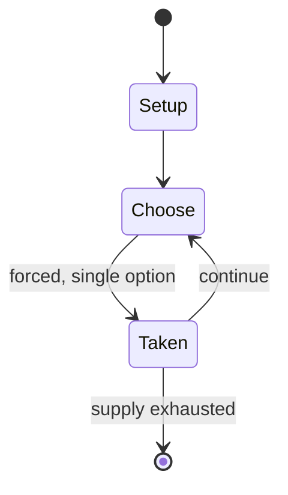

# Rough-and-tumble play

*form of play*

`rough_and_tumble_play` &nbsp; state: **DEEPENED** &nbsp; method: **heuristic**

## Found layer (recorded, not trusted)

| field | value |
| --- | --- |
| wikidata | Q104817380 |
| wikipedia | Rough-and-tumble play |
| genres (source) | -- |
| instance of (source) | children's game |
| country of origin | -- |

## Declared layer (orders bench work)

| field | value |
| --- | --- |
| year created | -- |
| epoch | -- |
| region | -- |
| media | - |
| players | -- |
| age band | CHILD |
| exogenous process | -- |
| loss shape | -- |
| live axes | - |
| horizon | -- |
| scoring shape | -- |
| information | -- |
| interaction | COOPERATIVE |
| turn structure | -- |
| tractability | SAMPLING_ONLY |
| randomness | -- |
| luck factor | 0.35 |
| rules complexity | 2.31 |
| strategic depth | 2.0 |
| novelty | 0.5176 |
| solved status | -- |
| strategies | -- |
| algorithms | -- |

## Object model

```
Episode
  players      : ?
  turn_structure: ?
  horizon       : ?
  scoring       : ?

State          -- opaque; no medium or axis evidence was found
Player         -- an agent that selects among legal successors
```

## State transition diagram



## Research item -- turn trace

```
# Rough-and-tumble play -- simulated turn events
# generated from the DECLARED vector, not from a rulebook.
# structure: exo=None loss=None horizon=None scoring=None axes=-

t=0    SETUP        players=2  pot=0  capacity=4
t=1    FORCED       p1 single legal option taken (pot_gain=+1.9)
t=2    ENDTURN      turn passes to p2
t=3    FORCED       p2 single legal option taken (pot_gain=+1.1)
t=4    FORCED       p2 single legal option taken (pot_gain=+0.6)
t=5    FORCED       p2 single legal option taken (pot_gain=+1.8)
t=6    FORCED       p2 single legal option taken (pot_gain=+0.9)
t=7    FORCED       p2 single legal option taken (pot_gain=+0.8)
t=8    ENDTURN      turn passes to p1
t=9    FORCED       p1 single legal option taken (pot_gain=+1.4)
t=10   FORCED       p1 single legal option taken (pot_gain=+1.5)
t=11   FORCED       p1 single legal option taken (pot_gain=+0.7)
t=12   FORCED       p1 single legal option taken (pot_gain=+1.4)
t=13   FORCED       p1 single legal option taken (pot_gain=+1.7)
t=14   FORCED       p1 single legal option taken (pot_gain=+1.4)
t=15   FORCED       p1 single legal option taken (pot_gain=+1.9)
t=16   ENDTURN      turn passes to p2
t=17   FORCED       p2 single legal option taken (pot_gain=+1.9)
t=18   FORCED       p2 single legal option taken (pot_gain=+1.9)
t=19   FORCED       p2 single legal option taken (pot_gain=+0.7)
t=20   FORCED       p2 single legal option taken (pot_gain=+0.7)
t=21   FORCED       p2 single legal option taken (pot_gain=+1.1)
t=22   FORCED       p2 single legal option taken (pot_gain=+1.8)
t=23   FORCED       p2 single legal option taken (pot_gain=+0.6)
t=24   ENDTURN      turn passes to p1
t=25   FORCED       p1 single legal option taken (pot_gain=+0.8)
t=26   FORCED       p1 single legal option taken (pot_gain=+1.9)

terminal: VARIABLE
```

## Source extract

Rough-and-tumble play, also called play fighting, is a form of play where participants compete
with one another attempting to obtain certain advantages (such as biting or pushing the opponent
onto the ground) but play in this way without the severity of genuine fighting (which rough-and-
tumble play resembles). Rough-and-tumble play is one of the most common forms of play in both
humans and non-human animals. It has been pointed out that despite its apparent aggressiveness,
rough-and-tumble play is helpful for encouraging cooperative behavior and cultivation of social
skills. For rough-and-tumble play to remain "play" (instead of spiraling into a real fight),
there has to be cooperation (e.g., with participants agreeing to not actually exert forces in
pretend punches). Sometimes, one participant may push or hit harder than expected, and then the
other participants will have to decide whether it was an unintended mistake or a malicious
transgression. Thus, rough-and-tumble play involves considerable social reasoning and judgment.
== Sexual dimorphism == This form of play exhibits notable sexual dimorphism in many mammalian
species, including humans. Males typically engage in this t

<sub>Wikipedia, CC BY-SA. Retained as evidence for the structural
classification above. Every rule inferred from it is HYPOTHESIZED
until audited against a rulebook.</sub>
