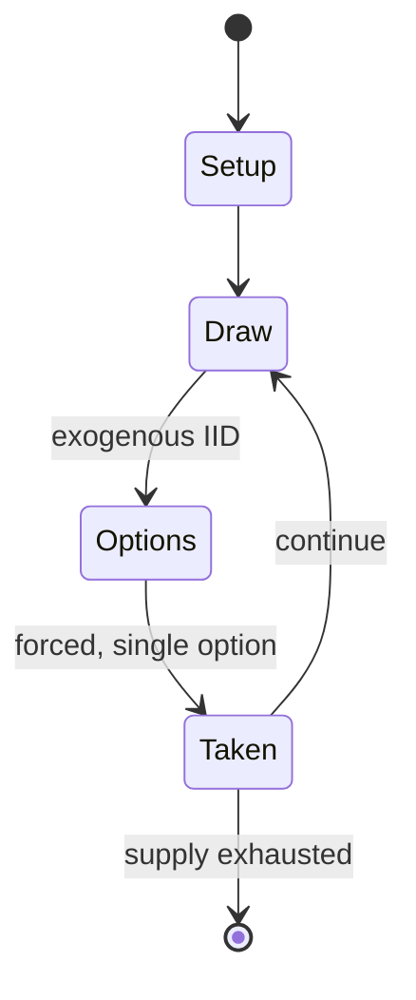

# Royal Game of Ur

*ancient Mesopotamian board game*

`royal_game_of_ur` &nbsp; state: **DEEPENED** &nbsp; method: **heuristic**

## Found layer (recorded, not trusted)

| field | value |
| --- | --- |
| wikidata | Q937315 |
| wikipedia | Royal Game of Ur |
| genres (source) | -- |
| instance of (source) | archaeological find, board game, dice game, race game |
| country of origin | -- |

## Declared layer (orders bench work)

| field | value |
| --- | --- |
| year created | -2400 |
| epoch | DEEP_ANTIQUITY |
| region | -- |
| media | BOARD, DICE |
| players | 2 |
| age band | -- |
| exogenous process | IID |
| loss shape | OPPORTUNITY_ONLY |
| live axes | - |
| horizon | -- |
| scoring shape | RACE_POSITION |
| information | -- |
| interaction | SOLITAIRE |
| turn structure | PHASE_STRUCTURED |
| tractability | EXACT_WITH_CUT |
| randomness | DICE |
| luck factor | 0.58 |
| rules complexity | 2.14 |
| strategic depth | 2.12 |
| novelty | 0.7275 |
| solved status | -- |
| strategies | set_collection |
| algorithms | -- |

## Object model

```
Episode
  players      : 2
  turn_structure: PHASE_STRUCTURED
  horizon       : ?
  scoring       : RACE_POSITION

Board          -- spatial substrate; cells carry position and occupancy
Piece          -- movable token owned by a player
DicePool       -- n dice, each an iid categorical draw
Roll           -- realised outcome of a pool
```

## State transition diagram



## Research item -- turn trace

```
# Royal Game of Ur -- simulated turn events
# generated from the DECLARED vector, not from a rulebook.
# structure: exo=IID loss=OPPORTUNITY_ONLY horizon=None scoring=RACE_POSITION axes=-

t=0    SETUP        players=2  pot=0  capacity=5
t=1    DRAW         p1 roll from d6 pool -> outcome #1  (p=0.216)
t=2    FORCED       p1 single legal option taken (pot_gain=+1.3)
t=3    DRAW         p1 roll from d6 pool -> outcome #5  (p=0.265)
t=4    FORCED       p1 single legal option taken (pot_gain=+1.8)
t=5    DRAW         p1 roll from d6 pool -> outcome #6  (p=0.282)
t=6    FORCED       p1 single legal option taken (pot_gain=+1.4)
t=7    ENDTURN      turn passes to p2
t=8    DRAW         p2 roll from d6 pool -> outcome #1  (p=0.152)
t=9    FORCED       p2 single legal option taken (pot_gain=+2.0)
t=10   DRAW         p2 roll from d6 pool -> outcome #2  (p=0.108)
t=11   FORCED       p2 single legal option taken (pot_gain=+1.8)
t=12   ENDTURN      turn passes to p1
t=13   DRAW         p1 roll from d6 pool -> outcome #5  (p=0.228)
t=14   FORCED       p1 single legal option taken (pot_gain=+1.7)
t=15   ENDTURN      turn passes to p2
t=16   DRAW         p2 roll from d6 pool -> outcome #5  (p=0.005)
t=17   FORCED       p2 single legal option taken (pot_gain=+0.8)
t=18   ENDTURN      turn passes to p1
t=19   DRAW         p1 roll from d6 pool -> outcome #4  (p=0.074)
t=20   FORCED       p1 single legal option taken (pot_gain=+1.8)
t=21   DRAW         p1 roll from d6 pool -> outcome #1  (p=0.296)
t=22   FORCED       p1 single legal option taken (pot_gain=+1.6)
t=23   DRAW         p1 roll from d6 pool -> outcome #1  (p=0.061)
t=24   FORCED       p1 single legal option taken (pot_gain=+1.2)
t=25   DRAW         p1 roll from d6 pool -> outcome #2  (p=0.119)
t=26   FORCED       p1 single legal option taken (pot_gain=+1.0)

terminal: VARIABLE
```

## Conditions

| kind | threshold | effect | trigger |
| --- | --- | --- | --- |
| WIN | -- | -- | Once a player removes all their pieces off the board in this manner, that player wins the game. |

## Source extract

The Royal Game of Ur is a two-player strategy race board game of the tables family that was
first played in ancient Mesopotamia during the early third millennium BC. The game was popular
across the Middle East among people of all social strata, and boards for playing it have been
found at locations as far away from Mesopotamia as Crete and Sri Lanka. One board, held by the
British Museum, is dated to c. 2600 – c. 2400 BC, making it one of the oldest game boards in the
world. The Royal Game of Ur is sometimes equated to another ancient game which it closely
resembles, the Game of Twenty Squares. At the height of its popularity, the game acquired
spiritual significance, and events in the game were believed to reflect a player's future and
convey messages from deities or other supernatural beings. The Game of Ur remained popular until
late antiquity, when it stopped being played, possibly either evolving into, or being displaced
by, a form of tables game. It was eventually forgotten everywhere except among the Jewish
population of the Indian city of Kochi, who continued playing a version of it called 'Asha'
until the 1950s when they began emigrating to Israel. The Game of Ur received

<sub>Wikipedia, CC BY-SA. Retained as evidence for the structural
classification above. Every rule inferred from it is HYPOTHESIZED
until audited against a rulebook.</sub>
