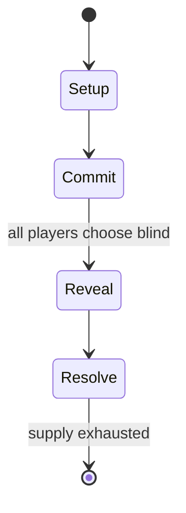

# Rubik's Cube

`rubik_s_cube` &nbsp; state: **DEEPENED** &nbsp; method: **heuristic**

## Found layer (recorded, not trusted)

| field | value |
| --- | --- |
| wikidata | Q47043 |
| wikipedia | Rubik's Cube |
| genres (source) | -- |
| instance of (source) | -- |
| country of origin | -- |

## Declared layer (orders bench work)

| field | value |
| --- | --- |
| year created | 1974 |
| epoch | DIGITAL |
| region | -- |
| media | PUZZLE |
| players | -- |
| age band | -- |
| exogenous process | NONE |
| loss shape | OPPORTUNITY_ONLY |
| live axes | ORDER |
| horizon | -- |
| scoring shape | NONLINEAR |
| information | PERFECT |
| interaction | COMPETITIVE |
| turn structure | SIMULTANEOUS |
| tractability | EXACT_WITH_CUT |
| randomness | HIDDEN_INFO, SIMULTANEOUS_CHOICE |
| luck factor | 0.05 |
| rules complexity | 2.7 |
| strategic depth | 2.7 |
| novelty | 0.8116 |
| solved status | -- |
| strategies | -- |
| algorithms | opening_book |

## Object model

```
Episode
  players      : ?
  turn_structure: SIMULTANEOUS
  horizon       : ?
  scoring       : NONLINEAR

Configuration  -- the arrangement to be resolved
Constraint     -- predicate a legal configuration must satisfy
Sequence       -- the permutation under the player's control
```

## State transition diagram



## Research item -- turn trace

```
# Rubik's Cube -- simulated turn events
# generated from the DECLARED vector, not from a rulebook.
# structure: exo=NONE loss=OPPORTUNITY_ONLY horizon=None scoring=NONLINEAR axes=ORDER

t=0    SETUP        players=2  pot=0  capacity=8
t=1    FORCED       p1 single legal option taken (pot_gain=+1.0)
t=2    FORCED       p1 single legal option taken (pot_gain=+1.5)
t=3    FORCED       p1 single legal option taken (pot_gain=+0.8)
t=4    FORCED       p1 single legal option taken (pot_gain=+0.7)
t=5    FORCED       p1 single legal option taken (pot_gain=+1.6)
t=6    FORCED       p1 single legal option taken (pot_gain=+1.8)
t=7    FORCED       p1 single legal option taken (pot_gain=+1.1)
t=8    FORCED       p1 single legal option taken (pot_gain=+1.6)
t=9    FORCED       p1 single legal option taken (pot_gain=+2.0)
t=10   ENDTURN      turn passes to p2
t=11   FORCED       p2 single legal option taken (pot_gain=+1.0)
t=12   FORCED       p2 single legal option taken (pot_gain=+1.0)
t=13   FORCED       p2 single legal option taken (pot_gain=+1.2)
t=14   FORCED       p2 single legal option taken (pot_gain=+1.9)
t=15   FORCED       p2 single legal option taken (pot_gain=+1.7)
t=16   FORCED       p2 single legal option taken (pot_gain=+1.7)
t=17   FORCED       p2 single legal option taken (pot_gain=+2.0)
t=18   FORCED       p2 single legal option taken (pot_gain=+0.9)
t=19   FORCED       p2 single legal option taken (pot_gain=+1.0)
t=20   FORCED       p2 single legal option taken (pot_gain=+1.1)
t=21   ENDTURN      turn passes to p1
t=22   FORCED       p1 single legal option taken (pot_gain=+1.9)
t=23   FORCED       p1 single legal option taken (pot_gain=+1.5)
t=24   FORCED       p1 single legal option taken (pot_gain=+1.9)
t=25   ENDTURN      turn passes to p2
t=26   FORCED       p2 single legal option taken (pot_gain=+0.6)

terminal: VARIABLE
```

## Conditions

| kind | threshold | effect | trigger |
| --- | --- | --- | --- |
| ELIMINATE | -- | -- | In this method, a 2×2×2 section is solved first, followed by a 2×2×3, and then the incorrect edges are solved using a three-move algorithm, which eliminates the need for a possible 32-move algorithm later. |
| BOUNDARY | -- | -- | On 9 April 1970, Frank Fox applied to patent an "amusement device", a type of sliding puzzle on a spherical surface with "at least two 3×3 arrays" intended to be used for the game of noughts and crosses. |

## Source extract

The Rubik's Cube is a 3D combination puzzle invented in 1974 by Hungarian sculptor and professor
of architecture Ernő Rubik. Originally called the Magic Cube, the puzzle was licensed by Rubik
to be sold by Pentangle Puzzles in the UK in 1978, and then by Ideal Toy Corp in 1980 via
businessman Tibor Laczi and Seven Towns founder Tom Kremer. The cube was released
internationally in 1980 and became one of the most recognised icons in popular culture. It won
the 1980 German Game of the Year special award for Best Puzzle. As of January 2024, around 500
million cubes had been sold worldwide, making it the world's bestselling puzzle game and
bestselling toy. The Rubik's Cube was inducted into the US National Toy Hall of Fame in 2014. On
the original, classic Rubik's Cube, each of the six faces was covered by nine stickers, with
each face in one of six solid colours: white, red, blue, orange, green and yellow. Some later
versions of the cube have been updated to use coloured plastic panels instead. Since 1988, the
arrangement of colours has been standardised, with white opposite yellow, blue opposite green
and orange opposite red, and with the red, white and blue arranged clockwise, in tha

<sub>Wikipedia, CC BY-SA. Retained as evidence for the structural
classification above. Every rule inferred from it is HYPOTHESIZED
until audited against a rulebook.</sub>
