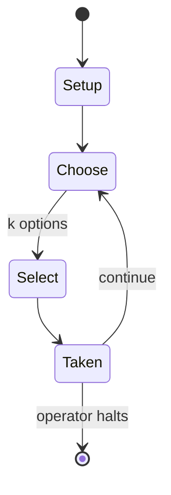

# RuneScape

*2001 massively multiplayer online role-playing game*

`runescape` &nbsp; state: **DEEPENED** &nbsp; method: **heuristic**

## Found layer (recorded, not trusted)

| field | value |
| --- | --- |
| wikidata | Q187732 |
| wikipedia | RuneScape |
| genres (source) | fantasy video game, massively multiplayer online role-playing game |
| instance of (source) | video game |
| country of origin | United Kingdom |

## Declared layer (orders bench work)

| field | value |
| --- | --- |
| year created | 2001 |
| epoch | CONTEMPORARY |
| region | EUROPE_WEST |
| media | DEXTERITY, RPG, VIDEO |
| players | -- |
| age band | -- |
| exogenous process | -- |
| loss shape | -- |
| live axes | SELECT, TRADE |
| horizon | OPEN_ENDED |
| scoring shape | -- |
| information | -- |
| interaction | NEGOTIATION |
| turn structure | -- |
| tractability | SAMPLING_ONLY |
| randomness | -- |
| luck factor | 0.35 |
| rules complexity | 4.3 |
| strategic depth | 2.25 |
| novelty | 0.6317 |
| solved status | -- |
| strategies | tempo |
| algorithms | -- |

## Object model

```
Episode
  players      : ?
  turn_structure: ?
  horizon       : OPEN_ENDED
  scoring       : ?

Character      -- persistent stat block owned by a player
GameMaster     -- adjudicating agent outside the scoring loop
Scenario       -- authored state the players traverse
WorldState     -- simulation state advanced by the engine
Avatar         -- player-controlled agent
Clock          -- frame or tick counter
OptionSet      -- the choices available after an exogenous draw
Offer          -- proposed exchange between two agents
```

## State transition diagram



## Research item -- turn trace

```
# RuneScape -- simulated turn events
# generated from the DECLARED vector, not from a rulebook.
# structure: exo=None loss=None horizon=OPEN_ENDED scoring=None axes=SELECT,TRADE

t=0    SETUP        players=2  pot=0  capacity=4
t=1    SELECT       p1 1 options; take #1  (pot_gain=+1.9, capacity=-2)
t=2    TRADE        p1 offers 2:1 exchange to p2
t=3    ENDTURN      turn passes to p2
t=4    SELECT       p2 2 options; take #2  (pot_gain=+2.1, capacity=-1)
t=5    TRADE        p2 offers 2:1 exchange to p1
t=6    ENDTURN      turn passes to p1
t=7    SELECT       p1 2 options; take #2  (pot_gain=+0.7, capacity=-0)
t=8    SELECT       p1 3 options; take #3  (pot_gain=+1.3, capacity=-1)
t=9    SELECT       p1 3 options; take #1  (pot_gain=+2.9, capacity=-1)
t=10   ENDTURN      turn passes to p2
t=11   SELECT       p2 3 options; take #2  (pot_gain=+0.7, capacity=-0)
t=12   SELECT       p2 3 options; take #3  (pot_gain=+0.8, capacity=-2)
t=13   SELECT       p2 4 options; take #3  (pot_gain=+2.5, capacity=-0)
t=14   TRADE        p2 offers 2:1 exchange to p1
t=15   SELECT       p2 4 options; take #3  (pot_gain=+1.4, capacity=-1)
t=16   SELECT       p2 2 options; take #2  (pot_gain=+0.8, capacity=-0)
t=17   TRADE        p2 offers 2:1 exchange to p1
t=18   ENDTURN      turn passes to p1
t=19   SELECT       p1 3 options; take #2  (pot_gain=+2.4, capacity=-1)
t=20   SELECT       p1 2 options; take #1  (pot_gain=+1.1, capacity=-1)
t=21   TRADE        p1 offers 2:1 exchange to p2
t=22   ENDTURN      turn passes to p2
t=23   SELECT       p2 1 options; take #1  (pot_gain=+1.8, capacity=-1)
t=24   SELECT       p2 4 options; take #3  (pot_gain=+2.6, capacity=-0)
t=25   ENDTURN      turn passes to p1
t=26   SELECT       p1 3 options; take #2  (pot_gain=+2.3, capacity=-2)
t=27   ENDTURN      turn passes to p2

terminal: OPEN_ENDED
```

## Conditions

| kind | threshold | effect | trigger |
| --- | --- | --- | --- |
| PENALTY | -- | -- | Its analysis stated that "RuneScape's mass-market appeal lies in its simplicity and accessibility (both financial and technical). |

## Source extract

RuneScape is a fantasy massively multiplayer online role-playing game (MMORPG) developed and
published by Jagex. Created by Andrew Gower with assistance from his brother Paul Gower, it was
first released on 4 January 2001 as a Java-based browser game; the original Java client was
later largely replaced by the standalone C++ NXT client in 2016. The game is set in the medieval
fantasy world of Gielinor, where players control customisable avatars and pursue open-ended
activities such as questing, combat, skill training, trading, socialising, minigames and
cooperative play. Several major versions of RuneScape have been released. The original version
became known as RuneScape Classic after the release of RuneScape 2 in 2004, while RuneScape 3,
the third major iteration of the main game, was released in July 2013. Old School RuneScape, a
separate game based on an August 2007 build, was released in February 2013 and is maintained
alongside the main game. Old School RuneScape was released for iOS and Android in 2018; the main
RuneScape game was released on Steam in 2020 and on iOS and Android in 2021. RuneScape is
recognised for its longevity and scale. Jagex has reported that more than 30

<sub>Wikipedia, CC BY-SA. Retained as evidence for the structural
classification above. Every rule inferred from it is HYPOTHESIZED
until audited against a rulebook.</sub>
