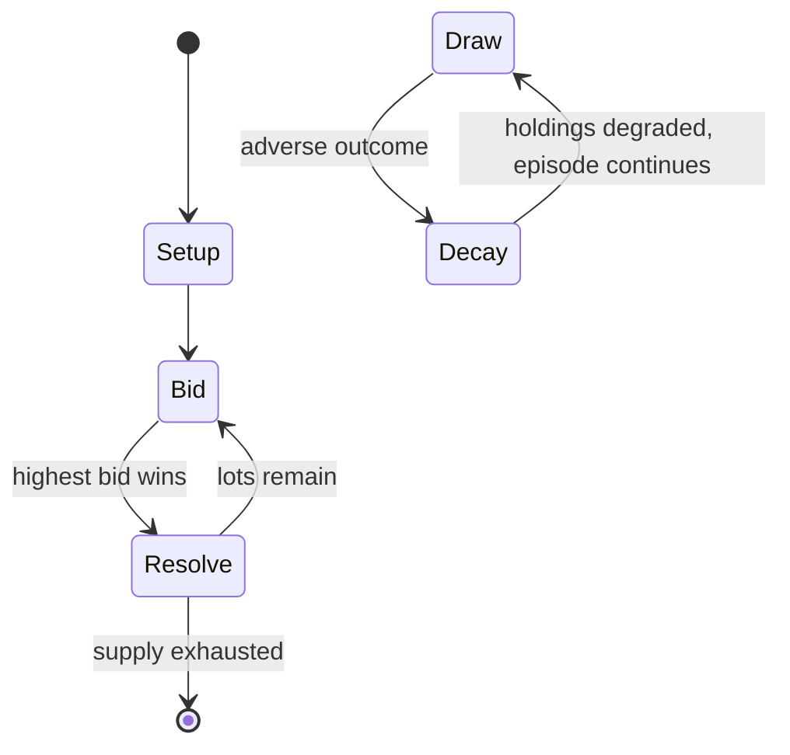

# Russian Schnapsen

*card game*

`russian_schnapsen` &nbsp; state: **DEEPENED** &nbsp; method: **heuristic**

## Found layer (recorded, not trusted)

| field | value |
| --- | --- |
| wikidata | Q2177181 |
| wikipedia | Russian Schnapsen |
| genres (source) | -- |
| instance of (source) | card game |
| country of origin | Russia |

## Declared layer (orders bench work)

| field | value |
| --- | --- |
| year created | -- |
| epoch | -- |
| region | EUROPE_EAST |
| media | CARD, TRICK_TAKING |
| players | 3 |
| age band | -- |
| exogenous process | DEPLETING_DECK |
| loss shape | PARTIAL_DECAY |
| live axes | BID, COMMIT_BLIND, SELECT |
| horizon | -- |
| scoring shape | -- |
| information | IMPERFECT |
| interaction | SOLITAIRE |
| turn structure | AUCTION_ROUND |
| tractability | SAMPLING_ONLY |
| randomness | DECK_SHUFFLE |
| luck factor | 0.48 |
| rules complexity | 3.3 |
| strategic depth | 3.0 |
| novelty | 0.7878 |
| solved status | -- |
| strategies | deduction, opponent_modelling, spatial_packing, tempo |
| algorithms | -- |

## Object model

```
Episode
  players      : 3
  turn_structure: AUCTION_ROUND
  horizon       : ?
  scoring       : ?

Deck           -- ordered multiset, drawn without replacement
Hand           -- private multiset held by one player
DiscardPile    -- public accumulation of spent cards
Trick          -- one card per player; a winner is determined
Trump          -- suit that dominates the ordering
Auction        -- priced competition resolving to one winner
SealedChoice   -- irrevocable choice made without observation
OptionSet      -- the choices available after an exogenous draw
```

## State transition diagram



## Research item -- turn trace

```
# Russian Schnapsen -- simulated turn events
# generated from the DECLARED vector, not from a rulebook.
# structure: exo=DEPLETING_DECK loss=PARTIAL_DECAY horizon=None scoring=None axes=BID,COMMIT_BLIND,SELECT

t=0    SETUP        players=3  pot=0  capacity=3
t=1    DRAW         p1 draw from deck -> outcome #2  (p=0.206)
t=2    SELECT       p1 3 options; take #3  (pot_gain=+1.9, capacity=-2)
t=3    BID          p1 sealed bid of 6 against 2 rivals
t=4    ENDTURN      turn passes to p2
t=5    DRAW         p2 draw from deck -> outcome #2  (p=0.197)
t=6    SELECT       p2 3 options; take #2  (pot_gain=+1.9, capacity=-1)
t=7    BID          p2 sealed bid of 2 against 2 rivals
t=8    DRAW         p2 draw from deck -> outcome #5  (p=0.079)
t=9    SELECT       p2 3 options; take #3  (pot_gain=+2.0, capacity=-2)
t=10   DRAW         p2 draw from deck -> outcome #2  (p=0.173)
t=11   SELECT       p2 2 options; take #2  (pot_gain=+1.7, capacity=-1)
t=12   DRAW         p2 draw from deck -> outcome #6  (p=0.134)
t=13   SELECT       p2 4 options; take #1  (pot_gain=+2.2, capacity=-1)
t=14   BID          p2 sealed bid of 1 against 2 rivals
t=15   ENDTURN      turn passes to p3
t=16   DRAW         p3 draw from deck -> outcome #1  (p=0.174)
t=17   SELECT       p3 1 options; take #1  (pot_gain=+2.9, capacity=-1)
t=18   DRAW         p3 draw from deck -> outcome #4  (p=0.013)
t=19   SELECT       p3 1 options; take #1  (pot_gain=+2.7, capacity=-1)
t=20   DRAW         p3 draw from deck -> outcome #6  (p=0.196)
t=21   SELECT       p3 2 options; take #1  (pot_gain=+2.9, capacity=-0)
t=22   BID          p3 sealed bid of 8 against 2 rivals
t=23   DRAW         p3 draw from deck -> outcome #1  (p=0.054)
t=24   SELECT       p3 3 options; take #3  (pot_gain=+2.4, capacity=-1)
t=25   BID          p3 sealed bid of 2 against 2 rivals
t=26   DRAW         p3 draw from deck -> outcome #6  (p=0.096)
t=27   SELECT       p3 3 options; take #3  (pot_gain=+3.5, capacity=-1)

terminal: VARIABLE
```

## Conditions

| kind | threshold | effect | trigger |
| --- | --- | --- | --- |
| WIN | 3 players | -- | Russian Schnapsen, Thousand Schnapsen, 1000 or Tysiacha is a trick-taking game of the ace–ten family for three players, the aim of which is to score over 1000 points to win the game. |
| WIN | 120 points | -- | if player won bidding and declared to achieve more than 120 points: in this case player either wins the game or gets down to 880 minus X points, where X was declared by this player |
| WIN | 120 points | -- | If a player who is on the barrel claims to achieve 120 points (which is the maximum allowed to claim without having a marriage), and wins the bidding, then this player gets Stock and considers to increase the number of c |
| BOUNDARY | 1 trick | -- | The player who has at least one trick taken and still has a marriage in his hand can declare a suit of the marriage to be a trump suit by making a move with either King or Ober/Queen card from available marriage and decl |
| BOUNDARY | 1 trick | -- | player has to have at least one trick taken before he / she can use marriage |
| WIN | -- | -- | Only a player sitting on a barrel can win the game. |

## Source extract

Russian Schnapsen, Thousand Schnapsen, 1000 or Tysiacha is a trick-taking game of the ace–ten
family for three players, the aim of which is to score over 1000 points to win the game. It is a
variant of the popular Austrian game of Schnapsen. Like its parent, Russian Schnapsen features
"marriages" (pairs of a King and Ober/Queen of the same suit) which are worth extra points.   ==
Cards == Russian Schnapsen is usually played with a 24-card Schnapsen pack using the normal
William Tell cards. In Russia it is played with French-suited cards, using a 24 card deck where
all cards lower than a nine have been removed. There are the usual four suits: Hearts (Herz or
Rot), Bells (Schelle), Leaves (Grün, Laub or Blatt) and Acorns (Eichel). In each suit the cards
rank and score as follows: ace (Ass) – 11 points, ten (Zehner) – 10 points, king (König) – 4
points, Ober (Ober) – 3 points, Unter (Unter) – 2 points and nine (Neuner) – 0 points. If
French-suited cards are used, the queen replaces the Ober and the jack, the Unter.   == Dealing
cards == The first dealer is chosen either by drawing lots or by mutual agreement. The dealer
rotates clockwise with each hand. Before dealing (after shuffling

<sub>Wikipedia, CC BY-SA. Retained as evidence for the structural
classification above. Every rule inferred from it is HYPOTHESIZED
until audited against a rulebook.</sub>
