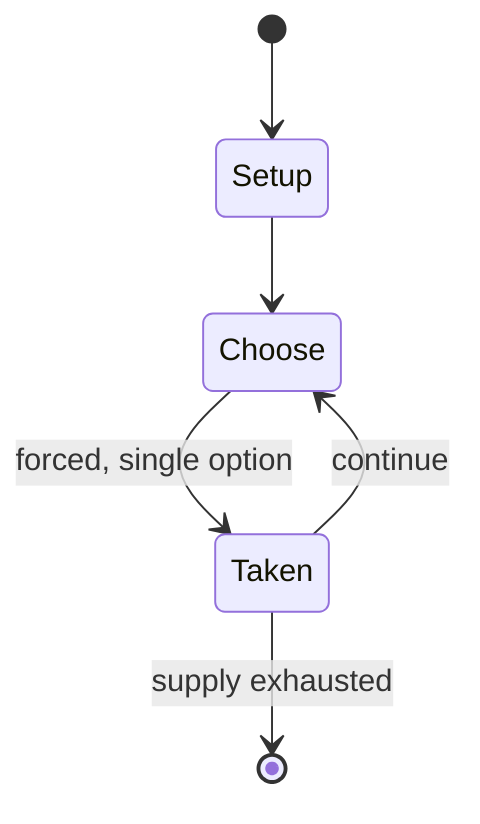

# sack race

*race in which participants hop towards a finish line with both legs contained in a sack*

`sack_race` &nbsp; state: **DEEPENED** &nbsp; method: **heuristic**

## Found layer (recorded, not trusted)

| field | value |
| --- | --- |
| wikidata | Q1142365 |
| wikipedia | Sack race |
| genres (source) | -- |
| instance of (source) | children's game, type of sport |
| country of origin | -- |

## Declared layer (orders bench work)

| field | value |
| --- | --- |
| year created | -- |
| epoch | -- |
| region | -- |
| media | SPORT |
| players | -- |
| age band | CHILD |
| exogenous process | -- |
| loss shape | -- |
| live axes | - |
| horizon | -- |
| scoring shape | RACE_POSITION |
| information | -- |
| interaction | COMPETITIVE |
| turn structure | -- |
| tractability | SAMPLING_ONLY |
| randomness | -- |
| luck factor | 0.35 |
| rules complexity | 1.68 |
| strategic depth | 2.0 |
| novelty | 0.5256 |
| solved status | -- |
| strategies | -- |
| algorithms | -- |

## Object model

```
Episode
  players      : ?
  turn_structure: ?
  horizon       : ?
  scoring       : RACE_POSITION

Pitch          -- bounded physical region
Player         -- embodied agent with a foul count
Clock          -- counts down; stoppages are rule events
Official       -- detects infractions and applies penalties
```

## State transition diagram



## Research item -- turn trace

```
# sack race -- simulated turn events
# generated from the DECLARED vector, not from a rulebook.
# structure: exo=None loss=None horizon=None scoring=RACE_POSITION axes=-

t=0    SETUP        players=2  pot=0  capacity=6
t=1    FORCED       p1 single legal option taken (pot_gain=+1.8)
t=2    FORCED       p1 single legal option taken (pot_gain=+1.6)
t=3    FORCED       p1 single legal option taken (pot_gain=+0.7)
t=4    FORCED       p1 single legal option taken (pot_gain=+0.5)
t=5    FORCED       p1 single legal option taken (pot_gain=+1.1)
t=6    FORCED       p1 single legal option taken (pot_gain=+0.7)
t=7    FORCED       p1 single legal option taken (pot_gain=+1.5)
t=8    FORCED       p1 single legal option taken (pot_gain=+1.0)
t=9    FORCED       p1 single legal option taken (pot_gain=+1.4)
t=10   FORCED       p1 single legal option taken (pot_gain=+1.2)
t=11   FORCED       p1 single legal option taken (pot_gain=+1.4)
t=12   FORCED       p1 single legal option taken (pot_gain=+1.8)
t=13   FORCED       p1 single legal option taken (pot_gain=+1.4)
t=14   ENDTURN      turn passes to p2
t=15   FORCED       p2 single legal option taken (pot_gain=+1.2)
t=16   FORCED       p2 single legal option taken (pot_gain=+1.1)
t=17   FORCED       p2 single legal option taken (pot_gain=+0.9)
t=18   FORCED       p2 single legal option taken (pot_gain=+1.4)
t=19   ENDTURN      turn passes to p1
t=20   FORCED       p1 single legal option taken (pot_gain=+0.8)
t=21   FORCED       p1 single legal option taken (pot_gain=+1.1)
t=22   FORCED       p1 single legal option taken (pot_gain=+1.2)
t=23   ENDTURN      turn passes to p2
t=24   FORCED       p2 single legal option taken (pot_gain=+1.7)
t=25   FORCED       p2 single legal option taken (pot_gain=+1.1)
t=26   ENDTURN      turn passes to p1

terminal: VARIABLE
```

## Conditions

| kind | threshold | effect | trigger |
| --- | --- | --- | --- |
| WIN | -- | -- | The first person to cross the finish line is the winner of the race. |

## Source extract

A sack race is a competitive game in which participants place both of their legs inside a sack
(usually a potato sack) or pillow case that reaches their waist or neck and hop forward from a
starting point toward a finish line. The first person to cross the finish line is the winner of
the race. Possible rule changes that people make to the traditional game include using extra
large sacks and running inside the sack; however, in some cases such technique may be viewed as
cheating. Sack racing is traditionally seen as an activity for children, but people of any age
can compete. In schools, the sack race often takes place on a sports day, along with numerous
other events such as the egg and spoon race. It is also a frequent pastime at fairs, birthday
parties, and picnics.   == Records == The fastest 100 metres sack race time is 25.96 seconds and
was achieved by Christian Roberto López Rodríguez in Yuncos, Spain, on 18 November 2020. He also
holds the world record for the 200 metres sack race: he completed the distance in a time of
63.88 seconds on 3 January 2021. The fastest 4×100 metres sack race time is 2 minutes and 29.09
seconds and was achieved by Andrew Rodaughan, Patrick Holcom

<sub>Wikipedia, CC BY-SA. Retained as evidence for the structural
classification above. Every rule inferred from it is HYPOTHESIZED
until audited against a rulebook.</sub>
