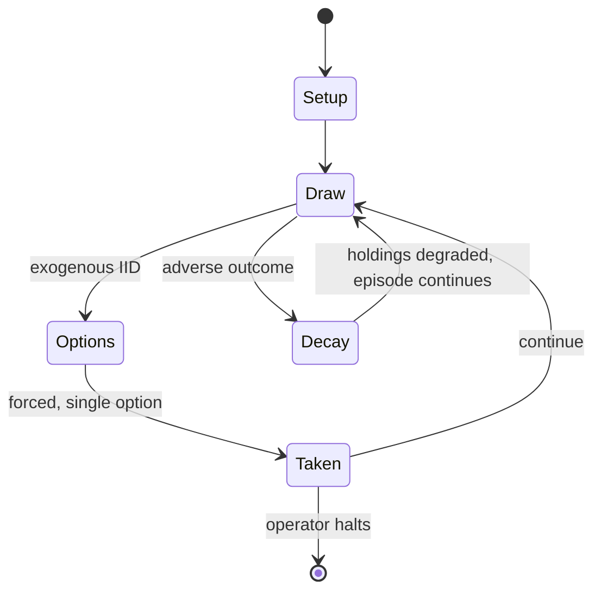

# Sagrada (board game)

`sagrada_board_game` &nbsp; state: **DEEPENED** &nbsp; method: **heuristic**

## Found layer (recorded, not trusted)

| field | value |
| --- | --- |
| wikidata | Q58764201 |
| wikipedia | Sagrada (board game) |
| genres (source) | -- |
| instance of (source) | -- |
| country of origin | -- |

## Declared layer (orders bench work)

| field | value |
| --- | --- |
| year created | 2017 |
| epoch | CONTEMPORARY |
| region | -- |
| media | BOARD, DICE |
| players | -- |
| age band | -- |
| exogenous process | IID |
| loss shape | PARTIAL_DECAY |
| live axes | SPATIAL |
| horizon | OPEN_ENDED |
| scoring shape | LINEAR_ACCUMULATION |
| information | HIDDEN_PRIVATE |
| interaction | -- |
| turn structure | STRICT_TURN |
| tractability | EXACT_WITH_CUT |
| randomness | DICE |
| luck factor | 0.58 |
| rules complexity | 2.07 |
| strategic depth | 2.12 |
| novelty | 0.7866 |
| solved status | -- |
| strategies | deduction |
| algorithms | -- |

## Object model

```
Episode
  players      : ?
  turn_structure: STRICT_TURN
  horizon       : OPEN_ENDED
  scoring       : LINEAR_ACCUMULATION

Board          -- spatial substrate; cells carry position and occupancy
Piece          -- movable token owned by a player
DicePool       -- n dice, each an iid categorical draw
Roll           -- realised outcome of a pool
Placement      -- position subject to geometric legality
```

## State transition diagram



## Research item -- turn trace

```
# Sagrada (board game) -- simulated turn events
# generated from the DECLARED vector, not from a rulebook.
# structure: exo=IID loss=PARTIAL_DECAY horizon=OPEN_ENDED scoring=LINEAR_ACCUMULATION axes=SPATIAL

t=0    SETUP        players=2  pot=0  capacity=7
t=1    DRAW         p1 roll from d6 pool -> outcome #4  (p=0.208)
t=2    FORCED       p1 single legal option taken (pot_gain=+1.1)
t=3    SPATIAL      p1 places at (2,3); adjacency legal
t=4    DRAW         p1 roll from d6 pool -> outcome #3  (p=0.085)
t=5    FORCED       p1 single legal option taken (pot_gain=+1.3)
t=6    DRAW         p1 roll from d6 pool -> outcome #2  (p=0.042)
t=7    FORCED       p1 single legal option taken (pot_gain=+1.8)
t=8    DRAW         p1 roll from d6 pool -> outcome #4  (p=0.042)
t=9    FORCED       p1 single legal option taken (pot_gain=+1.8)
t=10   DRAW         p1 roll from d6 pool -> outcome #5  (p=0.209)
t=11   FORCED       p1 single legal option taken (pot_gain=+1.7)
t=12   DRAW         p1 roll from d6 pool -> outcome #6  (p=0.234)
t=13   FORCED       p1 single legal option taken (pot_gain=+2.0)
t=14   DRAW         p1 roll from d6 pool -> outcome #1  (p=0.073)
t=15   FORCED       p1 single legal option taken (pot_gain=+0.5)
t=16   ENDTURN      turn passes to p2
t=17   DRAW         p2 roll from d6 pool -> outcome #3  (p=0.171)
t=18   FORCED       p2 single legal option taken (pot_gain=+1.1)
t=19   SPATIAL      p2 places at (4,0); adjacency legal
t=20   ENDTURN      turn passes to p1
t=21   DRAW         p1 roll from d6 pool -> outcome #1  (p=0.081)
t=22   FORCED       p1 single legal option taken (pot_gain=+1.4)
t=23   SPATIAL      p1 places at (7,1); adjacency legal
t=24   DRAW         p1 roll from d6 pool -> outcome #4  (p=0.036)
t=25   FORCED       p1 single legal option taken (pot_gain=+1.5)
t=26   DRAW         p1 roll from d6 pool -> outcome #5  (p=0.193)
t=27   FORCED       p1 single legal option taken (pot_gain=+1.4)

terminal: OPEN_ENDED
```

## Conditions

| kind | threshold | effect | trigger |
| --- | --- | --- | --- |
| WIN | 10 rounds | -- | Players gain points by completing public and secret objectives for dice placements, and the one with the most after ten rounds is the winner. |
| WIN | 10 rounds | -- | The player with the most points after ten rounds is the winner. |

## Source extract

Sagrada is a dice-drafting board game designed by Adrian Adamescu and Daryl Andrews and
published in 2017 by Floodgate Games. Each player constructs a stained-glass window using dice
on a personal 4×5 game board with restrictions on the types of dice that can be played on each
space. Players gain points by completing public and secret objectives for dice placements, and
the one with the most after ten rounds is the winner.   == Gameplay == The object of the game is
for each player to construct a stained-glass window using dice on a private board having 20
spaces. There are three global scoring cards used by all players, as well as a private scoring
card for each player. The available double-sided window boards have a complexity rating ranging
from 3 to 6, which represents how many spaces on the board have restrictions on colours or dice
and the number of favour tokens with which the player begins the game. Each turn, players choose
one at a time from a pool of coloured dice in two passes, such that the first player in the
first pass becomes the last player in the second pass. These are then placed on a player's
private board based on the restrictions specified on each space and the

<sub>Wikipedia, CC BY-SA. Retained as evidence for the structural
classification above. Every rule inferred from it is HYPOTHESIZED
until audited against a rulebook.</sub>
