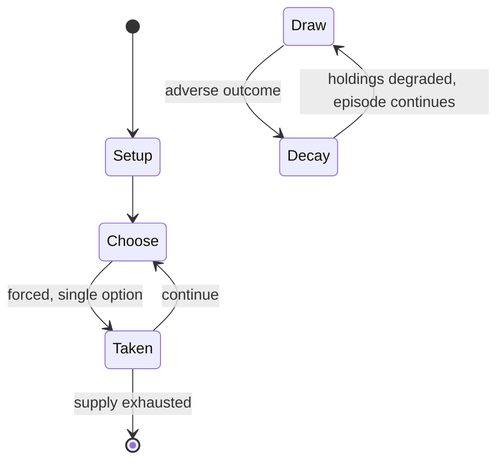

# Sanguosha

*Chinese card game based on the Three Kingdoms period of China and the semi-fictional novel Romance of the Three Kingdoms (ROTK)*

`sanguosha` &nbsp; state: **DEEPENED** &nbsp; method: **heuristic**

## Found layer (recorded, not trusted)

| field | value |
| --- | --- |
| wikidata | Q1049371 |
| wikipedia | Legends of the Three Kingdoms |
| genres (source) | -- |
| instance of (source) | card game, game, tabletop game |
| country of origin | -- |

## Declared layer (orders bench work)

| field | value |
| --- | --- |
| year created | 2008 |
| epoch | CONTEMPORARY |
| region | -- |
| media | CARD |
| players | -- |
| age band | -- |
| exogenous process | -- |
| loss shape | PARTIAL_DECAY |
| live axes | DISCARD |
| horizon | -- |
| scoring shape | WINNER_TAKE_ALL |
| information | ASYMMETRIC |
| interaction | -- |
| turn structure | PHASE_STRUCTURED |
| tractability | SAMPLING_ONLY |
| randomness | -- |
| luck factor | -- |
| rules complexity | 3.61 |
| strategic depth | 2.0 |
| novelty | 0.761 |
| solved status | -- |
| strategies | -- |
| algorithms | -- |

## Object model

```
Episode
  players      : ?
  turn_structure: PHASE_STRUCTURED
  horizon       : ?
  scoring       : WINNER_TAKE_ALL

Deck           -- ordered multiset, drawn without replacement
Hand           -- private multiset held by one player
DiscardPile    -- public accumulation of spent cards
DiscardChoice  -- what is given up to satisfy a limit
```

## State transition diagram



## Research item -- turn trace

```
# Sanguosha -- simulated turn events
# generated from the DECLARED vector, not from a rulebook.
# structure: exo=None loss=PARTIAL_DECAY horizon=None scoring=WINNER_TAKE_ALL axes=DISCARD

t=0    SETUP        players=2  pot=0  capacity=3
t=1    FORCED       p1 single legal option taken (pot_gain=+1.0)
t=2    FORCED       p1 single legal option taken (pot_gain=+1.5)
t=3    DISCARD      p1 discards to hand limit
t=4    FORCED       p1 single legal option taken (pot_gain=+0.7)
t=5    DISCARD      p1 discards to hand limit
t=6    FORCED       p1 single legal option taken (pot_gain=+1.1)
t=7    FORCED       p1 single legal option taken (pot_gain=+1.4)
t=8    FORCED       p1 single legal option taken (pot_gain=+0.8)
t=9    DISCARD      p1 discards to hand limit
t=10   ENDTURN      turn passes to p2
t=11   FORCED       p2 single legal option taken (pot_gain=+1.2)
t=12   DISCARD      p2 discards to hand limit
t=13   ENDTURN      turn passes to p1
t=14   FORCED       p1 single legal option taken (pot_gain=+1.3)
t=15   FORCED       p1 single legal option taken (pot_gain=+1.3)
t=16   FORCED       p1 single legal option taken (pot_gain=+1.0)
t=17   DISCARD      p1 discards to hand limit
t=18   FORCED       p1 single legal option taken (pot_gain=+0.5)
t=19   ENDTURN      turn passes to p2
t=20   FORCED       p2 single legal option taken (pot_gain=+1.7)
t=21   ENDTURN      turn passes to p1
t=22   FORCED       p1 single legal option taken (pot_gain=+1.8)
t=23   FORCED       p1 single legal option taken (pot_gain=+0.7)
t=24   FORCED       p1 single legal option taken (pot_gain=+1.7)
t=25   DISCARD      p1 discards to hand limit
t=26   FORCED       p1 single legal option taken (pot_gain=+1.9)
t=27   DISCARD      p1 discards to hand limit

terminal: VARIABLE
```

## Conditions

| kind | threshold | effect | trigger |
| --- | --- | --- | --- |
| TERMINATE | -- | -- | The game ends immediately if: |
| PENALTY | -- | -- | Failure will result in penalties such as to skip Drawing phase, skip Action phase, or lose 3 health points from a Lightning card. |

## Source extract

Legends of the Three Kingdoms (simplified Chinese: 三国杀; traditional Chinese: 三國殺; literally
Three Kingdoms Kill), or sometimes Sanguosha, LTK for short, is a Chinese card game based on the
Three Kingdoms period of China and the semi-fictional 14th century novel Romance of the Three
Kingdoms (ROTK) by Luo Guanzhong. The rules of the basic LTK are almost identical to the rules
of the older Italian card game Bang!. LTK was released by YOKA games (游卡桌游) on January 1, 2008,
and has been followed to date by a total of seven official expansion sets, an online version LTK
Online, as well as a children's version LTK Q Version. There are self-created cards by players,
but these are mostly unofficial. LTK initially began with a strong following in China since the
entire game is in Chinese. Sales of LTK totaled 20 million yuan in 2009, and 100 million yuan in
2010. However the game has begun to reach an international audience after players began
translating the game into the English language and posting these translations on blogs and
forums. Site visit statistics from one of these blogs showed that readers outside of Mainland
China come primarily from Hong Kong, Taiwan, Singapore, the United

<sub>Wikipedia, CC BY-SA. Retained as evidence for the structural
classification above. Every rule inferred from it is HYPOTHESIZED
until audited against a rulebook.</sub>
