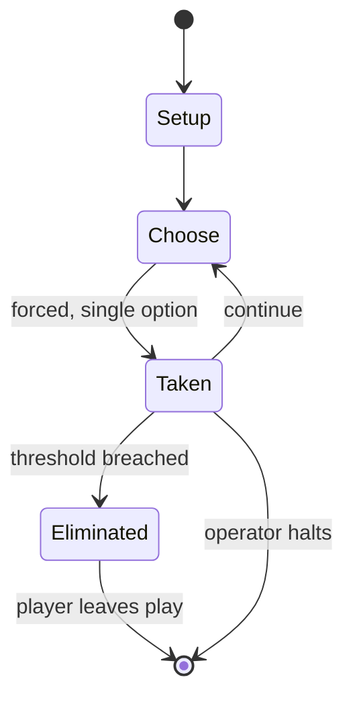

# Santorini (game)

`santorini_game` &nbsp; state: **DEEPENED** &nbsp; method: **heuristic**

## Found layer (recorded, not trusted)

| field | value |
| --- | --- |
| wikidata | Q4179219 |
| wikipedia | Santorini (game) |
| genres (source) | -- |
| instance of (source) | -- |
| country of origin | -- |

## Declared layer (orders bench work)

| field | value |
| --- | --- |
| year created | 2004 |
| epoch | CONTEMPORARY |
| region | -- |
| media | ABSTRACT, BOARD, TILE |
| players | 2-4 |
| age band | -- |
| exogenous process | -- |
| loss shape | ELIMINATION |
| live axes | SPATIAL |
| horizon | OPEN_ENDED |
| scoring shape | -- |
| information | -- |
| interaction | COMPETITIVE |
| turn structure | -- |
| tractability | SAMPLING_ONLY |
| randomness | -- |
| luck factor | 0.35 |
| rules complexity | 2.02 |
| strategic depth | 2.0 |
| novelty | 0.3553 |
| solved status | -- |
| strategies | -- |
| algorithms | -- |

## Object model

```
Episode
  players      : 2-4
  turn_structure: ?
  horizon       : OPEN_ENDED
  scoring       : ?

Board          -- spatial substrate; cells carry position and occupancy
Piece          -- movable token owned by a player
TileBag        -- unordered draw source
Layout         -- placed tiles and their adjacencies
Placement      -- position subject to geometric legality
```

## State transition diagram



## Research item -- turn trace

```
# Santorini (game) -- simulated turn events
# generated from the DECLARED vector, not from a rulebook.
# structure: exo=None loss=ELIMINATION horizon=OPEN_ENDED scoring=None axes=SPATIAL

t=0    SETUP        players=2  pot=0  capacity=5
t=1    FORCED       p1 single legal option taken (pot_gain=+1.6)
t=2    FORCED       p1 single legal option taken (pot_gain=+0.8)
t=3    SPATIAL      p1 places at (5,0); adjacency legal
t=4    FORCED       p1 single legal option taken (pot_gain=+1.5)
t=5    FORCED       p1 single legal option taken (pot_gain=+1.4)
t=6    SPATIAL      p1 places at (2,2); adjacency legal
t=7    FORCED       p1 single legal option taken (pot_gain=+0.9)
t=8    FORCED       p1 single legal option taken (pot_gain=+1.8)
t=9    FORCED       p1 single legal option taken (pot_gain=+0.7)
t=10   FORCED       p1 single legal option taken (pot_gain=+0.6)
t=11   FORCED       p1 single legal option taken (pot_gain=+0.7)
t=12   FORCED       p1 single legal option taken (pot_gain=+1.6)
t=13   FORCED       p1 single legal option taken (pot_gain=+0.7)
t=14   FORCED       p1 single legal option taken (pot_gain=+1.7)
t=15   FORCED       p1 single legal option taken (pot_gain=+2.0)
t=16   FORCED       p1 single legal option taken (pot_gain=+1.5)
t=17   SPATIAL      p1 places at (1,0); adjacency legal
t=18   FORCED       p1 single legal option taken (pot_gain=+0.9)
t=19   FORCED       p1 single legal option taken (pot_gain=+1.7)
t=20   SPATIAL      p1 places at (1,5); adjacency legal
t=21   FORCED       p1 single legal option taken (pot_gain=+1.6)
t=22   ENDTURN      turn passes to p2
t=23   FORCED       p2 single legal option taken (pot_gain=+1.1)
t=24   FORCED       p2 single legal option taken (pot_gain=+1.0)
t=25   SPATIAL      p2 places at (2,3); adjacency legal
t=26   FORCED       p2 single legal option taken (pot_gain=+1.6)

terminal: OPEN_ENDED
```

## Conditions

| kind | threshold | effect | trigger |
| --- | --- | --- | --- |
| ELIMINATE | 2 players | -- | A review on The Wirecutter stated that the game is "fun and easy to learn", but that "players can get knocked out early on" for games with more than two players. |
| WIN | -- | -- | To win the game, players must move one of their two characters to the third level of the town. |

## Source extract

Santorini is an abstract strategy board game for 2-4 players designed by Gordon Hamilton in
1985. He published the all-white wooden version in 2004. It was republished via Kickstarter in
2016 by Roxley Games. Inspired by the architecture of cliffside villages on Santorini Island in
Greece, and primarily designed for two players, the game is played on a grid where each turn
players build a town by placing building pieces up to three levels high. To win the game,
players must move one of their two characters to the third level of the town.   == Gameplay ==
Each turn of play involves moving one of your two pieces around a 5-by-5 grid and then placing a
tile adjacent to the moved piece, building up that spot of the board. On subsequent turns,
pieces may be moved onto one of these built-up tiles, but only one level up at a time. Pieces
may also be moved down any number of levels. Players may also place a special dome tile on top
of a three-level building, which prevents a player from moving onto that spot for the remainder
of the game. The primary winning condition is to get one of your pieces onto the third level,
though players may also win if their opponent is unable to make a move.

<sub>Wikipedia, CC BY-SA. Retained as evidence for the structural
classification above. Every rule inferred from it is HYPOTHESIZED
until audited against a rulebook.</sub>
