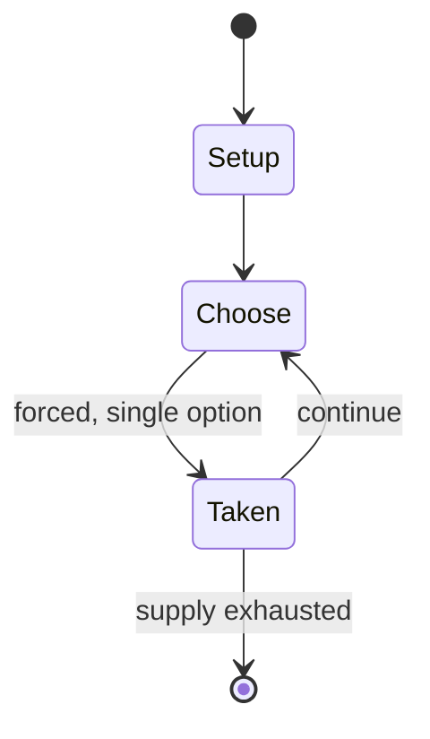

# scavenger hunt

*game*

`scavenger_hunt` &nbsp; state: **DEEPENED** &nbsp; method: **heuristic**

## Found layer (recorded, not trusted)

| field | value |
| --- | --- |
| wikidata | Q1053933 |
| wikipedia | Scavenger hunt |
| genres (source) | -- |
| instance of (source) | genre, outdoor game |
| country of origin | -- |

## Declared layer (orders bench work)

| field | value |
| --- | --- |
| year created | -- |
| epoch | -- |
| region | -- |
| media | PUZZLE |
| players | -- |
| age band | -- |
| exogenous process | -- |
| loss shape | OPPORTUNITY_ONLY |
| live axes | - |
| horizon | -- |
| scoring shape | SET_COLLECTION_CONVEX |
| information | -- |
| interaction | COMPETITIVE |
| turn structure | -- |
| tractability | SAMPLING_ONLY |
| randomness | HIDDEN_INFO |
| luck factor | 0.35 |
| rules complexity | 2.27 |
| strategic depth | 2.5 |
| novelty | 0.5702 |
| solved status | -- |
| strategies | route_optimisation, set_collection |
| algorithms | -- |

## Object model

```
Episode
  players      : ?
  turn_structure: ?
  horizon       : ?
  scoring       : SET_COLLECTION_CONVEX

Configuration  -- the arrangement to be resolved
Constraint     -- predicate a legal configuration must satisfy
```

## State transition diagram



## Research item -- turn trace

```
# scavenger hunt -- simulated turn events
# generated from the DECLARED vector, not from a rulebook.
# structure: exo=None loss=OPPORTUNITY_ONLY horizon=None scoring=SET_COLLECTION_CONVEX axes=-

t=0    SETUP        players=2  pot=0  capacity=5
t=1    FORCED       p1 single legal option taken (pot_gain=+0.8)
t=2    FORCED       p1 single legal option taken (pot_gain=+1.3)
t=3    FORCED       p1 single legal option taken (pot_gain=+1.2)
t=4    ENDTURN      turn passes to p2
t=5    FORCED       p2 single legal option taken (pot_gain=+1.7)
t=6    FORCED       p2 single legal option taken (pot_gain=+0.8)
t=7    FORCED       p2 single legal option taken (pot_gain=+1.8)
t=8    ENDTURN      turn passes to p1
t=9    FORCED       p1 single legal option taken (pot_gain=+1.4)
t=10   FORCED       p1 single legal option taken (pot_gain=+1.2)
t=11   FORCED       p1 single legal option taken (pot_gain=+1.9)
t=12   FORCED       p1 single legal option taken (pot_gain=+1.4)
t=13   FORCED       p1 single legal option taken (pot_gain=+1.6)
t=14   FORCED       p1 single legal option taken (pot_gain=+0.9)
t=15   FORCED       p1 single legal option taken (pot_gain=+1.5)
t=16   FORCED       p1 single legal option taken (pot_gain=+1.0)
t=17   FORCED       p1 single legal option taken (pot_gain=+1.7)
t=18   FORCED       p1 single legal option taken (pot_gain=+1.3)
t=19   FORCED       p1 single legal option taken (pot_gain=+0.7)
t=20   FORCED       p1 single legal option taken (pot_gain=+0.6)
t=21   FORCED       p1 single legal option taken (pot_gain=+1.0)
t=22   ENDTURN      turn passes to p2
t=23   FORCED       p2 single legal option taken (pot_gain=+1.0)
t=24   FORCED       p2 single legal option taken (pot_gain=+1.8)
t=25   FORCED       p2 single legal option taken (pot_gain=+0.7)
t=26   FORCED       p2 single legal option taken (pot_gain=+1.5)

terminal: VARIABLE
```

## Conditions

| kind | threshold | effect | trigger |
| --- | --- | --- | --- |
| WIN | -- | -- | The goal is to be the first to complete the list or to find the most items on that list. |

## Source extract

A scavenger hunt is a game in which the organizers prepare a list defining specific items that
need to be found, which the participants seek to gather or complete all items on the list,
usually without purchasing them. Participants typically work in small teams, although the rules
may allow individuals to participate. The goal is to be the first to complete the list or to
find the most items on that list. In variations of the game, players take photographs of listed
items or are challenged to complete the tasks on the list in the most creative manner. A
treasure hunt is another term for the game, but it may involve following a series of clues to
find objects or a single prize in a particular order.  According to game scholar Markus Montola,
scavenger hunts evolved from ancient folk games.  Gossip columnist Elsa Maxwell popularized
scavenger hunts in the United States with a series of exclusive New York parties starting in the
early 1930s. The scavenger-hunt craze among New York's elite was satirized in the 1936 film My
Man Godfrey, where one of the items socialite players are trying to collect is a "Forgotten
Man", a homeless person.   == Examples == Scavenger hunts are regularly h

<sub>Wikipedia, CC BY-SA. Retained as evidence for the structural
classification above. Every rule inferred from it is HYPOTHESIZED
until audited against a rulebook.</sub>
