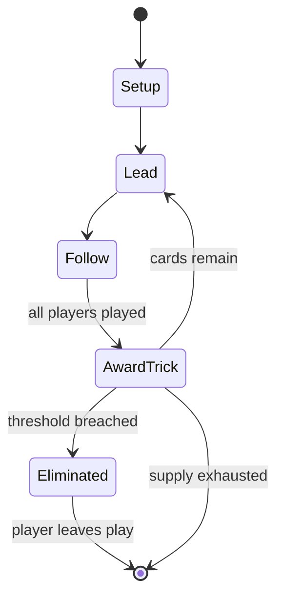

# Schnapsen

*card game*

`schnapsen` &nbsp; state: **DEEPENED** &nbsp; method: **heuristic**

## Found layer (recorded, not trusted)

| field | value |
| --- | --- |
| wikidata | Q16675811 |
| wikipedia | Schnapsen |
| genres (source) | -- |
| instance of (source) | trick-taking game |
| country of origin | -- |

## Declared layer (orders bench work)

| field | value |
| --- | --- |
| year created | -- |
| epoch | -- |
| region | -- |
| media | CARD, TRICK_TAKING |
| players | 4 |
| age band | -- |
| exogenous process | DEPLETING_DECK |
| loss shape | ELIMINATION |
| live axes | DISCARD |
| horizon | -- |
| scoring shape | SET_COLLECTION_CONVEX |
| information | -- |
| interaction | COMPETITIVE |
| turn structure | TRICK_ROUND |
| tractability | SAMPLING_ONLY |
| randomness | HIDDEN_INFO |
| luck factor | 0.35 |
| rules complexity | 2.17 |
| strategic depth | 2.25 |
| novelty | 0.5194 |
| solved status | -- |
| strategies | opponent_modelling |
| algorithms | -- |

## Object model

```
Episode
  players      : 4
  turn_structure: TRICK_ROUND
  horizon       : ?
  scoring       : SET_COLLECTION_CONVEX

Deck           -- ordered multiset, drawn without replacement
Hand           -- private multiset held by one player
DiscardPile    -- public accumulation of spent cards
Trick          -- one card per player; a winner is determined
Trump          -- suit that dominates the ordering
DiscardChoice  -- what is given up to satisfy a limit
```

## State transition diagram



## Research item -- turn trace

```
# Schnapsen -- simulated turn events
# generated from the DECLARED vector, not from a rulebook.
# structure: exo=DEPLETING_DECK loss=ELIMINATION horizon=None scoring=SET_COLLECTION_CONVEX axes=DISCARD

t=0    SETUP        players=4  pot=0  capacity=7
t=1    DRAW         p1 draw from deck -> outcome #6  (p=0.083)
t=2    FORCED       p1 single legal option taken (pot_gain=+1.7)
t=3    DISCARD      p1 discards to hand limit
t=4    ENDTURN      turn passes to p2
t=5    DRAW         p2 draw from deck -> outcome #5  (p=0.152)
t=6    FORCED       p2 single legal option taken (pot_gain=+1.9)
t=7    DISCARD      p2 discards to hand limit
t=8    DRAW         p2 draw from deck -> outcome #6  (p=0.066)
t=9    FORCED       p2 single legal option taken (pot_gain=+1.8)
t=10   DRAW         p2 draw from deck -> outcome #1  (p=0.263)
t=11   FORCED       p2 single legal option taken (pot_gain=+0.8)
t=12   DISCARD      p2 discards to hand limit
t=13   DRAW         p2 draw from deck -> outcome #2  (p=0.089)
t=14   FORCED       p2 single legal option taken (pot_gain=+1.9)
t=15   DISCARD      p2 discards to hand limit
t=16   DRAW         p2 draw from deck -> outcome #3  (p=0.247)
t=17   FORCED       p2 single legal option taken (pot_gain=+1.9)
t=18   ENDTURN      turn passes to p3
t=19   DRAW         p3 draw from deck -> outcome #1  (p=0.266)
t=20   FORCED       p3 single legal option taken (pot_gain=+0.6)
t=21   ENDTURN      turn passes to p4
t=22   DRAW         p4 draw from deck -> outcome #3  (p=0.095)
t=23   FORCED       p4 single legal option taken (pot_gain=+1.0)
t=24   DRAW         p4 draw from deck -> outcome #5  (p=0.079)
t=25   FORCED       p4 single legal option taken (pot_gain=+1.4)
t=26   DRAW         p4 draw from deck -> outcome #2  (p=0.287)
t=27   FORCED       p4 single legal option taken (pot_gain=+0.8)
t=28   DISCARD      p4 discards to hand limit

terminal: VARIABLE
```

## Conditions

| kind | threshold | effect | trigger |
| --- | --- | --- | --- |
| WIN | 1 point | -- | If neither player goes out before the last card is played, the last card must be played and the winner of the last trick is the winner of the deal, scoring one point. |
| BOUNDARY | 1 trick | -- | Players must have at least one trick before melding a pair or marriage (Zwanziger, Vierziger). |
| BOUNDARY | 3 cards | -- | Each player may buy a certain number of entry cards - variously called Lose ("batches" or "lots"), Leben ("lives") or Standkarten ("entry cards"), up to a maximum of, say, three cards, as specified in the tournament invi |
| ELIMINATE | -- | eliminated | While in the usual knockout system a player is eliminated after his first defeat, this is not always the case in the case of Preisschnapsen, as a player can buy several entry cards in some tournaments. |
| TERMINATE | -- | -- | After this, the game ends and each player counts the card points they have amassed. |
| BOUNDARY | -- | -- | Each deal can give a player a maximum of 3 game points. |

## Source extract

Schnapsen, Schnapser or Schnapsa is a trick-taking card game of the bézique (ace–ten) family
that is very popular in Bavaria and in the territories of the former Austro-Hungarian Empire and
has become the national card game of Austria and Hungary. Schnapsen is both of the point-trick
(individual cards in each trick are used to determine points as in Pinochle) and trick-and-draw
(a new card is drawn after each trick is won) subtypes. The game is similar to sixty-six
(Sechsundsechzig).  Many rule variations exist, and both Schnapsen and sixty-six involve
challenging strategy. Schnapsen has been described as "an inherently intense game that requires
a lot of concentration and so isn't good for socializing, but it's a challenging game whose
interest never wavers."   == Etymology and origins == The name Schnapsen (Hungarian: Snapszer)
may be derived from schnappen, which means "to trump". The most prevalent theory in popular
tradition is that the game is so named because people often played it for drinks, particularly
schnaps. Schnapsen is descended from Mariage, the earliest description of which is found in the
Leipziger Frauenzimmer-Lexicon of 1715. Mariage, a 32-card game, is still c

<sub>Wikipedia, CC BY-SA. Retained as evidence for the structural
classification above. Every rule inferred from it is HYPOTHESIZED
until audited against a rulebook.</sub>
