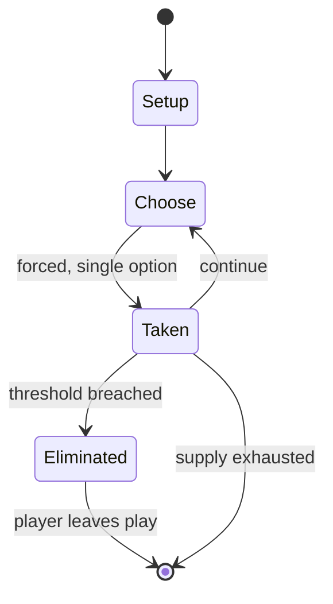

# Schutztruppe

*board wargame published in 1975*

`schutztruppe` &nbsp; state: **DEEPENED** &nbsp; method: **heuristic**

## Found layer (recorded, not trusted)

| field | value |
| --- | --- |
| wikidata | Q110707331 |
| wikipedia | Schutztruppe (board game) |
| genres (source) | -- |
| instance of (source) | board wargame |
| country of origin | -- |

## Declared layer (orders bench work)

| field | value |
| --- | --- |
| year created | 1975 |
| epoch | DIGITAL |
| region | -- |
| media | WARGAME |
| players | -- |
| age band | -- |
| exogenous process | -- |
| loss shape | ELIMINATION |
| live axes | SPATIAL |
| horizon | -- |
| scoring shape | -- |
| information | IMPERFECT |
| interaction | -- |
| turn structure | -- |
| tractability | SAMPLING_ONLY |
| randomness | DICE |
| luck factor | 0.58 |
| rules complexity | 3.3 |
| strategic depth | 2.12 |
| novelty | 0.6057 |
| solved status | -- |
| strategies | deduction |
| algorithms | -- |

## Object model

```
Episode
  players      : ?
  turn_structure: ?
  horizon       : ?
  scoring       : ?

Placement      -- position subject to geometric legality
```

## State transition diagram



## Research item -- turn trace

```
# Schutztruppe -- simulated turn events
# generated from the DECLARED vector, not from a rulebook.
# structure: exo=None loss=ELIMINATION horizon=None scoring=None axes=SPATIAL

t=0    SETUP        players=2  pot=0  capacity=3
t=1    FORCED       p1 single legal option taken (pot_gain=+1.1)
t=2    FORCED       p1 single legal option taken (pot_gain=+1.1)
t=3    FORCED       p1 single legal option taken (pot_gain=+1.8)
t=4    ENDTURN      turn passes to p2
t=5    FORCED       p2 single legal option taken (pot_gain=+1.4)
t=6    FORCED       p2 single legal option taken (pot_gain=+1.2)
t=7    FORCED       p2 single legal option taken (pot_gain=+1.3)
t=8    SPATIAL      p2 places at (2,6); adjacency legal
t=9    FORCED       p2 single legal option taken (pot_gain=+0.9)
t=10   FORCED       p2 single legal option taken (pot_gain=+2.0)
t=11   FORCED       p2 single legal option taken (pot_gain=+0.8)
t=12   SPATIAL      p2 places at (2,2); adjacency legal
t=13   FORCED       p2 single legal option taken (pot_gain=+1.1)
t=14   ENDTURN      turn passes to p1
t=15   FORCED       p1 single legal option taken (pot_gain=+1.8)
t=16   FORCED       p1 single legal option taken (pot_gain=+0.8)
t=17   FORCED       p1 single legal option taken (pot_gain=+1.4)
t=18   SPATIAL      p1 places at (4,1); adjacency legal
t=19   ENDTURN      turn passes to p2
t=20   FORCED       p2 single legal option taken (pot_gain=+0.9)
t=21   FORCED       p2 single legal option taken (pot_gain=+0.6)
t=22   SPATIAL      p2 places at (2,4); adjacency legal
t=23   ENDTURN      turn passes to p1
t=24   FORCED       p1 single legal option taken (pot_gain=+2.0)
t=25   SPATIAL      p1 places at (3,5); adjacency legal
t=26   FORCED       p1 single legal option taken (pot_gain=+1.9)
t=27   SPATIAL      p1 places at (3,4); adjacency legal

terminal: VARIABLE
```

## Conditions

| kind | threshold | effect | trigger |
| --- | --- | --- | --- |
| ELIMINATE | -- | -- | The Allied player deducts points from the German player's total by eliminating German units; there is also a large bonus deducted from the German point total if the Allied player eliminates all German units before the en |
| BOUNDARY | -- | -- | At the end of the game, the German player wins if they have at least 200 Victory Points; the Allied player wins if the German player's Victory Point total is 0 or less. |

## Source extract

Schutztruppe, subtitled "East African Guerilla Warfare, 1914-1918", is a board wargame
originally self-published by Jim Bumpas in 1975, then published by Flying Buffalo in 1978, that
simulates the conflict between German Schutztruppe ("protection force", the name given to the
colonial troops in German East Africa) and Allied forces during World War I.   == Background ==
During World War I in East Africa, a small force of German-African soldiers under the command of
Paul von Lettow-Vorbeck successfully waged a guerilla war against much larger conventional
Allied forces, thereby tying down up to 300,000 Allied soldiers who could have been used in
other, more active theatres of the war.  The British were never able to bring the Schutztruppe
to a full-scale battle, and German forces continued active operations until after the Armistice
of 11 November 1918; when word of the armistice reached East Africa several weeks later, von
Lettow-Vorbeck became the last German commander of the war to surrender to Allied forces.   ==
Description == Schutztruppe is a 2-player board wargame set in East Africa. In the original
self-published edition, the game starts in January 1916 and ends in November

<sub>Wikipedia, CC BY-SA. Retained as evidence for the structural
classification above. Every rule inferred from it is HYPOTHESIZED
until audited against a rulebook.</sub>
