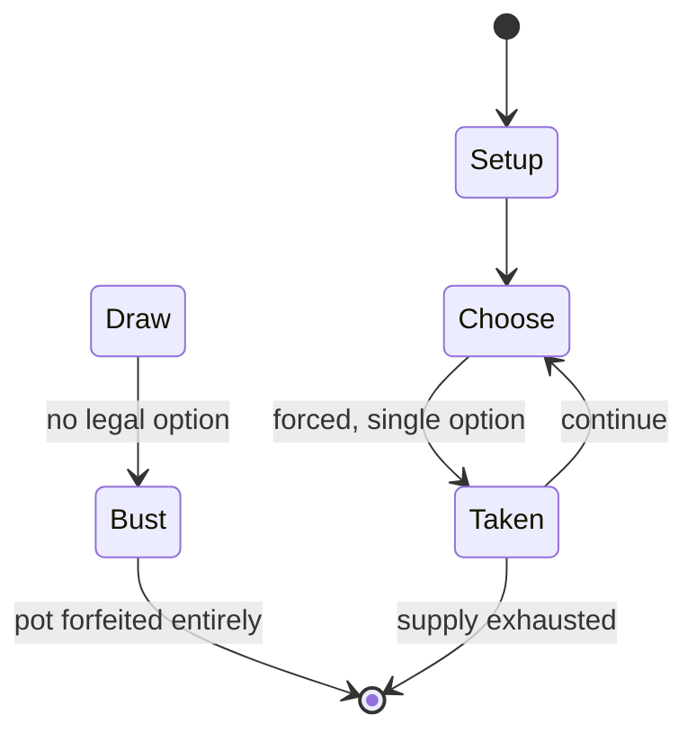

# Scrabble

`scrabble` &nbsp; state: **DEEPENED** &nbsp; method: **heuristic**

## Found layer (recorded, not trusted)

| field | value |
| --- | --- |
| wikidata | Q170436 |
| wikipedia | Scrabble |
| genres (source) | -- |
| instance of (source) | -- |
| country of origin | -- |

## Declared layer (orders bench work)

| field | value |
| --- | --- |
| year created | 1931 |
| epoch | MODERN |
| region | -- |
| media | BOARD, TILE |
| players | -- |
| age band | -- |
| exogenous process | -- |
| loss shape | TOTAL_RUIN |
| live axes | SPATIAL, TRADE |
| horizon | -- |
| scoring shape | -- |
| information | -- |
| interaction | COMPETITIVE |
| turn structure | -- |
| tractability | SAMPLING_ONLY |
| randomness | HIDDEN_INFO |
| luck factor | 0.35 |
| rules complexity | 3.0 |
| strategic depth | 2.0 |
| novelty | 0.0938 |
| solved status | -- |
| strategies | -- |
| algorithms | -- |

## Object model

```
Episode
  players      : ?
  turn_structure: ?
  horizon       : ?
  scoring       : ?

Board          -- spatial substrate; cells carry position and occupancy
Piece          -- movable token owned by a player
TileBag        -- unordered draw source
Layout         -- placed tiles and their adjacencies
Placement      -- position subject to geometric legality
Offer          -- proposed exchange between two agents
```

## State transition diagram



## Research item -- turn trace

```
# Scrabble -- simulated turn events
# generated from the DECLARED vector, not from a rulebook.
# structure: exo=None loss=TOTAL_RUIN horizon=None scoring=None axes=SPATIAL,TRADE

t=0    SETUP        players=2  pot=0  capacity=4
t=1    FORCED       p1 single legal option taken (pot_gain=+1.6)
t=2    ENDTURN      turn passes to p2
t=3    FORCED       p2 single legal option taken (pot_gain=+1.8)
t=4    TRADE        p2 offers 2:1 exchange to p1
t=5    SPATIAL      p2 places at (7,7); adjacency legal
t=6    FORCED       p2 single legal option taken (pot_gain=+0.7)
t=7    TRADE        p2 offers 2:1 exchange to p1
t=8    ENDTURN      turn passes to p1
t=9    DEATH        p1 no legal option -- BUST. pot 4.1 -> 0.0
t=10   NOTE         loss_shape=TOTAL_RUIN: entire pot forfeited

terminal: VARIABLE
```

## Conditions

| kind | threshold | effect | trigger |
| --- | --- | --- | --- |
| BOUNDARY | 1 tile | -- | Play at least one tile on the board, adding the value of all words formed to the player's cumulative score. |
| BOUNDARY | 2 tiles | -- | The first play of the game must consist of at least two tiles and cover the center square (H8). |
| BOUNDARY | 1 tile | -- | At least one tile must be adjacent (horizontally or vertically) to a tile already on the board. |
| WIN | -- | -- | If final scores are tied, the player whose score was highest before adjusting for unplayed tiles is the winner; in tournament play, a tie is counted as half a win for both players. |
| TERMINATE | -- | -- | The game ends when either: |
| LOSE | -- | -- | A player who goes overtime does not immediately lose the game (as in chess), but is instead assessed a 10-point penalty per minute. |
| BOUNDARY | -- | -- | Any play thereafter must use at least one of the player's tiles to form a "main word" (containing all of the player's played tiles in a straight line) reading left-to-right or top-to-bottom. |
| BOUNDARY | -- | removed | If at least one challenged word is unacceptable, the play is removed from the board, and the player scores zero for that turn. |
| BOUNDARY | -- | -- | At least six consecutive scoreless turns have occurred and either player decides to end the game. |
| BOUNDARY | -- | -- | If a word appears, at least historically, in any one of the dictionaries, it is included in the NWL and the OSPD. |
| PENALTY | -- | -- | The previously unspecified penalty for having one's play successfully challenged was stated: withdrawal of tiles and loss of turn. |
| PENALTY | -- | -- | A loss-of-turn penalty was added for challenging an acceptable play. |
| PENALTY | -- | -- | Pass, forfeiting the turn and scoring zero. |
| PENALTY | -- | -- | Penalties for unsuccessfully challenging an acceptable play vary in club and tournament play and are described in greater detail below. |
| PENALTY | -- | -- | The penalty for a successfully challenged play is nearly universal: the offending player removes the tiles played and forfeits their turn. |
| PENALTY | -- | -- | The penalty for an unsuccessful challenge (where all words challenged in the play are deemed valid) varies considerably, including: |
| PENALTY | -- | -- | Double challenge, in which an unsuccessfully challenging player must forfeit the next turn. |
| PENALTY | -- | -- | This penalty is most common in North American (NASPA- or WGPO-sanctioned) club and tournament play. |
| PENALTY | -- | -- | Single or free challenge, in which no penalty whatsoever is applied to a player who unsuccessfully challenges. |
| PENALTY | -- | -- | Modified single, penalty, or 5-point challenge, in which an unsuccessful challenge does not result in the loss of the challenging player's turn, but is penalized by a 5-point (or other specified point) penalty. |
| PENALTY | -- | -- | Some countries and tournaments (including Sweden) use a 10-point penalty instead. |
| PENALTY | -- | -- | In most game situations, this penalty is much lower than that of the "double challenge" rule. |
| PENALTY | -- | -- | The player is then required to make a different play, with no penalty applied. |

## Source extract

Scrabble is a word game in which two to four players score points by placing tiles, each bearing
a single letter, onto a game board divided into a 15×15 grid of squares. The tiles must form
words that, in crossword fashion, read left to right in rows or downward in columns and are
included in a standard dictionary or lexicon. American architect Alfred Mosher Butts invented
the game in 1931. Scrabble is produced in the United States and Canada by Hasbro, under the
brands of both of its subsidiaries, Milton Bradley and Parker Brothers. Mattel owns the rights
to manufacture Scrabble outside the U.S. and Canada. As of 2008, the game is sold in 121
countries and is available in more than 30 languages; approximately 150 million sets have been
sold worldwide, and roughly one-third of American homes and half of British homes have a
Scrabble set. There are approximately 4,000 Scrabble clubs around the world.   == Equipment ==
Scrabble is played on a 15x15 board, containing 225 squares. Certain squares are premium
squares: eight red triple word score (TWS) squares, 17 pink double word score (DWS) squares,
including the center square (H8, often marked with a star or other symbol), 12 blue tr

<sub>Wikipedia, CC BY-SA. Retained as evidence for the structural
classification above. Every rule inferred from it is HYPOTHESIZED
until audited against a rulebook.</sub>
