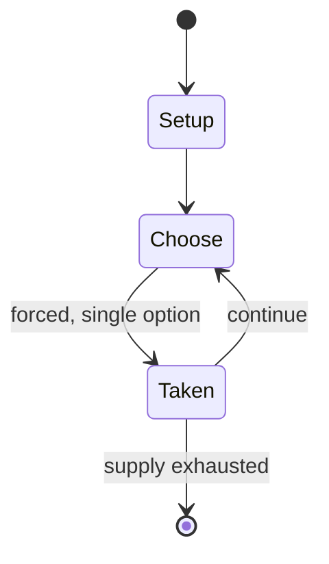

# Se Se Seboti

*traditional Meitei song and game*

`se_se_seboti` &nbsp; state: **DEEPENED** &nbsp; method: **heuristic**

## Found layer (recorded, not trusted)

| field | value |
| --- | --- |
| wikidata | Q132399884 |
| wikipedia | Se Se Seboti |
| genres (source) | -- |
| instance of (source) | Meitei traditional games |
| country of origin | -- |

## Declared layer (orders bench work)

| field | value |
| --- | --- |
| year created | -- |
| epoch | -- |
| region | -- |
| media | - |
| players | -- |
| age band | -- |
| exogenous process | -- |
| loss shape | -- |
| live axes | BID |
| horizon | -- |
| scoring shape | -- |
| information | -- |
| interaction | -- |
| turn structure | -- |
| tractability | SAMPLING_ONLY |
| randomness | -- |
| luck factor | 0.35 |
| rules complexity | 2.08 |
| strategic depth | 2.0 |
| novelty | 0.0877 |
| solved status | -- |
| strategies | -- |
| algorithms | -- |

## Object model

```
Episode
  players      : ?
  turn_structure: ?
  horizon       : ?
  scoring       : ?

Auction        -- priced competition resolving to one winner
```

## State transition diagram



## Research item -- turn trace

```
# Se Se Seboti -- simulated turn events
# generated from the DECLARED vector, not from a rulebook.
# structure: exo=None loss=None horizon=None scoring=None axes=BID

t=0    SETUP        players=2  pot=0  capacity=6
t=1    FORCED       p1 single legal option taken (pot_gain=+1.2)
t=2    FORCED       p1 single legal option taken (pot_gain=+0.9)
t=3    FORCED       p1 single legal option taken (pot_gain=+1.4)
t=4    BID          p1 sealed bid of 9 against 1 rivals
t=5    FORCED       p1 single legal option taken (pot_gain=+0.9)
t=6    FORCED       p1 single legal option taken (pot_gain=+2.0)
t=7    BID          p1 sealed bid of 1 against 1 rivals
t=8    FORCED       p1 single legal option taken (pot_gain=+1.5)
t=9    BID          p1 sealed bid of 6 against 1 rivals
t=10   FORCED       p1 single legal option taken (pot_gain=+0.9)
t=11   FORCED       p1 single legal option taken (pot_gain=+0.6)
t=12   FORCED       p1 single legal option taken (pot_gain=+1.4)
t=13   FORCED       p1 single legal option taken (pot_gain=+1.2)
t=14   FORCED       p1 single legal option taken (pot_gain=+1.9)
t=15   ENDTURN      turn passes to p2
t=16   FORCED       p2 single legal option taken (pot_gain=+1.2)
t=17   BID          p2 sealed bid of 5 against 1 rivals
t=18   FORCED       p2 single legal option taken (pot_gain=+1.8)
t=19   BID          p2 sealed bid of 5 against 1 rivals
t=20   FORCED       p2 single legal option taken (pot_gain=+1.3)
t=21   BID          p2 sealed bid of 4 against 1 rivals
t=22   FORCED       p2 single legal option taken (pot_gain=+1.6)
t=23   ENDTURN      turn passes to p1
t=24   FORCED       p1 single legal option taken (pot_gain=+1.3)
t=25   ENDTURN      turn passes to p2
t=26   FORCED       p2 single legal option taken (pot_gain=+1.1)
t=27   ENDTURN      turn passes to p1

terminal: VARIABLE
```

## Source extract

Se Se Seboti (or Seboti Kaonaba, also known as Seboti Kaonabi) refers to both a Meitei
traditional game and a Meitei language song, sung during the game. It is very popular among the
children of Meitei ethnicity of Manipur. It has traditional cultural meaning and is played by
both boys and girls. The game is accompanied by singing, with players singing in a rhythmic
pattern.   == Lyrics == Se se seboti Boboti son of Laishram, Let us have a duel To see who
defeats who Like a Kouna (reed) I can uproot you Like a Thambou (stalk of lotus) I can break you
Let's bid for girls cloth Then let's bid for Khudei At the foot of the Heitroi (Flocourtia
Cataphracta) tree Heitroi fruit fallen into half Let us see who pick it first Swah! (Disperse)
== Analysis ==  In the phrase "Nupa Khudei Thanasi," which means "Then let's bid for Khudei,"
Khudei refers to a short cloth worn by men around the waist, covering up to the knee (Sanahal,
1969, p. 29). Manipur has always been a place of conflict, with battles between different clans
and outsiders from Burma, Shan kingdom, Pong, and other areas. The early history of Manipur was
marked by continuous fights and challenges, showing the strength and skill

<sub>Wikipedia, CC BY-SA. Retained as evidence for the structural
classification above. Every rule inferred from it is HYPOTHESIZED
until audited against a rulebook.</sub>
