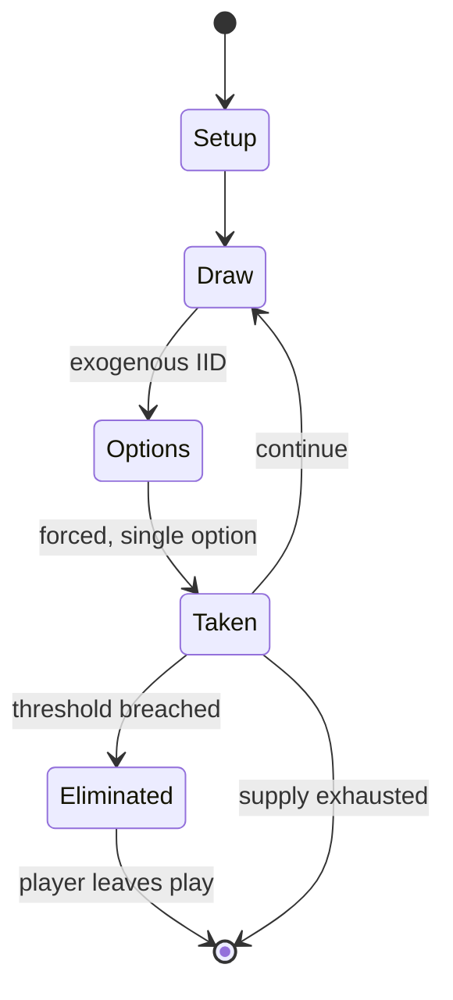

# Sea Hawks

*1981 board game*

`sea_hawks` &nbsp; state: **DEEPENED** &nbsp; method: **heuristic**

## Found layer (recorded, not trusted)

| field | value |
| --- | --- |
| wikidata | Q104881052 |
| wikipedia | Sea Hawks (board game) |
| genres (source) | -- |
| instance of (source) | board game |
| country of origin | -- |

## Declared layer (orders bench work)

| field | value |
| --- | --- |
| year created | 1981 |
| epoch | DIGITAL |
| region | -- |
| media | BOARD |
| players | 2-4 |
| age band | -- |
| exogenous process | IID |
| loss shape | ELIMINATION |
| live axes | - |
| horizon | -- |
| scoring shape | -- |
| information | IMPERFECT |
| interaction | -- |
| turn structure | -- |
| tractability | EXACT_WITH_CUT |
| randomness | DICE |
| luck factor | 0.58 |
| rules complexity | 1.71 |
| strategic depth | 2.37 |
| novelty | 0.7706 |
| solved status | -- |
| strategies | deduction, opponent_modelling |
| algorithms | -- |

## Object model

```
Episode
  players      : 2-4
  turn_structure: ?
  horizon       : ?
  scoring       : ?

Board          -- spatial substrate; cells carry position and occupancy
Piece          -- movable token owned by a player
```

## State transition diagram



## Research item -- turn trace

```
# Sea Hawks -- simulated turn events
# generated from the DECLARED vector, not from a rulebook.
# structure: exo=IID loss=ELIMINATION horizon=None scoring=None axes=-

t=0    SETUP        players=2  pot=0  capacity=5
t=1    DRAW         p1 roll from d6 pool -> outcome #3  (p=0.001)
t=2    FORCED       p1 single legal option taken (pot_gain=+1.0)
t=3    ENDTURN      turn passes to p2
t=4    DRAW         p2 roll from d6 pool -> outcome #3  (p=0.172)
t=5    FORCED       p2 single legal option taken (pot_gain=+1.4)
t=6    DRAW         p2 roll from d6 pool -> outcome #4  (p=0.012)
t=7    FORCED       p2 single legal option taken (pot_gain=+1.3)
t=8    DRAW         p2 roll from d6 pool -> outcome #3  (p=0.238)
t=9    FORCED       p2 single legal option taken (pot_gain=+0.6)
t=10   ENDTURN      turn passes to p1
t=11   DRAW         p1 roll from d6 pool -> outcome #2  (p=0.230)
t=12   FORCED       p1 single legal option taken (pot_gain=+1.4)
t=13   DRAW         p1 roll from d6 pool -> outcome #6  (p=0.291)
t=14   FORCED       p1 single legal option taken (pot_gain=+1.4)
t=15   DRAW         p1 roll from d6 pool -> outcome #6  (p=0.228)
t=16   FORCED       p1 single legal option taken (pot_gain=+1.7)
t=17   DRAW         p1 roll from d6 pool -> outcome #4  (p=0.029)
t=18   FORCED       p1 single legal option taken (pot_gain=+1.8)
t=19   ENDTURN      turn passes to p2
t=20   DRAW         p2 roll from d6 pool -> outcome #4  (p=0.268)
t=21   FORCED       p2 single legal option taken (pot_gain=+0.9)
t=22   DRAW         p2 roll from d6 pool -> outcome #3  (p=0.292)
t=23   FORCED       p2 single legal option taken (pot_gain=+1.6)
t=24   DRAW         p2 roll from d6 pool -> outcome #4  (p=0.125)
t=25   FORCED       p2 single legal option taken (pot_gain=+1.3)
t=26   DRAW         p2 roll from d6 pool -> outcome #3  (p=0.044)
t=27   FORCED       p2 single legal option taken (pot_gain=+0.7)

terminal: VARIABLE
```

## Conditions

| kind | threshold | effect | trigger |
| --- | --- | --- | --- |
| WIN | -- | -- | The first captain to discern which one contains the treasure and transport it to their home port is the winner. |

## Source extract

Sea Hawks is a family board game about pirates and buried treasure published by Orca Games in
1981.   == Description == Sea Hawks is a game for 2–4 players, each of which is an 18th-century
pirate captain sailing the Spanish Main, searching for buried treasure. There are ten sea chests
on the map, but only one contains treasure. The first captain to discern which one contains the
treasure  and transport it to their home port is the winner.    === Components === 20" x 28"
board with map of the Spanish Main four plastic ship markers ten plastic sea chests markers a
plastic sea monster two decks of cards two 6-sided dice rulebook   === Gameplay === Nine of the
ten sea chests placed on the map are empty. Players collect treasure cards, which tell the
player which chests do NOT contain treasure. Through a process of elimination, players deduce
which chest does contain the treasure. They must then sail to it and bring it back to their home
port. Other players can try to steal the chest by engaging in ship-to-ship combat. Fate cards
introduce another element of random chance, forcing the drawing player to make a die roll to
avoid catastrophes like being shipwrewcked or marooned.   == Rece

<sub>Wikipedia, CC BY-SA. Retained as evidence for the structural
classification above. Every rule inferred from it is HYPOTHESIZED
until audited against a rulebook.</sub>
