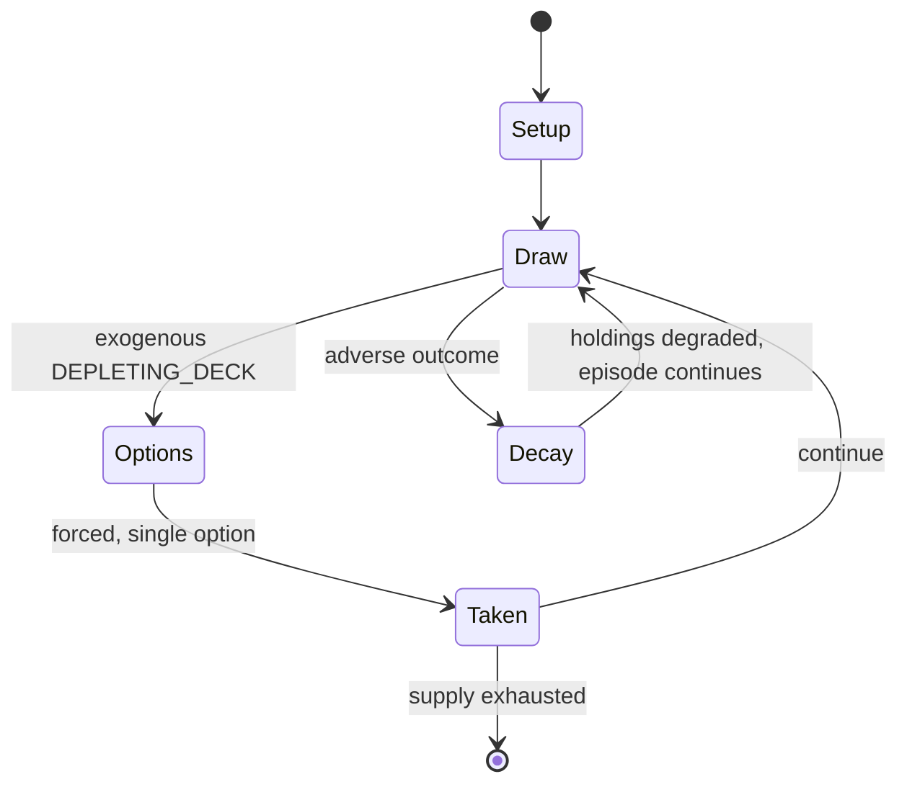

# Secret Hitler

`secret_hitler` &nbsp; state: **DEEPENED** &nbsp; method: **heuristic**

## Found layer (recorded, not trusted)

| field | value |
| --- | --- |
| wikidata | Q25339944 |
| wikipedia | Secret Hitler |
| genres (source) | -- |
| instance of (source) | -- |
| country of origin | -- |

## Declared layer (orders bench work)

| field | value |
| --- | --- |
| year created | 2016 |
| epoch | CONTEMPORARY |
| region | -- |
| media | BOARD |
| players | -- |
| age band | -- |
| exogenous process | DEPLETING_DECK |
| loss shape | PARTIAL_DECAY |
| live axes | COMMIT_BLIND, DISCARD |
| horizon | VARIABLE |
| scoring shape | -- |
| information | IMPERFECT |
| interaction | TRAITOR |
| turn structure | STRICT_TURN |
| tractability | EXACT_WITH_CUT |
| randomness | DECK_SHUFFLE, HIDDEN_INFO |
| luck factor | 0.53 |
| rules complexity | 3.7 |
| strategic depth | 2.45 |
| novelty | 0.9398 |
| solved status | -- |
| strategies | deduction, spatial_packing |
| algorithms | -- |

## Object model

```
Episode
  players      : ?
  turn_structure: STRICT_TURN
  horizon       : VARIABLE
  scoring       : ?

Board          -- spatial substrate; cells carry position and occupancy
Piece          -- movable token owned by a player
SealedChoice   -- irrevocable choice made without observation
DiscardChoice  -- what is given up to satisfy a limit
```

## State transition diagram



## Research item -- turn trace

```
# Secret Hitler -- simulated turn events
# generated from the DECLARED vector, not from a rulebook.
# structure: exo=DEPLETING_DECK loss=PARTIAL_DECAY horizon=VARIABLE scoring=None axes=COMMIT_BLIND,DISCARD

t=0    SETUP        players=2  pot=0  capacity=8
t=1    DRAW         p1 draw from deck -> outcome #5  (p=0.284)
t=2    FORCED       p1 single legal option taken (pot_gain=+1.6)
t=3    DISCARD      p1 discards to hand limit
t=4    ENDTURN      turn passes to p2
t=5    DRAW         p2 draw from deck -> outcome #6  (p=0.200)
t=6    FORCED       p2 single legal option taken (pot_gain=+1.3)
t=7    ENDTURN      turn passes to p1
t=8    DRAW         p1 draw from deck -> outcome #2  (p=0.277)
t=9    FORCED       p1 single legal option taken (pot_gain=+1.7)
t=10   DRAW         p1 draw from deck -> outcome #1  (p=0.165)
t=11   FORCED       p1 single legal option taken (pot_gain=+1.0)
t=12   DRAW         p1 draw from deck -> outcome #1  (p=0.053)
t=13   FORCED       p1 single legal option taken (pot_gain=+1.1)
t=14   DRAW         p1 draw from deck -> outcome #4  (p=0.068)
t=15   FORCED       p1 single legal option taken (pot_gain=+1.3)
t=16   DISCARD      p1 discards to hand limit
t=17   DRAW         p1 draw from deck -> outcome #1  (p=0.172)
t=18   FORCED       p1 single legal option taken (pot_gain=+1.5)
t=19   DISCARD      p1 discards to hand limit
t=20   DRAW         p1 draw from deck -> outcome #2  (p=0.002)
t=21   FORCED       p1 single legal option taken (pot_gain=+1.7)
t=22   DISCARD      p1 discards to hand limit
t=23   DRAW         p1 draw from deck -> outcome #4  (p=0.227)
t=24   FORCED       p1 single legal option taken (pot_gain=+1.2)
t=25   DRAW         p1 draw from deck -> outcome #1  (p=0.110)
t=26   FORCED       p1 single legal option taken (pot_gain=+1.6)

terminal: VARIABLE
```

## Conditions

| kind | threshold | effect | trigger |
| --- | --- | --- | --- |
| WIN | -- | -- | To win the game, both parties are set to competitively enact liberal and fascist policies respectively, or complete a secondary objective directly tied to the Hitler role. |
| TERMINATE | -- | -- | The game ends when either five liberal policies or six fascist policies have been enacted, resulting in victory for whichever team has achieved that policy count requirement. |

## Source extract

Secret Hitler is a hidden identity social deduction party game developed by Goat, Wolf, &
Cabbage LLC, manufactured by Breaking Games and distributed by Blackbox. The board game was
designed by Max Temkin, Mike Boxleiter and Tommy Maranges, with artwork created by Mackenzie
Schubert, and first released on August 25, 2016. In Secret Hitler, players assume the roles of
liberals and fascists in the Reichstag of the Weimar Republic, with one player becoming Hitler.
To win the game, both parties are set to competitively enact liberal and fascist policies
respectively, or complete a secondary objective directly tied to the Hitler role.   == Gameplay
== Secret Hitler sees players divided into two teams: the liberals and the fascists, the latter
also including the Hitler role. There are always more liberals than there are fascists in each
game, but the fascists have the advantage of knowing the identities of each other. The liberals,
with only the information of their personal affiliation, must therefore deduce, using social and
mechanical means, for themselves which players to trust. When playing with five or six players,
there are only two fascists, one of whom is Hitler; as there are on

<sub>Wikipedia, CC BY-SA. Retained as evidence for the structural
classification above. Every rule inferred from it is HYPOTHESIZED
until audited against a rulebook.</sub>
